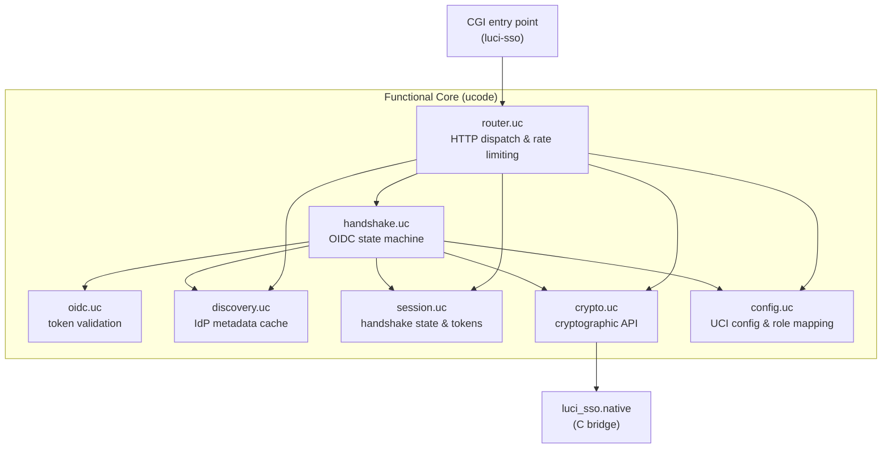
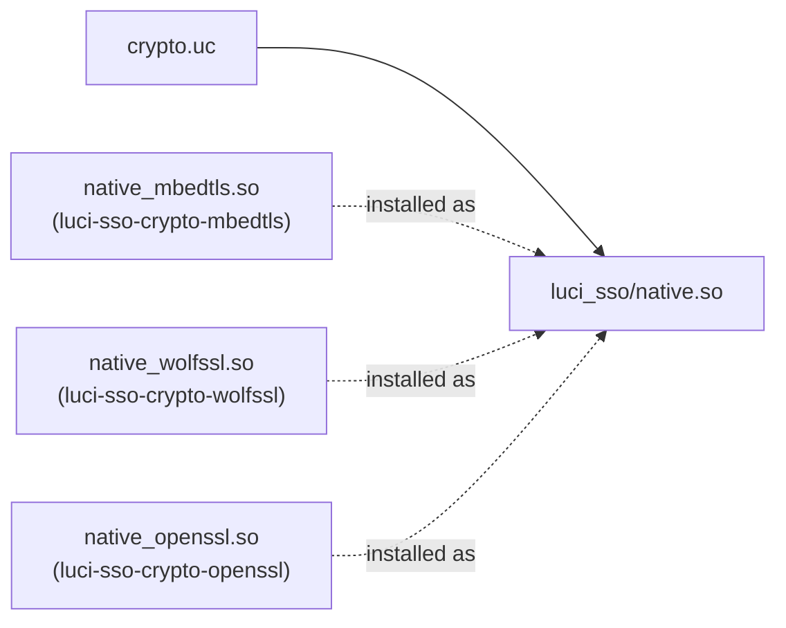

# About the Architecture

Understanding how `luci-sso` is structured explains why it can be both secure and testable in an environment that makes both of those things genuinely difficult. The architecture is a direct response to the constraints of OpenWrt.

---

## Functional Core / Imperative Shell

The most important structural decision in `luci-sso` is the strict separation between pure logic and I/O. All authentication logic — OIDC validation, JWT verification, role mapping — lives in pure `ucode` functions that know nothing about the network, the filesystem, or real time. The only way logic interacts with the outside world is through an `io` object injected at the boundary.

This pattern is called Functional Core / Imperative Shell. The "shell" is a thin CGI entry point (`files/www/cgi-bin/luci-sso`) that wires real I/O into the core and calls it. The "core" is everything in `files/usr/share/ucode/luci_sso/`.

The reason this matters: OpenWrt routers can't run network tests. Without this separation, you'd need a real IdP to test anything meaningful. With it, every function in the codebase can be exercised by a test that substitutes a controlled mock environment for the real one.

### Module responsibilities

*   **`router.uc`** — HTTP dispatcher and rate limiter. Receives every request from the CGI entry point, enforces the global rate limit, and routes to the correct handler (`/` → login, `/callback` → code exchange, `/logout` → session teardown).
*   **`handshake.uc`** — The OIDC state machine. Orchestrates the full authorization code flow: generates state and nonce, exchanges the code for tokens, validates them, and injects the resulting identity into LuCI's session.
*   **`oidc.uc`** — Pure protocol validation. Given a token and claims, checks: is the issuer right? Is the audience right? Is it expired? Does the nonce match? All of this with no I/O.
*   **`discovery.uc`** — Fetches and caches OIDC metadata from the IdP's `/.well-known/openid-configuration`. Caches to `/var/run/luci-sso/` (tmpfs) for 24 hours. The cache survives the router staying up but is cleared on every reboot — the first login after a reboot always fetches fresh discovery data. A stale cache is used as a fallback only when the IdP becomes temporarily unreachable while the router is already running.
*   **`session.uc`** — Manages handshake state files (creation, consumption, and reaping of stale entries) and session tokens. Acts as a facade over the modular `session/` sub-package.
*   **`crypto.uc`** — High-level cryptographic API. Wraps the native C bridge, exposes JWS signing/verification and constant-time comparisons.
*   **`config.uc`** — Reads UCI configuration and maps OIDC claims to LuCI roles.

---

## Split-Horizon Networking

Home labs create a common problem: the browser accesses the IdP at `https://auth.homelab.local`, but the router — sitting on a different network segment — may need to reach it at `https://192.168.2.10`. The OIDC issuer identifier (used for `iss` claim validation) is the public URL, but the router's back-channel HTTP calls need to use the private one.

`luci-sso` handles this with two configuration options:

*   **`issuer_url`** — The logical OIDC identifier. Used for `iss` validation and as the base for discovery. This is what the IdP publishes.
*   **`internal_issuer_url`** — The physical address the router uses for HTTP calls. When set, the origin of every back-channel URL is replaced with this value, while the paths remain unchanged for provider compatibility.

This is a deliberate departure from a strict reading of the OIDC spec, justified by the practical reality of self-hosted setups. The alternative — requiring the router to reach the IdP at its public address — would break most home lab configurations.

---

## Native C Bridge

Most of `luci-sso` is ucode. The exception is cryptography: RSA and EC signature verification, HMAC, and CSPRNG operations are implemented in C via a thin native bridge (`src/`).

The reason for this boundary is not performance — ucode is fast enough for the authentication overhead. The reason is correctness. Cryptographic primitives require guaranteed memory behavior (constant-time comparisons, buffer zeroization) that is hard to guarantee in a higher-level language. MbedTLS, WolfSSL, and OpenSSL provide these guarantees; a hand-rolled ucode implementation would not.

The bridge is designed to be swappable: all code uses `luci_sso.native` rather than importing a backend directly. At install time, whichever `luci-sso-crypto-*` package is chosen copies its `.so` to `/usr/lib/ucode/luci_sso/native.so` — there is no runtime dispatcher.

---

## Session Integration

`luci-sso` doesn't create local user accounts. Instead, after a successful OIDC flow, it injects a "Virtual Identity" directly into LuCI's session layer via UBUS.

The injection grants:
- **ACLs** derived from matched OIDC groups and UCI role mappings
- **Wildcard grants** for admin roles (dynamically discovers all `luci-*` access groups)
- **A 256-bit CSRF token** that satisfies LuCI's write protection

The session is created with a fixed 1-hour (3600-second) timeout via UBUS. The ID Token's `exp` claim is validated at login time — an already-expired token is rejected — but it does not dynamically set the session duration. A token with a short expiry does not shorten the session below one hour, and a token with a long expiry does not extend it beyond one hour.
