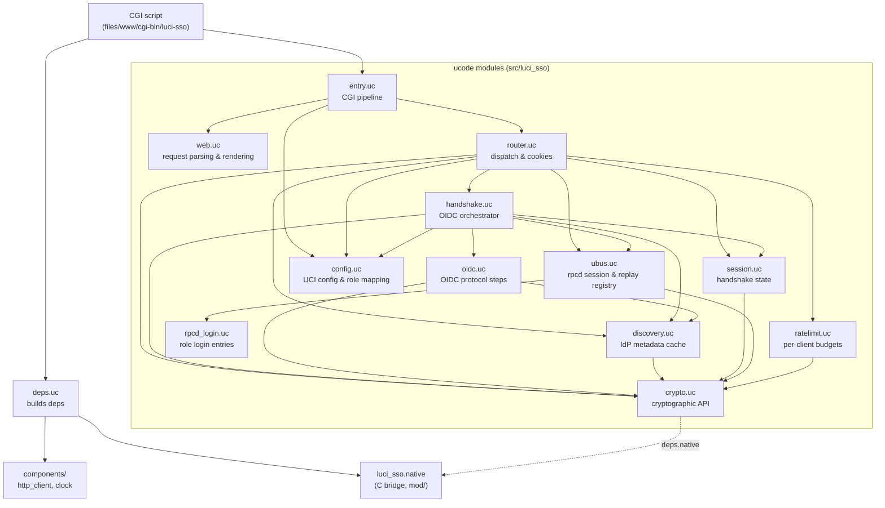
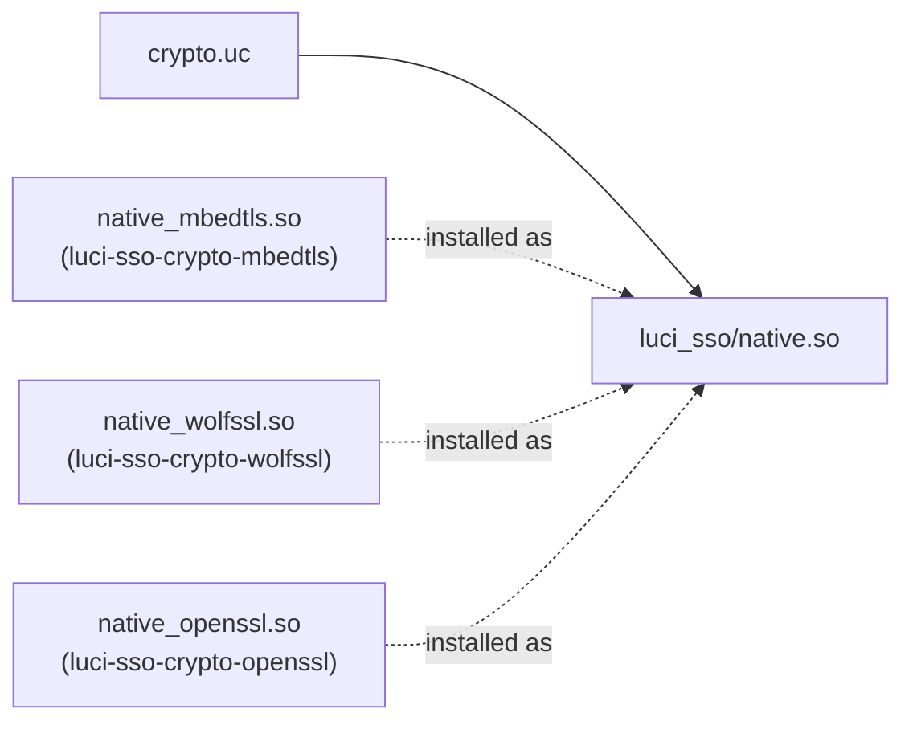

# About the Architecture

Understanding how `luci-sso` is structured explains why it can be both secure and testable in an environment that makes both of those things genuinely difficult. The architecture is a direct response to the constraints of OpenWrt.

---

## All I/O goes through `deps`

The most important structural decision in `luci-sso` is that no module reaches the outside world on its own. Everything that touches the system or is not deterministic arrives through one injected object, `deps`:

| Field | What it is in production |
| :--- | :--- |
| `fs` | ucode's `fs` module |
| `http` | an HTTPS-only client built on `uclient` (`components/http_client.uc`) |
| `ubus` | a ubus connection wrapped to return Results |
| `uci` | a UCI cursor |
| `clock` | `time()` plus a `uloop`-based sleep (`components/clock.uc`) |
| `native` | the compiled crypto bridge, `luci_sso.native` |
| `log` | a syslog writer with the tag `luci-sso` |

`deps.uc` builds this object with the real modules. The CGI script (`files/www/cgi-bin/luci-sso`) is only a few lines: it calls `deps.create()` and hands the result, plus the CGI environment, to `entry.run()`. Functions deeper down receive `deps` (or just `deps.native`, for the crypto wrappers) as their first argument and pass it on.

The reason this matters: OpenWrt routers can't run network tests. Because the real system only enters through `deps`, a test that fakes `deps` controls a module *and* everything it imports. The same fake drives a single crypto wrapper or the whole login flow, with real module code and no network. See [About the Test Architecture](test-architecture.md) for how the test buckets use this.

### Module responsibilities

*   **`entry.uc`** — The CGI pipeline. Parses the request with `web.uc`, loads the configuration with `config.uc`, lets `router.uc` handle the request, and renders the result or an error page. It also catches crashes, and lets the `?action=enabled` probe through when SSO is disabled.
*   **`web.uc`** — The HTTP layer. Reads the CGI environment (path, query string, cookies, client address) with size limits, and writes responses and error pages with the security headers.
*   **`router.uc`** — HTTP dispatcher. Answers the probe, applies the per-client rate limits from `ratelimit.uc`, and routes to the correct handler (`/` → login, `/callback` → code exchange, `/logout` → session teardown and RP-Initiated Logout). It sets and clears the cookies.
*   **`handshake.uc`** — The OIDC orchestrator. `initiate()` runs discovery, creates the handshake state and builds the authorization URL. `authenticate()` checks the returned `state`, exchanges the code, fetches the JWK Set, verifies the ID Token (refreshing the keys once if the signing key is unknown), falls back to UserInfo when the email is missing, registers the access token against replay, maps the user to a role, and creates the LuCI session.
*   **`oidc.uc`** — The OIDC protocol steps. Builds the authorization URL, performs the token exchange and the UserInfo request over `deps.http`, and validates the ID Token claims (issuer, audience, nonce, `azp`, `at_hash`) on top of the signature check in `crypto`.
*   **`discovery.uc`** — Fetches and caches OIDC metadata from the IdP's `/.well-known/openid-configuration` and the JWK Set. Caches to `/var/run/luci-sso/` (tmpfs) for 24 hours. The cache survives the router staying up but is cleared on every reboot — the first login after a reboot always fetches fresh discovery data. A stale cache is used as a fallback only when the IdP becomes temporarily unreachable while the router is already running.
*   **`session.uc`** — Manages handshake state files (creation, verification and consumption, and reaping of stale entries). A facade over `session/handshake.uc` and `session/common.uc`. The LuCI session itself lives in `rpcd`; `luci-sso` issues no tokens of its own.
*   **`ubus.uc`** — The `rpcd` side. Reads the matched role's `rpcd` login entry, creates the LuCI session under the entry's user name, grants it the ACLs the entry grants, stores the tokens and, when there is one, the user's verified email in it, and reads or destroys it at logout. Also keeps the access-token replay registry.
*   **`rpcd_login.uc`** — The roles' `rpcd` login entries (`luci_sso_<role>`, user name `sso:<role>`) and `rpcd`'s rules for them: names, list checks, how a list grants an access group, the `unauthenticated` baseline, and the move of permissions between `/etc/config/luci-sso` and `/etc/config/rpcd` on install and removal. It takes no `deps`; the code that writes passes it a UCI cursor.
*   **`ratelimit.uc`** — Per-client request budgets, kept in one small JSON file.
*   **`config.uc`** — Reads UCI configuration and maps OIDC claims to the first matching role.
*   **`crypto.uc`** — High-level cryptographic API, a facade over `crypto/*.uc`. Wraps the native C bridge for JWT signature verification, JWK conversion, hashing, PKCE and random bytes, and provides the best-effort constant-time comparison, which is plain ucode.
*   **`encoding.uc`, `result.uc`, `errors.uc`** — Pure helpers used everywhere: Base64URL, JSON and URL handling, the `Result` type, and the error code constants.
*   **`deps.uc` and `components/`** — Build the production `deps` object: the HTTPS client, the clock, the ubus and syslog channels.

```mermaid
graph TD
    CGI["CGI script<br/>(files/www/cgi-bin/luci-sso)"]
    deps["deps.uc<br/>builds deps"]

    subgraph core["ucode modules (src/luci_sso)"]
        entry["entry.uc<br/>CGI pipeline"]
        web["web.uc<br/>request parsing &amp; rendering"]
        router["router.uc<br/>dispatch &amp; cookies"]
        ratelimit["ratelimit.uc<br/>per-client budgets"]
        handshake["handshake.uc<br/>OIDC orchestrator"]
        oidc["oidc.uc<br/>OIDC protocol steps"]
        discovery["discovery.uc<br/>IdP metadata cache"]
        session["session.uc<br/>handshake state"]
        ubus["ubus.uc<br/>rpcd session &amp; replay registry"]
        config["config.uc<br/>UCI config &amp; role mapping"]
        rpcd_login["rpcd_login.uc<br/>role login entries"]
        crypto["crypto.uc<br/>cryptographic API"]
    end

    components["components/<br/>http_client, clock"]
    native["luci_sso.native<br/>(C bridge, mod/)"]

    CGI --> deps
    CGI --> entry
    deps --> components
    deps --> native
    entry --> web
    entry --> config
    entry --> router
    router --> ratelimit
    router --> handshake
    router --> session
    router --> ubus
    router --> discovery
    router --> config
    router --> crypto
    handshake --> oidc
    handshake --> discovery
    handshake --> session
    handshake --> ubus
    handshake --> config
    handshake --> crypto
    oidc --> discovery
    oidc --> crypto
    discovery --> crypto
    session --> crypto
    ubus --> crypto
    ubus --> rpcd_login
    ratelimit --> crypto
    crypto -.->|"deps.native"| native
```

**Textual summary:** The CGI script builds `deps` with `deps.uc` (which wires in the HTTP client, the clock and the native crypto bridge) and calls `entry.uc`. `entry.uc` parses the request with `web.uc`, loads the configuration with `config.uc` and passes the request to `router.uc`. The router applies the rate limit from `ratelimit.uc`, then sends a login or callback to `handshake.uc` and handles logout itself with `ubus.uc`, `session.uc` and `discovery.uc`. `handshake.uc` drives the flow through `oidc.uc`, `discovery.uc`, `session.uc`, `ubus.uc` and `config.uc`; `ubus.uc` reads the role's permissions with the rules in `rpcd_login.uc`. Every module that needs cryptography calls `crypto.uc`, which reaches the C bridge only through the `native` object passed down from `deps`. The pure helpers `encoding.uc`, `result.uc` and `errors.uc` are used by almost every module and are left out of the diagram.

---

## Split-Horizon Networking

Home labs create a common problem: the browser accesses the IdP at `https://auth.homelab.local`, but the router — sitting on a different network segment — may need to reach it at `https://192.168.2.10`. The OIDC issuer identifier (used for `iss` claim validation) is the public URL, but the router's back-channel HTTP calls need to use the private one.

`luci-sso` handles this with two configuration options:

*   **`issuer_url`** — The logical OIDC identifier. Used for `iss` validation and as the base for discovery. This is what the IdP publishes.
*   **`internal_issuer_url`** — The physical address the router uses for HTTP calls. When set, the origin of every back-channel URL is replaced with this value, while the paths remain unchanged for provider compatibility.

This is a deliberate departure from a strict reading of the OIDC spec, justified by the practical reality of self-hosted setups. The alternative — requiring the router to reach the IdP at its public address — would break most home lab configurations.

---

## Native C Bridge

Most of `luci-sso` is ucode. The exception is the cryptographic primitives: RSA and EC signature verification, SHA-256, HMAC, random bytes and JWK-to-PEM conversion are implemented in C by a thin native bridge in `mod/`. The bridge has three layers: `native_ucode.c` converts ucode values, `native_api.c` holds every input check, and `native_<lib>.c` calls one crypto library.

The reason for this boundary is not performance — ucode is fast enough for the authentication overhead. The reason is correctness. Signature verification and random number generation are exactly the code that should come from a maintained crypto library rather than be written again in a scripting language, and C can wipe buffers that held secret-derived data, which ucode cannot. MbedTLS, WolfSSL, and OpenSSL provide these primitives; a hand-rolled ucode implementation would not be trustworthy. Comparisons of secrets are the exception: `constant_time_eq()` is plain ucode and only best-effort constant time, as [Security Model](security-model.md#why-constant-time-comparisons) explains.

The bridge is designed to be swappable: only `deps.uc` imports `luci_sso.native`, and every other module receives it as `deps.native`, so no code names a backend. At install time, whichever `luci-sso-crypto-*` package is chosen copies its `.so` to `/usr/lib/ucode/luci_sso/native.so` — there is no runtime dispatcher.

```mermaid
graph LR
    crypto["crypto.uc"]
    native["luci_sso/native.so"]
    mbedtls["native_mbedtls.so<br/>(luci-sso-crypto-mbedtls)"]
    wolfssl["native_wolfssl.so<br/>(luci-sso-crypto-wolfssl)"]
    openssl["native_openssl.so<br/>(luci-sso-crypto-openssl)"]

    crypto --> native
    mbedtls -.->|"installed as"| native
    wolfssl -.->|"installed as"| native
    openssl -.->|"installed as"| native
```

**Textual summary:** `crypto.uc` always calls the same module, `luci_sso/native.so`. Each of the three backend packages (`luci-sso-crypto-mbedtls`, `luci-sso-crypto-wolfssl`, `luci-sso-crypto-openssl`) installs its own build of the bridge under that one name, so whichever backend is installed is the one used. Only one backend can be installed at a time.

---

## Session Integration

`luci-sso` doesn't create local user accounts. Instead, after a successful OIDC flow, it injects a "Virtual Identity" directly into LuCI's session layer via UBUS.

The injection grants:
- **ACLs** from the matched role's `rpcd` login entry, `luci_sso_<role>` in `/etc/config/rpcd`, expanded into concrete permissions exactly as `rpcd` expands them for a password login with that entry. The session's user name is the entry's, `sso:<role>`, so `rpcd` rebuilds the same rights when it reloads.
- **A 256-bit CSRF token** that satisfies LuCI's write protection

The session is created via UBUS with LuCI's own idle timeout, `luci.sauth.sessiontime` (3600 seconds by default), the same one a password login gets. The ID Token's `exp` claim is validated at login time — an already-expired token is rejected — but it does not set the session duration in either direction.

The entries are written by an `rpcd` plugin, `/usr/share/rpcd/ucode/luci-sso.uc`, which runs inside `rpcd` and exposes the `luci-sso` ubus object (`list_roles`, `set_role`, `delete_role`). The settings page calls it instead of editing `/etc/config/rpcd` through UCI, because UCI permissions cover a whole configuration file: a page that could write `rpcd`'s file could also rewrite `root`'s login. After a write, the plugin makes `rpcd` reload, so the change reaches open sessions. [About Roles and Permissions](roles-and-permissions.md) explains the design.

LuCI's own **Log out** entry ends SSO sessions through `luci-sso` by way of a menu override, not a patch. LuCI builds its menu from every file in `/usr/share/luci/menu.d/`, in name order, and a later file that names an existing path replaces only the keys it gives. `luci-sso-logout.json` sorts after LuCI's `luci-base.json` and gives `admin/logout` a new `action` (and the same `depends`), so the entry keeps LuCI's title and position. The action is `luci.controller.sso`'s `action_logout`: for a session whose username is `sso:<role>` it redirects to `/cgi-bin/luci-sso/logout` with the session's CSRF token, which destroys the session and continues to the IdP's `end_session_endpoint`; for any other session it calls LuCI's own `action_logout` unchanged. Removing the package removes both files, and LuCI's entry is back.
