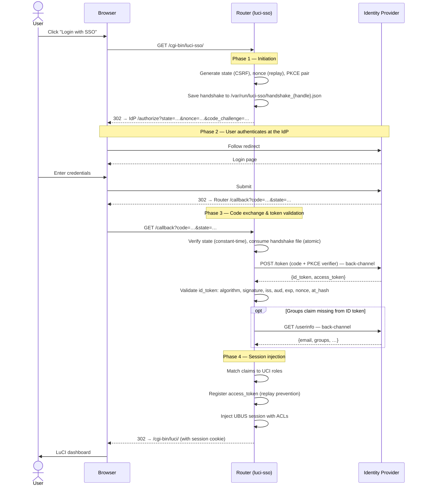

# About the OIDC Login Flow

When a user clicks "Login with SSO", a sequence of cryptographic handshakes runs between the browser, the router, and the identity provider. Understanding this flow helps make sense of what `luci-sso` is doing when things go wrong — and why it is designed the way it is.

---

## The four phases

The textual summary below explains what happens in each phase.

**Phase 1 — Initiation:** The router generates the security parameters for this specific login attempt and redirects the browser to the IdP.

**Phase 2 — IdP authentication:** The browser handles everything. The router is not involved. The user enters their credentials and the IdP redirects back with a short-lived authorization code.

**Phase 3 — Code exchange:** The router's back-channel takes over. The code is exchanged for tokens, and every security property of the tokens is verified before anything is trusted.

**Phase 4 — Session injection:** The user's identity is mapped to a LuCI role and a session is created. The browser receives a session cookie and lands on the dashboard.

---

## Why the flow is designed this way

### The authorization code, not the token, travels through the browser

The browser is an untrusted environment. Browser history, proxies, logged redirects, and injected scripts can all observe URL parameters. The OIDC authorization code flow keeps the actual tokens off the browser entirely — the code that travels through the browser is short-lived, single-use, and worthless without the PKCE verifier that only the router holds.

The alternative — the implicit flow, where the IdP puts the access token directly in the redirect URL — is deprecated precisely because tokens in URLs are dangerous.

### PKCE prevents authorization code injection

PKCE (Proof Key for Code Exchange) ties the authorization code to the specific device that initiated the flow. At initiation, the router generates a random `code_verifier` (kept secret on the router) and sends a `code_challenge` (SHA256 of the verifier) to the IdP. At code exchange, the router sends the verifier. The IdP verifies that SHA256(verifier) matches the challenge it stored.

An attacker who intercepts the authorization code cannot use it — they don't have the verifier. It never left the router.

### State prevents CSRF

The `state` parameter is a random value the router generates and sends to the IdP. When the IdP redirects back, the router checks the returned `state` matches what it generated — using constant-time comparison to prevent timing side-channels.

Without `state`, an attacker could craft a callback URL and trick the user's browser into completing an authentication flow the attacker initiated, potentially logging the user into the attacker's session.

### Nonce prevents token replay across sessions

The `nonce` is included in the authorization request and must appear verbatim in the ID Token the IdP issues. The router checks it at validation time using constant-time comparison.

This prevents an attacker from capturing a valid ID Token from one session and replaying it in another. The nonce is only ever generated once, stored in the handshake file, and verified exactly once before that file is deleted.

### The handshake file is atomically consumed

The handshake state file at `/var/run/luci-sso/handshake_{handle}.json` is deleted by atomically renaming it before any processing occurs. POSIX `rename` is guaranteed to either succeed or fail — two concurrent requests cannot both succeed on the same file.

This means each authorization code can only be processed once, even under concurrent requests. There is no time-of-check-time-of-use race condition.

### at_hash binds the access token to the ID token

The ID Token contains an `at_hash` claim: the base64url-encoded first 16 bytes of SHA256 of the access token. The router recomputes this and compares it using constant-time equality.

If an attacker substitutes a different access token in the token response — while somehow preserving a valid ID token — the `at_hash` check fails. The identity from the ID token cannot be decoupled from the access token actually received.

### Token registry prevents access token replay

After a successful login, the SHA256 hash of the access token is registered in `/var/run/luci-sso/tokens/`. This is an atomic `mkdir` operation: the first process to create the directory wins; subsequent attempts fail. Tokens are kept for 24 hours, matching the maximum OIDC session lifetime.

This prevents an attacker who observes a valid access token from reusing it after the user has logged out.

---

## What can go wrong — and where

Each phase has distinct failure modes visible in the [system log](../reference/log-messages.md):

| Phase | Typical error codes |
| :--- | :--- |
| Discovery | `OIDC_DISCOVERY_FAILED`, `DISCOVERY_ISSUER_MISMATCH`, `JWKS_FETCH_FAILED` |
| Callback | `STATE_MISMATCH`, `MISSING_HANDSHAKE_COOKIE`, `IDP_ERROR`, `STATE_NOT_FOUND` |
| Token exchange | `TOKEN_EXCHANGE_FAILED`, `OIDC_INVALID_GRANT`, `NETWORK_ERROR` |
| Token validation | `UNSUPPORTED_ALGORITHM`, `NONCE_MISMATCH`, `AT_HASH_MISMATCH`, `ID_TOKEN_VERIFICATION_FAILED` |
| Authorization | `NO_ROLES_MATCHED`, `USER_NOT_AUTHORIZED` |
| Session injection | `UBUS_LOGIN_FAILED` |

For step-by-step troubleshooting, see [How to Debug luci-sso](../how-to/sysadmin/debugging.md).
