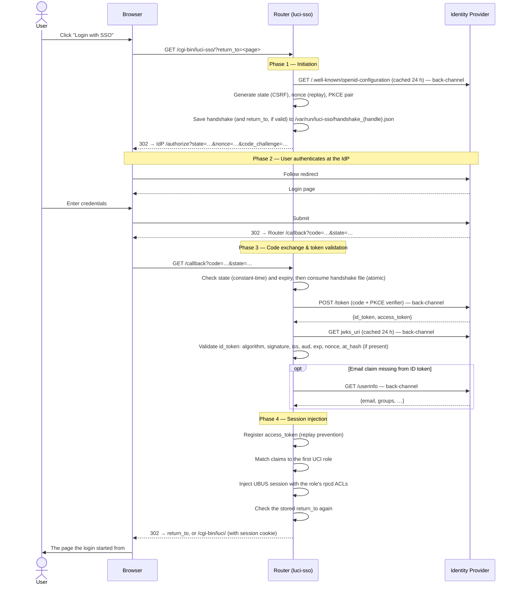

# About the OIDC Login Flow

When a user clicks "Login with SSO", a sequence of cryptographic handshakes runs between the browser, the router, and the identity provider. Understanding this flow helps make sense of what `luci-sso` is doing when things go wrong — and why it is designed the way it is.

---

## The four phases

```mermaid
sequenceDiagram
    actor User
    participant B as Browser
    participant R as Router (luci-sso)
    participant I as Identity Provider

    User->>B: Click "Login with SSO"
    B->>R: GET /cgi-bin/luci-sso/?return_to=<page>

    Note over R: Phase 1 — Initiation
    R->>I: GET /.well-known/openid-configuration (cached 24 h) — back-channel
    R->>R: Generate state (CSRF), nonce (replay), PKCE pair
    R->>R: Save handshake (and return_to, if valid) to /var/run/luci-sso/handshake_{handle}.json
    R-->>B: 302 → IdP /authorize?state=…&nonce=…&code_challenge=…

    Note over B,I: Phase 2 — User authenticates at the IdP
    B->>I: Follow redirect
    I-->>B: Login page
    User->>B: Enter credentials
    B->>I: Submit
    I-->>B: 302 → Router /callback?code=…&state=…

    Note over R: Phase 3 — Code exchange & token validation
    B->>R: GET /callback?code=…&state=…
    R->>R: Check state (constant-time) and expiry, then consume handshake file (atomic)
    R->>I: POST /token (code + PKCE verifier) — back-channel
    I-->>R: {id_token, access_token}
    R->>I: GET jwks_uri (cached 24 h) — back-channel
    R->>R: Validate id_token: algorithm, signature, iss, aud, exp, nonce, at_hash (if present)
    opt Email claim missing from ID token
        R->>I: GET /userinfo — back-channel
        I-->>R: {email, groups, …}
    end

    Note over R: Phase 4 — Session injection
    R->>R: Register access_token (replay prevention)
    R->>R: Match claims to the first UCI role
    R->>R: Inject UBUS session with the role's rpcd ACLs
    R->>R: Check the stored return_to again
    R-->>B: 302 → return_to, or /cgi-bin/luci/ (with session cookie)
    B->>User: The page the login started from
```

The textual summary below explains what happens in each phase.

**Phase 1 — Initiation:** The router loads the IdP's discovery document, generates the security parameters for this specific login attempt, keeps the page the login started from if it is a LuCI page, and redirects the browser to the IdP.

**Phase 2 — IdP authentication:** The browser handles everything. The router is not involved. The user enters their credentials and the IdP redirects back with a short-lived authorization code.

**Phase 3 — Code exchange:** The router's back-channel takes over. The code is exchanged for tokens, and every security property of the tokens is verified before anything is trusted.

**Phase 4 — Session injection:** The access token is registered so it cannot be used for a second login, the user's identity is mapped to the first matching role, and a session is created with the rights of that role's `rpcd` login entry. The browser receives a session cookie and lands on the page the login started from, or on LuCI's start page.

---

## Why the flow is designed this way

### The authorization code, not the token, travels through the browser

The browser is an untrusted environment. Browser history, proxies, logged redirects, and injected scripts can all observe URL parameters. The OIDC authorization code flow keeps the actual tokens off the browser entirely — the code that travels through the browser is short-lived, single-use, and worthless without the PKCE verifier that only the router holds.

The alternative — the implicit flow, where the IdP puts the access token directly in the redirect URL — is deprecated precisely because tokens in URLs are dangerous.

### PKCE prevents authorization code injection

PKCE (Proof Key for Code Exchange) ties the authorization code to the specific device that initiated the flow. At initiation, the router generates a random `code_verifier` (kept secret on the router) and sends a `code_challenge` (SHA256 of the verifier) to the IdP. At code exchange, the router sends the verifier. The IdP verifies that SHA256(verifier) matches the challenge it stored.

An attacker who intercepts the authorization code cannot use it — they don't have the verifier. It never left the router.

### State prevents CSRF

The `state` parameter is a random value the router generates and sends to the IdP. When the IdP redirects back, the router checks the returned `state` matches what it generated — using constant-time comparison to prevent timing side-channels.

Without `state`, an attacker could craft a callback URL and trick the user's browser into completing an authentication flow the attacker initiated, potentially logging the user into the attacker's session.

### Nonce prevents token replay across sessions

The `nonce` is included in the authorization request and must appear verbatim in the ID Token the IdP issues. The router checks it at validation time using constant-time comparison.

This prevents an attacker from capturing a valid ID Token from one session and replaying it in another. The nonce is generated once and stored in the handshake file. That file is consumed at the callback, before the code is exchanged, so the nonce is checked exactly once and can never match again.

### The handshake file is atomically consumed

The handshake state file at `/var/run/luci-sso/handshake_{handle}.json` is first read and checked: the returned `state` must match and the handshake must not have expired. Only then is it claimed by atomically renaming it, before the code is exchanged. POSIX `rename` is guaranteed to either succeed or fail — two concurrent requests cannot both succeed on the same file. A request with the wrong `state` is rejected without touching the file, so a forged callback cannot cancel a login in progress.

This means each authorization code can only be processed once, even under concurrent requests. There is no time-of-check-time-of-use race condition.

### at_hash binds the access token to the ID token

The ID Token can carry an `at_hash` claim: the base64url-encoded first 16 bytes of the SHA-256 of the access token. When it is there, the router recomputes it and compares the two using constant-time equality.

If an attacker substitutes a different access token in the token response, while somehow preserving a valid ID token, the `at_hash` check fails. The identity from the ID token cannot be decoupled from the access token actually received.

In the authorization code flow, OIDC Core makes `at_hash` optional, and some IdPs never send it. The router then accepts the ID Token without the check. [About the Threat Model](threat-model.md#access-token-substitution) explains why that leaves no practical gap.

### The page to return to stays on the router

LuCI shows its login page at whatever address was asked for, and its password login then opens that page. The **Login with SSO** button does the same: it sends the page's path and query string as `return_to`, and the callback redirects there.

A redirect target taken from a request is a classic open redirect: a link to the router could send a freshly logged-in user to a look-alike site. So `return_to` is held to a strict allow-list. It must be a path under `/cgi-bin/luci/` with no `//`, no dot segments and only a small set of characters, checked again after each level of percent-decoding; anything else is dropped and the login lands on `/cgi-bin/luci/`. The [HTTP API Reference](../reference/http-api.md#return_to-rules) lists the rules, and [About the Threat Model](threat-model.md#open-redirect-after-login) the reasoning.

The page is kept in the handshake file, on the router, beside `state`, not in a cookie or in the authorization request: the IdP never sees it, and the browser cannot change it between the two legs. The callback checks it again before redirecting, because the file sits on disk between the two requests.

### Token registry prevents access token replay

After a successful login, the SHA256 hash of the access token is registered in `/var/run/luci-sso/tokens/`. This is an atomic `mkdir` operation: the first process to create the directory wins; subsequent attempts fail. A daily cleanup job removes entries older than 24 hours, and the router logs a warning when an access token lives longer than that window.

The registration happens only after the ID Token has been verified, so forged tokens cannot fill the registry. From then on, a token response carrying the same access token cannot create a second session: a replayed response, or an IdP that reissues access tokens, ends with `TOKEN_REPLAYED`.

---

## What can go wrong — and where

Each phase has distinct failure modes visible in the [system log](../reference/log-messages.md). A failed request ends with one `[<status>] <CODE>` line; the lines before it carry the detail:

| Phase | Code on the request's last line | Detail on the lines before it |
| :--- | :--- | :--- |
| Discovery | `OIDC_DISCOVERY_FAILED`, `JWKS_FETCH_FAILED` | `DISCOVERY_ISSUER_MISMATCH: …`, `DISCOVERY_MISSING_ENDPOINT: …`, `INSECURE_ENDPOINT: …`, `Discovery fetch failed … HTTP_REQUEST_FAILED (<cause>)`, `JWKS fetch HTTP <status> …` |
| Callback | `STATE_PARAMETER_MISMATCH`, `MISSING_HANDSHAKE_COOKIE`, `IDP_ERROR`, `STATE_NOT_FOUND` | `IDP_ERROR: the IdP returned error=<error> (…)`, `Callback state does not match the handshake; handshake kept`, `Handshake state not found or already consumed` |
| Token exchange | `TOKEN_EXCHANGE_FAILED`, `OIDC_INVALID_GRANT`, `TOKEN_ENDPOINT_NETWORK_ERROR` | `Token exchange HTTP <status>`, `Token exchange network error … (<cause>)` |
| Token validation | `ID_TOKEN_VERIFICATION_FAILED` | `OAuth flow failed …` naming the check, such as `UNSUPPORTED_ALGORITHM`, `NONCE_MISMATCH` or `AT_HASH_MISMATCH` |
| Authorization | `USER_NOT_AUTHORIZED` | `User [sub_id: …] matched no roles` |
| Session injection | `UBUS_LOGIN_FAILED` | `UBUS session creation failed` and similar |

Discovery, JWK Set and token exchange failures happen on the router's own requests to the IdP, not in anything the browser sent, so they all end as `[502]` (Bad Gateway). The IdP's HTTP status appears only in the detail line, such as `Token exchange HTTP 401`.

For step-by-step troubleshooting, see [How to Debug luci-sso](../how-to/sysadmin/debugging.md).
