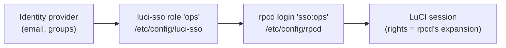

# About Roles and Permissions

Two questions decide what happens when someone signs in with SSO: *who is this person*, and *what may they do on this router*. `luci-sso` answers the first. OpenWrt's own session daemon, `rpcd`, answers the second. This page explains why the work is split that way, how the pieces connect, and which alternatives were considered and set aside.

**Textual summary:** The identity provider (IdP) vouches for a user and sends claims such as an email address and group memberships. `luci-sso` matches those claims against its roles in `/etc/config/luci-sso`. Each role has exactly one partner entry in `/etc/config/rpcd`, a login named `sso:` followed by the role's name, which holds the role's permissions. The LuCI session the user receives gets the rights `rpcd` derives from that entry, exactly as it would for a password user.

---

## How OpenWrt grants rights

A LuCI session is a record inside `rpcd`. It carries a user name and a set of rights, and `rpcd` checks every LuCI request against those rights.

Rights come from two places. **Access groups**, defined in `/usr/share/rpcd/acl.d/*.json` by each installed LuCI package, bundle the concrete calls a feature needs: which `ubus` methods it may call, which UCI configurations it may read or write. **Login entries** in `/etc/config/rpcd` then say which access groups a user may read and which they may write. When a user logs in with a password, `rpcd` expands the user's entry into the concrete rights of every matching access group and stores them in the session.

One detail turns out to matter a great deal. When `rpcd` reloads, it does not keep the rights it stored. It rebuilds every session's rights from the login entry whose user name matches the session's. Reloads are not rare. Several LuCI packages, such as `luci-light`, reload `rpcd` when they are installed, so installing software through LuCI can trigger one.

---

## Why luci-sso stopped keeping its own permissions

Earlier versions of `luci-sso` kept permissions in their own configuration. Each role listed the access groups it could read and write, and `luci-sso` granted those rights to the session directly. The session's user name was the role's name. That design had three problems, and all of them came from the same root: the rights lived somewhere `rpcd` could not see.

**Rights disappeared on reload.** No `rpcd` login entry matched an SSO session's user name, so a reload rebuilt its rights from nothing. The session stayed open but could no longer do anything, and LuCI told the user their session had expired. Password users, whose entries `rpcd` could find, were unaffected.

**A role name could collide with a real login.** OpenWrt ships one `rpcd` login, `root`, with full rights. A role that happened to be named `root` got its session rebuilt from that entry on the next reload. A read-only role could become a full administrator. This was confirmed in a test environment running OpenWrt's `rpcd`: a configuration write the session was refused before a reload succeeded after it.

**Two implementations of the same rules.** `luci-sso` had to reproduce `rpcd`'s rules for turning access groups into rights, and keep them in step with `rpcd`'s C code across OpenWrt releases.

Moving permissions into `rpcd` removes all three. Reloads rebuild SSO sessions correctly, because `rpcd` now finds a matching entry. The `sso:` prefix keeps role names out of the space of real logins. And there is only one set of rules: `rpcd`'s.

---

## How a role and its rpcd entry relate

Every role has exactly one partner entry, and the partner's user name is always `sso:` followed by the role's name. There is no setting to point a role at some other `rpcd` login. That rigidity is deliberate. If a role could name any login, an administrator could map an SSO group to `root` by accident, and the collision described above would come back as a feature. A role that should have full access gets it from its own entry instead, with `*` in both lists.

The work is split between the two files along a clear line:

- **`/etc/config/luci-sso`** holds what is specific to single sign-on: the role's name and how to recognise its members, by `email` and `group` claims.
- **`/etc/config/rpcd`** holds what OpenWrt needs to authorise a session: the access groups the role may read and write.

`rpcd` matches user names exactly. A session named `sso:root` gets the rights of the `sso:root` entry, or none if there isn't one; it never gets the rights of `root`. This, too, was checked against `rpcd` on both supported OpenWrt releases.

---

## Why every entry reads `unauthenticated`

LuCI checks the session on every page it loads. It calls two methods, `session.access` and `luci.getFeatures`, which the `unauthenticated` access group grants. If a session may call neither, LuCI tells the user their session has expired, even though it has not.

Earlier versions of `luci-sso` added that group to every restricted SSO session on their own. `rpcd` knew nothing about the addition, so it disappeared at the next reload, and LuCI then treated the session as expired. Now the group lives where `rpcd` can see it: in the entry's read list.

The `luci-sso` object adds it when it saves an entry, following `rpcd`'s own rules:

- A read list that already grants the group, by name or through a pattern such as `*`, is stored as it is. An entry with `*` in both lists stays exactly what a `root` login has.
- Any other read list gets `unauthenticated` appended, once.
- A read list with a negation that denies the group, such as `!unauthenticated`, is refused. `rpcd` checks negations first, so no addition could undo it.

The settings page never lists the group, and nobody can remove it there. A role whose lists grant nothing else is still valid: its users can log in, but they see nothing.

---

## When a user matches more than one role

People often match several roles. They belong to more than one group at the IdP, a personal `email` rule overlaps a team's `group` rule, or groups are nested so that everyone in `admins` is also in `staff`.

A session has one user name, and `rpcd` rebuilds it from one login entry. So a session can carry only one role's rights. `luci-sso` uses the **first** role that matches, in the order the roles appear on the settings page and in `/etc/config/luci-sso`. The system log names the role that was chosen, and says when the user matched others too.

This is the same model as firewall rules: order expresses priority. The most specific or most privileged role belongs at the top, so `admins` comes before `staff`, and a personal override comes before the team rule it overrides.

Earlier versions merged the rights of every matching role instead, which made roles work like building blocks: one role for status pages, another for network settings, and a user in both got both. Under the new model each role is a complete profile. A user who needs status pages *and* network settings gets a role that grants both. On a router, the number of distinct profiles people need is usually small, so this trades a little flexibility for rules that are easy to predict.

---

## Verified email addresses

An `email` rule trusts the address the IdP sends. But the IdP only vouches for the account. Some IdPs let users type in their own address, and do not check that the user owns it. On such an IdP, anyone could set their address to an administrator's and match the administrator's role. The `email_verified` claim is how an IdP says it has checked the address, or that an administrator entered it.

So by default an email counts for role matching only if the same response marks it as verified: `email_verified` is the JSON boolean `true`, as OIDC Core §5.1 defines the claim. The string `"true"` does not count. Otherwise the address is set aside, the system log says so, and the user can still match a role by group. If nothing else matches, the login is refused like any other user without a role. The email and its flag always come from the same place, the ID Token or UserInfo, so one response cannot vouch for an address from the other.

Not every IdP sends `true` by default, even for addresses an administrator typed in. [Provider Compatibility](../reference/provider-compatibility.md#verified-email) lists what each one sends, and its guide shows how to make it send `true`. The `require_email_verified` option turns the check off, which is safe only when every address at the IdP is set by an administrator, or matching is by group alone.

Even a verified email is a weaker identifier than the account itself. OIDC Core §5.7 says that only the pair of `iss` and `sub` identifies a user reliably, and that claims such as `email` "MUST NOT be used as unique identifiers". An address can be reassigned: when someone leaves, their address may later go to someone else. A role that matches by email therefore trusts the IdP never to hand an address to a different person. Requiring `email_verified` narrows that risk, because the IdP vouches for the address today, but it does not remove it. Group matching avoids it: membership of a group is managed at the IdP, not inferred from an address.

---

## Why the entries have no password

An `sso:` entry exists so that `rpcd` can rebuild a session's rights. It must never let anyone log in with a password.

`rpcd`'s password login skips any login entry that has no password option at all, so an `sso:` entry without one can never be used to log in, whatever password is tried. `rpcd`'s reload path, on the other hand, finds the entry before it would ever look at a password, so reloads work. The absence of a password is what separates "rights for SSO sessions" from "a way in".

An *empty* password is a different thing, and a dangerous one: `rpcd`'s code accepts any password for an entry whose password is empty. `luci-sso` therefore never writes a password option, and refuses to create a session from an entry that has one. If someone edits `/etc/config/rpcd` by hand and adds a password to an `sso:` entry, SSO logins for that role stop, with a clear message in the system log, rather than quietly turning the entry into a password account.

---

## Why the settings page goes through a ubus object

Administrators keep managing roles from **Services > Single Sign-On**, as before. The difference is in how that page saves.

The obvious route would be for the page to edit `/etc/config/rpcd` through LuCI's normal UCI calls. But UCI permissions apply to whole configuration files, not to sections within them. Letting the page write `rpcd`'s configuration would let anyone who can change SSO settings also rewrite `root`'s login, with or without the page's cooperation.

So the page talks to a small `luci-sso` object on `ubus` instead. That object only creates, changes and deletes `sso:` entries, always writes them without a password, and checks the lists it is given. The rule "`luci-sso` only touches its own entries" is enforced on the router, not just in the browser.

This split shows on the page as two moments at which changes take effect. A role's emails, groups and position live in `/etc/config/luci-sso`. The page stages them like any LuCI setting, and they take effect with **Save & Apply**. A role's read and write access live in `/etc/config/rpcd`. The object writes them straight away when the page is saved, with **Save** or with **Save & Apply**, and then makes `rpcd` reload so the new rights are in force about a second later. LuCI's staged changes cannot hold them, because the page has no UCI access to `rpcd`. The role editor has its own **Save** button, which only keeps the edit on the page, so the editor says so: "Permission changes take effect when you click Save at the bottom of the page."

---

## What `*` means now

In `rpcd`, `*` in a login entry matches every access group. `luci-sso` now uses that meaning too, so a wildcard means the same thing for an SSO role as for a password user.

Earlier versions gave `*` a narrower meaning, "every LuCI access group", and treated a `*` in the write list as a special full-administrator mode with extra raw grants. Both special cases are gone. A role with `*` in both lists gets exactly what a `root` password login gets, which covers everything LuCI needs.

This changes existing configurations on upgrade. A role that could read `*` could previously read only LuCI's access groups; it can now read every access group `rpcd` knows about, including non-LuCI ones. It still cannot write anything its write list does not grant. The choice was to follow `rpcd` rather than preserve the old meaning, because one meaning for `*` across the whole router is easier to reason about than two.

---

## Alternatives that were considered

**Prefixing the session's user name, and nothing else.** Naming sessions `sso:<role>` alone closes the `root` collision, and is a small change. But `rpcd` would still find no entry for the session on reload, so SSO users would keep losing their rights whenever a LuCI package was installed.

**Letting `luci-sso` write `rpcd` entries automatically**, from its own permission settings, at login or whenever its configuration changed. This fixes reloads while keeping the old configuration format. It also means a package silently maintaining security-relevant entries in another package's file, with two sources of truth to keep in step. Moving the permissions into `rpcd` outright, and editing them only when an administrator asks, is simpler to explain and to audit.

**Mapping roles to any `rpcd` login**, including existing password users. Flexible, but it reopens the door to mapping SSO users onto `root`.

**Keeping the union of matching roles** by generating a combined entry for each combination, such as `sso:network_editor+viewer`. This preserves the old building-block behaviour, but it fills `/etc/config/rpcd` with entries nobody wrote, and every role change would have to update every combination that includes it.

---

## What this costs

The design is not free.

`luci-sso` now manages entries in a file that belongs to another package. Some OpenWrt packages already manage settings in other packages' configuration, but managing login entries is unusual, and it deserves the care described above: owned entries only, recognisable by the `sso:` prefix, never a password, and none left behind. Deleting a role on the settings page deletes its entry. Removing the package deletes them all, as the next section describes.

Administrators who read `/etc/config/rpcd` will see `sso:` entries next to `root`. They can edit them over SSH, as long as they leave out the password option; `luci-sso` refuses an entry that has one. An entry edited by hand without `unauthenticated` gets the group back the next time the object saves it, or when the package is removed and installed again.

And the configuration format changes. Upgrading converts each existing role into an `sso:` entry and removes the permission lists from the role, adopting `rpcd`'s meaning of `*` as described above. A user who matched several roles and used to get their combined rights now gets the first matching role's rights only, so role order needs a look after upgrading. Sessions that were open during the upgrade carry the old user name, which no entry matches, so they lose their rights at the reload the upgrade triggers, and their users log in again.

---

## Upgrades, removal and reinstalls

The move to `rpcd` has to survive the package's own life cycle: upgrades from releases that kept permissions on the role, removal, and installing again. Two rules shape it.

**Nothing gets full access by accident.** On an upgrade, a role that carried read and write lists gets an entry made from them. A role without lists is harder: nothing says what it should grant. The package ships one role, `admin`, whose only rule is the placeholder email `admin@example.com`. That role, untouched, gets `*` in both lists, so a fresh install works as it always did. Any other role without lists gets an entry that grants nothing but `unauthenticated`, and a warning in the system log names it. That includes an `admin` role someone has edited. Its rules now name real people, and giving them every right because the role happens to be called `admin` would be the wrong guess.

**Removal is the reverse of the upgrade.** Removing the package copies each entry's lists back onto its role, as the read and write options earlier releases used, and only then deletes the entries. It commits `/etc/config/luci-sso` before `/etc/config/rpcd`, so an interruption leaves the permissions in at least one place. Installing again moves the lists back into `rpcd`, recreating each entry exactly, `unauthenticated` included, in the order of the roles. This matters more than it looks: `opkg install --force-reinstall` runs the removal script too, and without the copy it would wipe every role's permissions. After removal, `rpcd` reloads rather than restarts. Password users stay logged in, and SSO sessions, whose entries are gone, keep no rights.

---

## Related pages

- [How to Configure Role-Based Access Control](../how-to/sysadmin/rbac.md)
- [About the Session Lifecycle](session-lifecycle.md)
- [About the Security Model](security-model.md)
- [About the Threat Model](threat-model.md)
