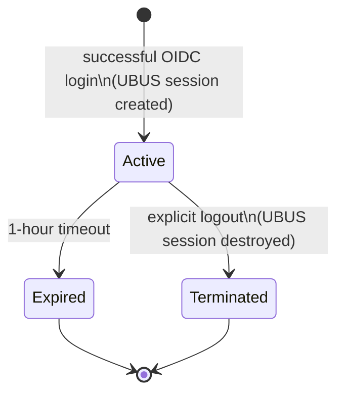

# About the Session Lifecycle

After a successful login, `luci-sso` creates a LuCI session and hands the browser a session cookie. Understanding what that session is, how long it lasts, and when it ends matters for anyone reasoning about access control on the router.

**Textual summary:** A session begins when the OIDC flow completes and UBUS creates the session record. From that point it either expires after one hour (regardless of IdP token expiry) or is terminated immediately by an explicit logout. Mid-session IdP revocation has no effect — the session continues until one of these two endpoints is reached. Multiple independent sessions can be active simultaneously.

---

## What a session is

`luci-sso` does not create local user accounts. There is no entry in `/etc/passwd`, no stored password, no local identity record. Instead, after a successful OIDC flow, it calls UBUS to create a **UBUS session** — an in-memory record managed by `rpcd` — and injects the user's ACLs and a CSRF token into it.

The browser receives a `sysauth_https` cookie containing the UBUS session ID. Every subsequent LuCI request presents this cookie; `rpcd` looks up the session and enforces the ACLs. From LuCI's perspective, a OIDC-authenticated user is indistinguishable from a password-authenticated one.

---

## Why the session lifetime is fixed at one hour

The session is created with a hard 1-hour (3600-second) timeout. This is not configurable.

The IdP's ID Token carries its own `exp` claim, which `luci-sso` validates at login time — an expired token is rejected before a session is created. But once the session exists, `luci-sso` does not re-read the token's `exp` on subsequent requests. A token with a 5-minute expiry does not shorten the session to 5 minutes; a token with a 24-hour expiry does not extend it beyond one hour.

The reason for decoupling session length from token expiry is the architectural constraint of the CGI model. `luci-sso` runs as a CGI script, not a daemon. There is no background process watching for token expiry and terminating sessions. The alternative — re-validating the ID Token on every LuCI page load — would require storing the raw token server-side and making a back-channel call to the IdP on every request, which is expensive for an embedded router and introduces a new failure mode if the IdP is temporarily unreachable. A fixed 1-hour cap balances session usability against the cost of re-authentication.

---

## What happens if the IdP revokes access mid-session

Nothing, immediately. `luci-sso` validates OIDC claims once, at login. If the IdP revokes a user's account or removes them from a group after they have logged in, the active LuCI session is not affected. The user retains their access until the session expires or they log out.

This is a known, documented residual risk. The mitigation available to administrators is to log the user out explicitly, which destroys the UBUS session immediately (see below). The 1-hour session cap also bounds the exposure window.

---

## Logout mechanics

When a user navigates to `/cgi-bin/luci-sso/logout` (or clicks a logout link in LuCI):

1. The CSRF token is verified — the request must include the `stoken` parameter matching the session's CSRF token.
2. The UBUS session is destroyed. The `sysauth_https` and `sysauth` cookies are cleared with `Max-Age=0`.
3. If the IdP's discovery document advertises an `end_session_endpoint`, the browser is redirected there (RP-Initiated Logout per the OIDC Session Management spec). Otherwise the browser is sent to `/`.

Destroying the UBUS session is immediate and complete — the session ID in the cookie becomes invalid the moment `rpcd` processes the destroy call. A browser holding a stale cookie after logout will be rejected on the next LuCI request.

The `end_session_endpoint` redirect is best-effort: if the IdP does not support it, the user is logged out of the router but remains authenticated at the IdP. A subsequent "Login with SSO" click will complete immediately without prompting for credentials again.

---

## Session storage

UBUS sessions live entirely in `rpcd`'s memory. They are not written to disk and do not survive a reboot or a restart of `rpcd`. Upgrading `luci-sso` with `opkg upgrade` does not restart `rpcd`, so active sessions survive the upgrade — see [How to Upgrade luci-sso](../how-to/sysadmin/upgrade.md).

Multiple simultaneous sessions are allowed. Each login creates a new independent UBUS session with its own ID and 1-hour timeout. There is no mechanism to enumerate or revoke all sessions for a given user short of restarting `rpcd`, which evicts all sessions including those of password-authenticated users.

---

## Summary

| Property | Value |
| :--- | :--- |
| Session store | UBUS / `rpcd` (in-memory) |
| Session lifetime | Fixed 1 hour from login |
| Token expiry effect | Validated at login only; does not shorten or extend session |
| Mid-session IdP revocation | Session continues until expiry or explicit logout |
| Logout scope | Destroys the router session; IdP session is separate |
| Persistence across reboots | No — UBUS sessions are in-memory |
| Persistence across `opkg upgrade` | Yes — `rpcd` is not restarted by the upgrade |
