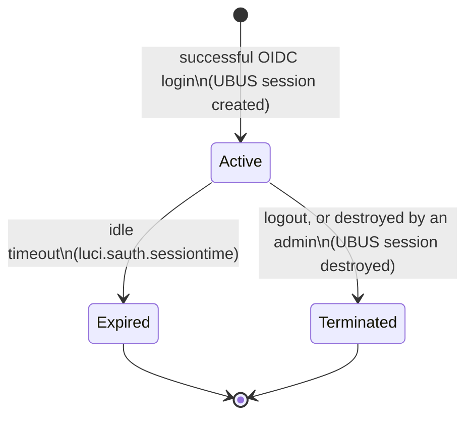

# About the Session Lifecycle

After a successful login, `luci-sso` creates a LuCI session and hands the browser a session cookie. Understanding what that session is, how long it lasts, and when it ends matters for anyone reasoning about access control on the router.


```mermaid
stateDiagram-v2
    [*] --> Active : successful OIDC login\n(UBUS session created)
    Active --> Expired : idle timeout\n(luci.sauth.sessiontime)
    Active --> Terminated : logout, or destroyed by an admin\n(UBUS session destroyed)
    Expired --> [*]
    Terminated --> [*]
```

**Textual summary:** A session begins when the OIDC flow completes and UBUS creates the session record. From that point it either expires after LuCI's idle timeout (one hour by default, regardless of IdP token expiry) or is terminated immediately by a logout or by an administrator destroying it. Mid-session IdP revocation has no effect — the session continues until one of these two endpoints is reached. Multiple independent sessions can be active simultaneously.

---

## What a session is

`luci-sso` does not create local user accounts. There is no entry in `/etc/passwd`, no stored password, no local identity record. Instead, after a successful OIDC flow, it calls UBUS to create a **UBUS session** — an in-memory record managed by `rpcd` — and injects the user's ACLs and a CSRF token into it. The session's user name is `sso:` followed by the role's name, and its ACLs are exactly what `rpcd` would grant a password login with that role's entry, `luci_sso_<role>` in `/etc/config/rpcd`. [About Roles and Permissions](roles-and-permissions.md) explains why.

The browser receives a `sysauth_https` cookie (and the legacy `sysauth`) containing the UBUS session ID. Every subsequent LuCI request presents this cookie; `rpcd` looks up the session and enforces the ACLs. From LuCI's perspective, an OIDC-authenticated user is indistinguishable from a password-authenticated one.

---

## Why the session lifetime follows LuCI, not the IdP

The session is created with LuCI's own session timeout, `luci.sauth.sessiontime` in `/etc/config/luci`: the same value LuCI passes to `rpcd` for a password login, so SSO and password sessions behave alike. OpenWrt ships it as `3600`; if the option is missing or not a positive integer, `luci-sso` uses 3600.

This is an **idle** timeout, not a hard cap. `rpcd` resets it every time the session is used, so an active user stays logged in and a session expires only after that many seconds without any LuCI request. To change it:

```bash
uci set luci.sauth.sessiontime='1800'
uci commit luci
```

The new value applies to sessions created after the change.

The IdP's ID Token carries its own `exp` claim, which `luci-sso` validates at login time — an expired token is rejected before a session is created. But once the session exists, `luci-sso` does not re-read the token's `exp` on subsequent requests. A token with a 5-minute expiry does not shorten the session to 5 minutes, and a token with a 24-hour expiry does not change it either.

The reason for decoupling session length from token expiry is the architectural constraint of the CGI model. `luci-sso` runs as a CGI script, not a daemon. There is no background process watching for token expiry and terminating sessions, and LuCI does not call `luci-sso` on later page loads, so nothing could re-check the tokens there. Doing so would also mean a back-channel call to the IdP on every request, which is expensive for an embedded router and introduces a new failure mode if the IdP is temporarily unreachable. Reusing LuCI's idle timeout keeps SSO sessions as long-lived as password sessions, without that cost.

The tokens themselves are kept. The access, refresh and ID tokens from the login are stored in the `rpcd` session, next to the user's email, for as long as the session lives. `luci-sso` only ever reads the ID token back, as the `id_token_hint` of an RP-Initiated Logout; it never refreshes or re-validates the others.

---

## What happens if the IdP revokes access mid-session

Nothing, immediately. `luci-sso` validates OIDC claims once, at login. If the IdP revokes a user's account or removes them from a group after they have logged in, the active LuCI session is not affected. The user retains their access until the session expires or they log out.

This is a known, documented residual risk. The mitigation available to administrators is to end the user's sessions on the router, which takes effect immediately: each SSO session is labelled with the user's email, so it can be found and destroyed without touching anyone else's. [How to Configure Role-Based Access Control](../how-to/sysadmin/rbac.md#change-access-for-users-already-logged-in) shows the commands. The idle timeout also bounds the exposure window, but only once the session stops being used: an attacker who keeps using a stolen session keeps it alive.

---

## Logout mechanics

LuCI's own **Log out** menu entry is the way users log out. For a session created through SSO it leads to `/cgi-bin/luci-sso/logout`; for any other session it does exactly what it always did. `luci-sso` does this by overriding the menu entry's action, not by patching LuCI (see [About the Architecture](architecture.md#session-integration)).

When a browser is sent to `/cgi-bin/luci-sso/logout` with a live session (without one, it is simply sent to `/`):

1. The CSRF token is verified — the request must include the `stoken` parameter matching the session's CSRF token.
2. The UBUS session is destroyed. The `sysauth_https` and `sysauth` cookies are cleared with `Max-Age=0`, both at `Path=/` and at LuCI's own `Path=/cgi-bin/luci`.
3. If the IdP's discovery document advertises an HTTPS `end_session_endpoint`, the browser is redirected there with the stored ID token as `id_token_hint` and the router's own origin as `post_logout_redirect_uri`, as defined by [OpenID Connect RP-Initiated Logout 1.0](https://openid.net/specs/openid-connect-rpinitiated-1_0.html). Otherwise the browser is sent to `/`.

Destroying the UBUS session is immediate and complete — the session ID in the cookie becomes invalid the moment `rpcd` processes the destroy call. A browser holding a stale cookie after logout will be rejected on the next LuCI request.

The `end_session_endpoint` redirect is best-effort: if the IdP does not support it, the user is logged out of the router but remains authenticated at the IdP. A subsequent "Login with SSO" click will complete immediately without prompting for credentials again.

A password session never reaches this endpoint: its **Log out** runs LuCI's own logout, which destroys the session and returns to the login page.

---

## Session storage

UBUS sessions live entirely in `rpcd`'s memory. They are not written to disk and do not survive a reboot or a restart of `rpcd`.

A *reload* of `rpcd` keeps them. On a reload, `rpcd` keeps every session and its values, and rebuilds each session's rights from the login entry in `/etc/config/rpcd` whose user name matches the session's. A password session gets its user's rights back. An SSO session, named `sso:<role>`, gets the rights of its role's entry. Reloads happen more often than one might think: some LuCI packages reload `rpcd` when they are installed, and `luci-sso` reloads it itself whenever a role's permissions are saved, so a permission change reaches the role's open sessions within a second or so.

The rebuild has two consequences worth knowing. A session keeps the role it was given at login: changing a role's emails or groups moves nobody until they log in again. And a session whose entry is gone, because its role was deleted or the package removed, comes back with no rights at all.

The `luci-sso` package reloads `rpcd` when it is installed, upgraded or removed; it never restarts it. Sessions created before the upgrade that moved role permissions into `rpcd` are the exception. They carry the bare role name as their user name, which matches no `sso:` entry, so at that upgrade's reload they lose their rights and their users log in again. A role named like an existing login, such as `root`, would instead get that login's rights at the reload, which is one of the problems the move to `sso:` names fixes; ending such sessions before the upgrade avoids it. See [How to Upgrade luci-sso](../how-to/sysadmin/upgrade.md) and [How to Remove luci-sso](../how-to/sysadmin/uninstall.md).

Multiple simultaneous sessions are allowed. Each login creates a new independent UBUS session with its own ID and idle timeout. `rpcd` can list every session with its values, and SSO sessions carry the user's email as `oidc_user`, so an administrator can find one user's sessions and destroy just those. Restarting `rpcd`, rather than reloading it, evicts every session, password logins included.

---

## Summary

| Property | Value |
| :--- | :--- |
| Session store | UBUS / `rpcd` (in-memory) |
| Session lifetime | Idle timeout from `luci.sauth.sessiontime` (default 3600 s), reset on every request |
| Token expiry effect | Validated at login only; does not shorten or extend session |
| Mid-session IdP revocation | Session continues until expiry, logout, or an administrator destroys it |
| Logout scope | Destroys the router session; for SSO sessions, also ends the IdP session if the IdP supports RP-Initiated Logout |
| Persistence across reboots | No — UBUS sessions are in-memory |
| Persistence across a `luci-sso` upgrade | Yes — the upgrade reloads `rpcd`, which keeps sessions (except sessions from before role permissions moved to `rpcd`) |
| Effect of an `rpcd` reload (e.g. installing a LuCI app, saving a role) | Every session stays; its rights are rebuilt from its `rpcd` login entry |
| Effect of removing `luci-sso` | SSO sessions stay open with no rights; password sessions lose only the SSO settings ACL |
