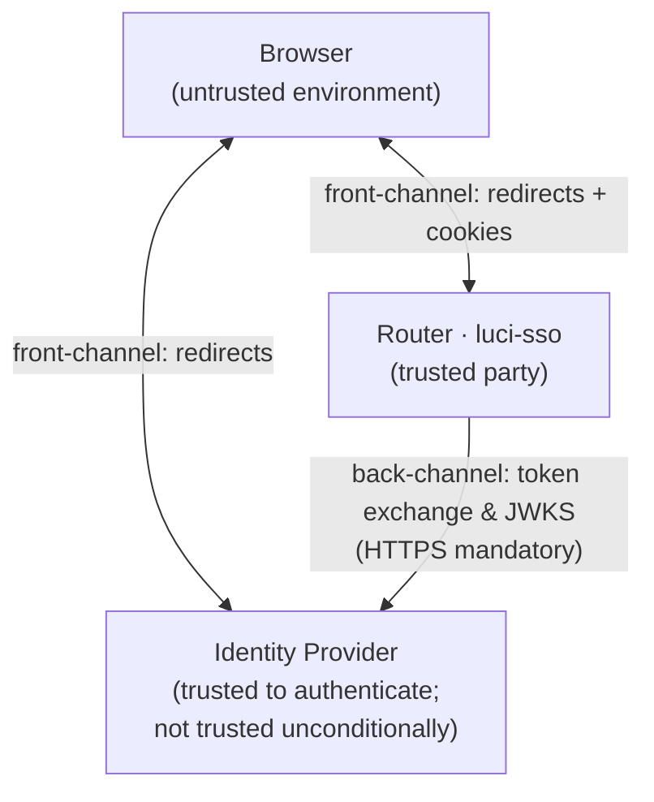

# About the Threat Model

A router's admin interface is a high-value target. Whoever controls LuCI controls the network: DNS, firewall rules, routing, VPN tunnels. `luci-sso` sits directly in front of that access, which means its failure modes are not abstract — a broken authentication implementation hands an attacker the network.

This document describes the landscape of threats that shaped the design, how each is addressed, and where residual risk remains. It pairs with the [Security Model](security-model.md), which explains the specific cryptographic mechanisms; and with [About the OIDC Login Flow](oidc-flow.md), which traces the sequence of events for each login.

---

## The attack surface

`luci-sso` operates at the boundary between three parties that do not fully trust each other:

- **The browser** is an untrusted environment. Browser history, extensions, local scripts, injected JavaScript, and logged HTTP requests can all observe anything that passes through a URL — including redirect parameters. The browser also runs code from arbitrary origins unless strict Content Security Policy headers prevent it.

- **The identity provider** is trusted to authenticate users correctly but is not trusted to issue arbitrary tokens that the router accepts without verification. A misconfigured, compromised, or rogue IdP should not be able to forge access to the router.

- **The network** between the router and the IdP is assumed to be untrusted. HTTPS is mandatory for all back-channel communication for exactly this reason — the router enforces it in code and refuses to proceed if any endpoint URL uses plain HTTP.

The router itself is the trusted party. All security-critical state (PKCE verifiers, nonces, handshake files, the token registry) lives only on the router.

**Textual summary:** The browser communicates with both the router and the IdP via front-channel redirects — these pass through the untrusted browser environment. The router's back-channel communication to the IdP (discovery, token exchange, JWKS and UserInfo fetches) bypasses the browser entirely and is protected by mandatory HTTPS. Security-critical state never leaves the router.

---

## Authorization code injection

When a user clicks "Login with SSO", the router generates an authorization code challenge and redirects the browser to the IdP. The IdP authenticates the user and redirects back with a short-lived authorization code. An attacker who obtains that code — perhaps by observing a shared browser, logging redirect URLs, or using a CSRF-style trick to force another user's browser to submit the attacker's code — has a potential entry point.

PKCE closes this. The router generates a random `code_verifier`, keeps it on the router filesystem, and sends only a SHA256 hash of it (`code_challenge`) to the IdP. When the code is exchanged for tokens, the router must present the verifier — and only the router has it. An intercepted code is worthless without the verifier, which never left the router.

CSRF is separately prevented by the `state` parameter. The router generates a random state value, binds it to the browser session via a cookie, and checks the returned `state` at callback time using constant-time comparison. This ensures the callback request was initiated by the same browser that started the flow, not injected by a third party.

---

## Token replay

An attacker who captures a valid ID Token — from a logged network segment, a browser extension, or a compromised IdP response — might attempt to present it in a different session, perhaps after the legitimate user has logged out.

The `nonce` prevents this. The router generates a random nonce at flow initiation, embeds it in the authorization request, and the IdP must include it verbatim in the ID Token. The router verifies the nonce against the stored handshake state before accepting the token. Because the handshake file is deleted atomically at the moment of first use, the nonce can only be verified once — a replayed token with the same nonce finds no matching handshake to validate against.

Once the ID Token has been verified, the SHA256 hash of the access token is registered in the token registry (`/var/run/luci-sso/tokens/`). This is a distinct layer of protection: if a token response carrying an access token that was already used for a valid login arrives again, the login fails with `TOKEN_REPLAYED` because the hash is already registered. A daily job removes entries older than 24 hours, and the router logs a warning when an access token's lifetime exceeds that window.

---

## Access token substitution

The token exchange is a back-channel request from the router to the IdP's token endpoint. An attacker with man-in-the-middle capability on that back-channel could, in theory, let the ID Token through unchanged while substituting a different access token.

Two things stand in the way. First, the back channel is HTTPS, and the router checks the IdP's certificate, so an attacker needs the IdP's certificate or a CA the router trusts before they can change the response at all.

Second, the `at_hash` claim binds the two tokens. When the IdP puts it in the ID Token, it holds the base64url-encoded first half of the SHA-256 of the access token. The router recomputes this value from the access token it received and compares the two with constant-time equality. If the access token has been substituted, the check fails and the login is rejected.

OIDC Core makes `at_hash` optional in the authorization code flow, and some IdPs, such as Authentik, never send it. For those IdPs the binding is missing, and the router accepts the ID Token without it. The gap is small. The ID Token and the access token arrive together, in one response to a request the router made itself, over the same verified TLS connection. The router never uses the access token to decide who the user is. It registers the token against replay, stores it in the session, and sends it with the one UserInfo request that fills in a missing email. That request is bound too: the `sub` UserInfo returns must equal the ID Token's `sub`, or the login fails with `IDENTITY_MISMATCH`. So a substituted access token cannot change who the router thinks the user is.

---

## Timing side-channels

Security-critical string comparisons — nonce verification, state verification, `at_hash` verification, logout CSRF token verification — all use a constant-time equality function. On an embedded device where cryptographic operations are measurable, a naive `==` comparison would leak information through timing: an attacker probing whether the first byte matches, then the second, could potentially reconstruct secret values by measuring response latency.

Constant-time comparison removes this signal by making the comparison's running time independent of how many bytes match. The implementation, `constant_time_eq()` in `crypto/base.uc`, is ucode, not C: it XOR-accumulates over the longer input without early exit. An interpreted runtime cannot guarantee exact constant time, so this is a best-effort mitigation, which the source documents.

---

## Memory corruption in the C bridge

The native C bridge verifies RS256 and ES256 signatures, turns the IdP's JWK key material into PEM keys, and computes SHA-256 and HMAC; JWT and JWK parsing happen in ucode before it. The bridge's inputs — signatures, signed data and key material from the IdP — are attacker-controlled if the IdP or the connection to it is. A memory safety bug in this code could allow an attacker who controls the IdP to achieve arbitrary code execution on the router.

The bridge is hardened at multiple levels. All input is length-checked before any parsing begins: ucode refuses ID tokens over 16 KB, `mod/native_api.c` rejects any input over 16 KB (`NATIVE_MAX_INPUT_SIZE`) before a backend sees it, and the backends keep their own bounds checks. EC public keys are validated (coordinate length, curve membership) and RSA keys limited to the 65537 exponent and at least 2048 bits. Buffers in C that held secret-derived data, such as HMAC outputs and random bytes, are wiped before the functions return.

Coverage-guided fuzz testing exercises the bridge's entry points with every backend whenever the C code changes, and the native and crypto tests then also run under AddressSanitizer and UndefinedBehaviorSanitizer to catch out-of-bounds reads and writes. The goal is not to eliminate all possible bugs — that is impossible to guarantee — but to make exploitation difficult and ensure that common classes of memory error are caught before they reach a release.

---

## Privilege of an SSO session

A signed-in user must get exactly what their role allows, no more. `luci-sso` creates the LuCI session itself, so it also decides its rights. It grants exactly what `rpcd` would grant a password login with the role's entry in `/etc/config/rpcd`, by expanding each access group's ACL file the same way `rpcd` does. Nothing is added. A role with `*` in both lists gets what `root` gets.

Two risks shaped this.

**Drift from rpcd.** If `luci-sso`'s expansion ever differed from `rpcd`'s, SSO sessions could quietly get more or less than intended. And `rpcd` rebuilds every session from its login entry when it reloads, so any difference would also change a session's rights at the next reload. A system test compares an SSO session with a real `rpcd` password login for several role shapes in CI, on each supported OpenWrt release, and fails on any difference. Another checks that an SSO session keeps exactly its rights across a reload.

**Borrowing another login's rights.** `rpcd` matches a session to a login entry by user name alone. An SSO session is therefore named `sso:<role>`, a name no password login uses, and its entry is written only through the `luci-sso` ubus object, which touches `luci_sso_*` sections only. A role named `root` gets a session named `sso:root`, which never receives `root`'s rights. The entries never carry a password, so they cannot be used to log in; an entry that has one is refused at login with `INSECURE_RPCD_LOGIN`. [About Roles and Permissions](roles-and-permissions.md) describes the design.

---

## Denial of service

An unauthenticated attacker can initiate login flows by sending requests to the `/` endpoint. Each request writes a handshake state file and, whenever the cached discovery document has expired, makes a network connection to the IdP. Without a rate limit, this would allow an attacker to exhaust router memory, fill `/var/run/`, or keep the router busy with CGI processes.

Three defences work together, and each is designed so that the attacker's traffic cannot take down other users' logins.

**Per-client rate limits.** Each client (its source address; the `/64` for IPv6) may start at most 10 logins per 5 minutes and make at most 30 requests per minute. The callback and logout count only toward the second budget. One busy or hostile client is refused with `429` and a `Retry-After` header, and everyone else is unaffected. There is deliberately no router-wide budget: a shared counter is exactly what would let one client lock everybody out. The router-wide backstop for CPU is uhttpd's own cap on concurrent CGI processes.

**A bounded handshake table that never evicts live logins.** At most 500 logins can be in progress at once. When the table is full, only handshakes that can no longer be completed (past their expiry plus clock tolerance) are removed. If every slot holds a live handshake, the *new* login is refused with `503`. Users already at the IdP keep their place.

**Callbacks cannot cancel someone else's login.** The handshake cookie is `SameSite=Lax`, so a cross-site link to `/callback` carries it. The router compares the returned `state` before consuming the handshake, so such a link with a made-up `state` gets `403` and the victim's pending login is untouched.

The `?action=enabled` probe is exempt from rate limiting — it reads a single UCI value and produces no side effects, so it is safe to poll from monitoring scripts.

**Residual risk.** An attacker who controls many addresses, or many IPv6 `/64`s, gets a separate budget for each. With about 50 of them, each starting 10 logins, they can fill the 500-slot handshake table and keep it full, blocking *new* SSO logins for as long as the flood lasts. Logins already in progress survive, and password login at `/cgi-bin/luci` is unaffected, so administrators are never locked out.

**Reverse proxies.** Behind a reverse proxy, `REMOTE_ADDR` is the proxy's address, so every client shares one budget. That is no worse than the old global counter. `X-Forwarded-For` is deliberately not trusted: any client can set it, so honouring it would let an attacker choose a fresh budget per request.

---

## What is out of scope

Some threats exist that `luci-sso` cannot address on its own:

**IdP compromise.** If the identity provider itself is compromised, an attacker who controls it can issue arbitrary tokens that pass all of `luci-sso`'s verification. The nonce, PKCE, and `at_hash` checks all assume the IdP is behaving correctly. Defence against a fully compromised IdP requires additional layers outside the scope of this project — for example, network segmentation that limits what a compromised router can reach.

**Physical access to the router.** An attacker with physical access to the router can read UCI configuration (including the client secret), mount the filesystem, or reset to factory defaults. luci-sso does not protect against physical access; that is an operational security concern.

**TLS failure.** All back-channel security assumes the router correctly verifies the IdP's TLS certificate. If the router's CA bundle is corrupted or if the TLS verification is bypassed (for example, by `curl -k` in a custom script), the guarantee that the router is talking to the real IdP is lost. luci-sso enforces HTTPS at the URL level; the underlying TLS library must be correctly configured.

**Session without logout.** UBUS sessions persist in router memory. A user who closes the browser **without** logging out leaves the session alive until the idle timeout, and anyone who has the session cookie can use it until then. Logout destroys the UBUS session on the router, so the cookie becomes worthless as soon as the router processes the logout request. LuCI's **Log out** entry does this for every session; for SSO sessions it goes through `luci-sso`'s `/logout`, which also ends the IdP session when the IdP supports it.
