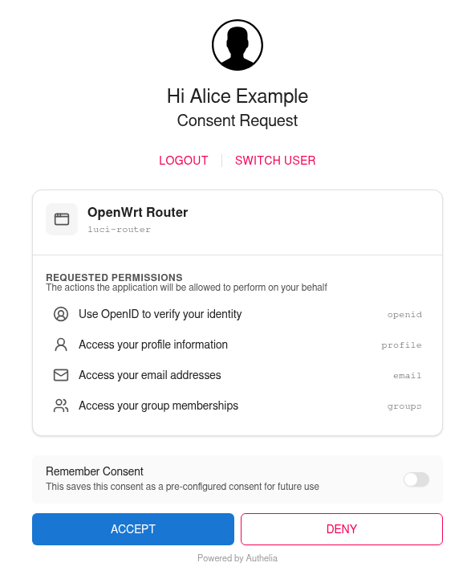

# How to Configure Authelia

This guide describes how to connect `luci-sso` to an [Authelia](https://www.authelia.com/) instance.

The configuration and screenshot were checked against Authelia 4.39.28. Key names can differ in other releases.

---

## 1. Register an OIDC client in Authelia

Generate a client secret and its hash:

```bash
authelia crypto hash generate pbkdf2 --variant sha512 --random --random.length 72 --random.charset rfc3986
```

The command prints a `Random Password` (the plaintext secret, for the router) and a `Digest` (the hash, for Authelia). To hash a secret you already have, use `--password '<your-secret>'` in place of the three `--random` options. If Authelia runs in Docker, prefix the command with `docker run --rm authelia/authelia:latest`.

Add the client to your Authelia `configuration.yml`, with the digest as `client_secret`:

```yaml
identity_providers:
  oidc:
    claims_policies:
      luci_sso:
        id_token: ['email', 'email_verified', 'name', 'groups']
    clients:
      - client_id: luci-router
        client_name: OpenWrt Router
        client_secret: '$pbkdf2-sha512$310000$...'  # the Digest, not the plaintext
        public: false
        authorization_policy: one_factor
        redirect_uris:
          - https://<YOUR_ROUTER_IP_OR_DOMAIN>/cgi-bin/luci-sso/callback
        scopes:
          - openid
          - profile
          - email
          - groups
        userinfo_signed_response_alg: none
        token_endpoint_auth_method: client_secret_post
        claims_policy: luci_sso
```

`luci-sso` sends the client secret in the token request body (`client_secret_post`). Keep the `token_endpoint_auth_method` line: without it, Authelia accepts only `client_secret_basic` and rejects the router's token request with HTTP 401.

By default Authelia leaves `email` and `groups` out of the ID Token and returns them only from its UserInfo endpoint. `luci-sso` then fetches UserInfo on every login, which works while `userinfo_signed_response_alg` is `none` (the default). The `luci_sso` claims policy puts them in the ID Token, so no UserInfo request is needed. Keep `email_verified` in its list: an email in the ID Token counts for role matching only with the ID Token's own `email_verified` claim (see [Map by email](#map-by-email)).

Optional settings for the client:

- `require_pkce: true` and `pkce_challenge_method: S256` make Authelia refuse any login without PKCE. `luci-sso` always sends an S256 challenge.
- Authelia asks the user to consent on every login. To let users tick **Remember Consent**, add `consent_mode: pre-configured` and `pre_configured_consent_duration: 1y` (any duration).



Restart Authelia after saving the configuration: it reads the file only at start.

---

## 2. Configure the router

The **Client Secret** is the **plaintext** secret — Authelia stores the hash, but the router presents the plaintext during token exchange.

=== "Browser (LuCI)"

    Navigate to **Services > Single Sign-On**.

    Fill in the **Settings** section:

    | Field | Value |
    | :--- | :--- |
    | **Enable SSO** | On |
    | **Issuer URL** | `https://auth.example.com` |
    | **Client ID** | `luci-router` |
    | **Client Secret** | Your plaintext secret |
    | **Redirect URI** | `https://<YOUR_ROUTER_IP_OR_DOMAIN>/cgi-bin/luci-sso/callback` |
    | **Scopes** | `openid profile email groups` |
    | **Clock Tolerance** | `60` |

    The Redirect URI must exactly match the value in the Authelia client config.

    Click **Save & Apply**.

=== "Terminal (SSH)"

    ```bash
    uci set luci-sso.default.issuer_url='https://auth.example.com'
    uci set luci-sso.default.client_id='luci-router'
    uci set luci-sso.default.client_secret='<YOUR_PLAINTEXT_SECRET>'
    uci set luci-sso.default.redirect_uri='https://<YOUR_ROUTER_IP_OR_DOMAIN>/cgi-bin/luci-sso/callback'
    uci set luci-sso.default.scope='openid profile email groups'
    uci set luci-sso.default.clock_tolerance='60'
    uci set luci-sso.default.enabled='1'
    uci commit luci-sso
    ```

    The `redirect_uri` must exactly match the value in the Authelia client config.

The **Issuer URL** is the `authelia_url` of the session cookie that covers Authelia's domain in `configuration.yml`, exactly: same host and port, no path and no trailing slash. Authelia answers discovery requests for other host names with HTTP 400.

---

## 3. Configure role mapping

A role says which users it matches, by email or by group. What the role may do on the router is its `rpcd` login entry. On a fresh install, the shipped `admin` role grants full access. To give some users less, add a role with its own **Read Access** and **Write Access**, as described in [How to Configure Role-Based Access Control](../sysadmin/rbac.md). A user gets the first role that matches, from the top.

### Map by email

=== "Browser (LuCI)"

    Navigate to **Services > Single Sign-On** and scroll to the **Users** section.

    Click **Edit** in the `admin` row. In **Email Addresses**, replace the placeholder `admin@example.com` with the user's email address, then click **Save** in the editor.

    Click **Save & Apply**.

=== "Terminal (SSH)"

    ```bash
    uci -q del_list luci-sso.admin.email='admin@example.com'
    uci add_list luci-sso.admin.email='user@example.com'
    uci commit luci-sso
    ```

An email matches only if Authelia marks it as verified, with `email_verified: true` next to it. Authelia does so for every user, but only where it sends the email: in UserInfo, or in the ID Token when the claims policy lists `email_verified`. With a claims policy that lists `email` without `email_verified`, the login fails with `[403] USER_NOT_AUTHORIZED` unless a group matches. Authelia does not check addresses itself, so `true` means the address in its user database, which an administrator controls.

### Map by group

Authelia returns the user's groups from its authentication backend (file or LDAP) in the `groups` claim: in the ID Token with the `luci_sso` claims policy from Step 1, otherwise through UserInfo. The group name must exactly match the name as Authelia returns it (case-sensitive).

=== "Browser (LuCI)"

    Navigate to **Services > Single Sign-On** and scroll to the **Users** section.

    Click **Edit** in the `admin` row. In **Groups**, enter the group name, then click **Save** in the editor.

    Click **Save & Apply**.

=== "Terminal (SSH)"

    ```bash
    uci add_list luci-sso.admin.group='router-admins'
    uci commit luci-sso
    ```

---

## 4. Verify

Check that the service is active. On the router:

--8<-- "probe-enabled.md"

Navigate to the LuCI login page. The **Login with SSO** button should appear. Clicking it redirects to your Authelia instance. After the user signs in, Authelia shows the consent page from Step 1, then returns to the router.

Authelia has no end-session endpoint, so LuCI's **Log out** ends the router session only. The Authelia session stays, and the next **Login with SSO** does not ask for a password. To end the Authelia session too, open `https://auth.example.com/logout`.

---

## Troubleshooting

--8<-- "check-log.md"

| Symptom | Likely cause |
| :--- | :--- |
| `[502] OIDC_DISCOVERY_FAILED`, preceded by `Discovery fetch failed for [id: …]: …` | The router cannot reach `auth.example.com`; the end of the line names the cause. Test from the router with `uclient-fetch -q -O - 'https://auth.example.com/.well-known/openid-configuration'`. If the line ends in `HTTP_REQUEST_FAILED (CERT_UNTRUSTED)`, the router does not trust Authelia's certificate; see [How to Install a Private CA Certificate](../sysadmin/install-ca-certificate.md). |
| `[502] OIDC_DISCOVERY_FAILED`, preceded by `Discovery fetch HTTP 400 from [id: …]` | `issuer_url` is not the `authelia_url` of any session cookie in Authelia's configuration (a different host name, a port, or an IP address). Authelia logs `no session cookie configuration matches url '…'`. Set `issuer_url` to the `authelia_url` exactly. |
| `[502] OIDC_DISCOVERY_FAILED`, preceded by `DISCOVERY_ISSUER_MISMATCH: issuer_url is "…" but the discovery document declares "…"` | `issuer_url` differs from the issuer Authelia declares, even if only by a trailing slash or letter case. Copy the declared value into `issuer_url` exactly. |
| `[500] CONFIG_ERROR`, preceded by `Configuration rejected: redirect_uri is mandatory and must use HTTPS` | `redirect_uri` was never saved. Set it with `uci set luci-sso.default.redirect_uri='https://<YOUR_ROUTER_IP_OR_DOMAIN>/cgi-bin/luci-sso/callback'` and `uci commit luci-sso`. Other `Configuration rejected` reasons name the option to fix. |
| Authelia shows "An error occurred processing the request" with the hint "The 'redirect_uri' parameter does not match any of the OAuth 2.0 Client's pre-registered 'redirect_uris'" | The `redirect_uri` in UCI does not exactly match a `redirect_uris` entry in Authelia's client config. The router logs no `OIDC callback received` line. |
| `[502] TOKEN_EXCHANGE_FAILED`, preceded by `Token exchange HTTP 401` | Authelia rejected the client credentials: the client secret is wrong (UCI needs the plaintext, Authelia the hash), or the client config has no `token_endpoint_auth_method: client_secret_post` line (Authelia logs `… is configured to only support 'token_endpoint_auth_method' method 'client_secret_basic'`). |
| `UserInfo fallback failed [session_id: …]: USERINFO_INVALID_JSON`, then `[403] USER_NOT_AUTHORIZED` | Authelia returned a signed UserInfo response, which `luci-sso` cannot read, so the email and groups it carries are lost. Set `userinfo_signed_response_alg: none` on the client, or add the `luci_sso` claims policy from Step 1 so that UserInfo is not needed, and restart Authelia. |
| `[403] USER_NOT_AUTHORIZED`, preceded by `Ignoring the unverified email of user [sub_id: …] for role matching` | The claims policy puts `email` in the ID Token without `email_verified`. Add `'email_verified'` to its `id_token` list, as in Step 1, and restart Authelia. |
| `[403] USER_NOT_AUTHORIZED`, preceded by `User [sub_id: …] matched no roles` | The user's email or group does not match any configured role. Email matching ignores case; group matching is case-sensitive, so check the group name exactly. |

For a full list of error codes, see the [Log Messages Reference](../../reference/log-messages.md). For every check `luci-sso` makes of an identity provider, and the error each failure logs, see [Provider Compatibility](../../reference/provider-compatibility.md).
