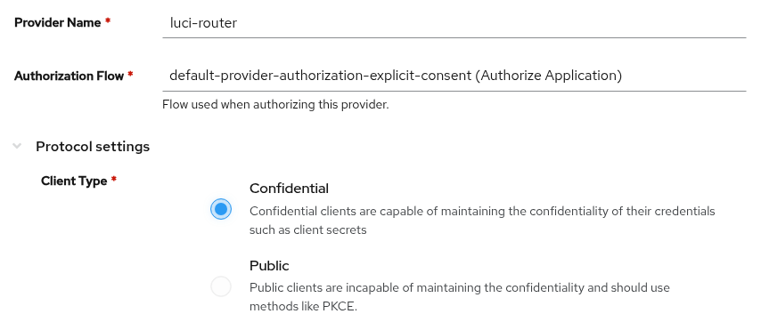
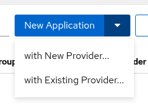
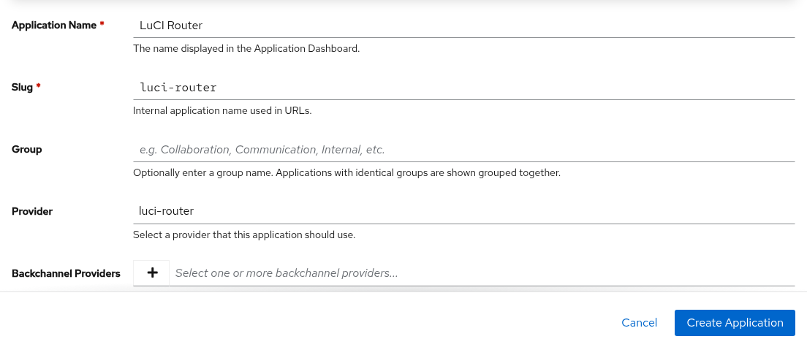

# How to Configure Authentik

This guide describes how to connect `luci-sso` to an [Authentik](https://goauthentik.io/) instance.

Authentik uses a two-step setup: you create a **Provider** (the OAuth2/OIDC configuration) and then an **Application** that exposes it. Both are required.

The steps and screenshots were checked against Authentik 2026.8.3. Labels can differ in other releases.

---

## 1. Create an OAuth2/OpenID Connect provider

Log in to the Authentik admin interface and open **Applications > Providers**. Click **New Provider**, select **OAuth2/OpenID Provider**, and click **Next** if the form does not open by itself.

| Field | Value |
| :--- | :--- |
| **Provider Name** | `luci-router` |
| **Authorization Flow** | `default-provider-authorization-explicit-consent` (users confirm once), or `default-provider-authorization-implicit-consent` (no confirmation page). The field is required and has no default. |
| **Client Type** | `Confidential` (the default) |



Further down the same form:

| Field | Value |
| :--- | :--- |
| **Redirect URIs/Origins (RegEx)** | Click **Add entry**. Leave **Strict** and **Authorization**, and enter `https://<YOUR_ROUTER_IP_OR_DOMAIN>/cgi-bin/luci-sso/callback`. Click **Add entry** again, set the type to **Post Logout**, and enter `https://<YOUR_ROUTER_IP_OR_DOMAIN>/`, with the trailing slash, so that LuCI's **Log out** returns to the router. |
| **Signing Key** | `authentik Self-signed Certificate` (preselected). Do not clear it: without a signing key, Authentik signs ID Tokens with `HS256`, which `luci-sso` rejects. |


Copy the **Client ID** and **Client Secret** shown in the form, then click **Create**. The provider's detail page shows only the Client ID. To see the secret later, click **Edit**, then **Modify** next to **Client Secret**.

Optional: to make LuCI's **Log out** also end the Authentik session, open **Advanced flow settings** and set **Invalidation Flow** to `default-invalidation-flow`. With the default, `default-provider-invalidation-flow`, the user stays signed in to Authentik, and the next SSO login does not ask for a password.

---

## 2. Create an Application

Open **Applications > Applications**. Click the arrow next to **New Application** and choose **with Existing Provider...**. The **New Application** button itself opens a wizard that creates a second provider.



| Field | Value |
| :--- | :--- |
| **Application Name** | `LuCI Router` |
| **Slug** | `luci-router`. Authentik fills this in from the name as `lu-ci-router`; replace it. |
| **Provider** | `luci-router`, the provider from Step 1 |



Click **Create Application**. The slug becomes part of the issuer URL.

---

## 3. Find your issuer URL

The issuer URL for Authentik includes the application slug and ends with a trailing slash. `issuer_url` must match it exactly, slash included:

```
https://<YOUR_AUTHENTIK_HOST>/application/o/<APPLICATION_SLUG>/
```

Using the slug `luci-router` from Step 2:

```
https://authentik.example.com/application/o/luci-router/
```

Verify the router can fetch the discovery document. On the router:

```bash
uclient-fetch -q -O - 'https://authentik.example.com/application/o/luci-router/.well-known/openid-configuration'
```

A certificate error here means the router does not trust Authentik's certificate; see [How to Install a Private CA Certificate](../sysadmin/install-ca-certificate.md).

---

## 4. Configure the router

=== "Browser (LuCI)"

    Navigate to **Services > Single Sign-On**.

    Fill in the **Identity provider** section:

    | Field | Value |
    | :--- | :--- |
    | **Issuer URL** | `https://authentik.example.com/application/o/luci-router/` |
    | **Client ID** | Your Client ID from Step 1 |
    | **Client Secret** | Your Client Secret from Step 1 |
    | **Redirect URI** | `https://<YOUR_ROUTER_IP_OR_DOMAIN>/cgi-bin/luci-sso/callback` |
    | **Scopes** | `openid profile email` |
    | **Enable SSO** | On |

    Before you save, click **Test connection**, above **Enable SSO**, and check that every line reads **Pass**; a line that fails says what to fix. See [Test the connection](../sysadmin/configure-in-luci.md#3-test-the-connection).

    Click **Save & Apply**.

=== "Terminal (SSH)"

    ```bash
    uci set luci-sso.default.issuer_url='https://authentik.example.com/application/o/luci-router/'
    uci set luci-sso.default.client_id='<YOUR_CLIENT_ID>'
    uci set luci-sso.default.client_secret='<YOUR_CLIENT_SECRET>'
    uci set luci-sso.default.redirect_uri='https://<YOUR_ROUTER_IP_OR_DOMAIN>/cgi-bin/luci-sso/callback'
    uci set luci-sso.default.scope='openid profile email'
    uci set luci-sso.default.enabled='1'
    uci commit luci-sso
    ```

---

## 5. Configure role mapping

A role says which users it matches, by email or by group. What the role may do on the router is its `rpcd` login entry. On a fresh install, the shipped `admin` role grants full access. To give some users less, add a role with its own **Read access** and **Write access**, as described in [How to Configure Role-Based Access Control](../sysadmin/rbac.md). A user gets the first role that matches, from the top.

### Map by email

=== "Browser (LuCI)"

    Navigate to **Services > Single Sign-On** and scroll to the **Roles** section.

    Click **Edit** in the `admin` row. In **Emails**, replace the placeholder `admin@example.com` with the user's email address, then click **Save** in the editor.

    Click **Save & Apply**.

=== "Terminal (SSH)"

    ```bash
    uci -q del_list luci-sso.admin.email='admin@example.com'
    uci add_list luci-sso.admin.email='user@example.com'
    uci commit luci-sso
    ```

An email matches only if Authentik marks it as verified (`email_verified: true`). Since 2025.10, Authentik's default `email` scope mapping always sends `false`, so the login fails with `[403] USER_NOT_AUTHORIZED` unless a group matches. To send `true`, replace that mapping with your own:

1. Open **Customization > Property Mappings**, click **Create**, select **Scope Mapping**, and click **Next**.
2. Set **Name** to `luci-sso email`, **Scope name** to `email`, and **Expression** to:

    ```python
    return {"email": request.user.email, "email_verified": True}
    ```

    Click **Finish**.

3. Open the `luci-router` provider, click **Edit**, and open **Advanced protocol settings**. Under **Scopes**, move **authentik default OAuth Mapping: OpenID 'email'** out of **Selected Scopes** and move `luci-sso email` in. Click **Update**.

This mapping vouches for every address, as Authentik's own [documentation](https://docs.goauthentik.io/add-secure-apps/providers/oauth2/#email-scope-verification) warns: Authentik has no record of which addresses were checked. It is right when only administrators set addresses, for example when enrollment flows and user settings do not let users change their email. The same documentation suggests keeping a verified flag in a user attribute and returning `request.user.attributes.get("email_verified", False)` instead.

If you would rather not add the mapping, map by group instead, or turn the check off:

--8<-- "email-verified-off.md"

With the check off, an email rule matches any address the IdP sends, verified or not. Do this only if users cannot set their own address at Authentik; see [About Roles and Permissions](../../explanation/roles-and-permissions.md#verified-email-addresses).

### Map by group

Authentik puts the user's group names in the `groups` claim of the ID Token through the **authentik default OAuth Mapping: OpenID 'profile'** scope mapping. It is selected by default; check that it is still under **Selected Scopes** in the provider's **Advanced protocol settings > Scopes**. Each value is the group's **Name** exactly as shown in **Directory > Groups** (case-sensitive).

Authentik delivers group memberships through the `profile` scope, so no separate `groups` scope is required (it is already set in Step 4).

=== "Browser (LuCI)"

    Navigate to **Services > Single Sign-On** and scroll to the **Roles** section.

    Click **Edit** in the `admin` row. In **Groups**, enter the group name, then click **Save** in the editor.

    Click **Save & Apply**.

=== "Terminal (SSH)"

    ```bash
    uci add_list luci-sso.admin.group='router-admins'
    uci commit luci-sso
    ```

---

## 6. Verify

Check that the service is active. On the router:

--8<-- "probe-enabled.md"

Navigate to the LuCI login page. The **Login with SSO** button should appear. Clicking it redirects to your Authentik login screen. With the explicit-consent flow, Authentik then asks the user to confirm once before it returns to the router.

To check logout, sign in with SSO and click **Log out** in LuCI. The browser passes through Authentik and returns to `https://<YOUR_ROUTER_IP_OR_DOMAIN>/`. If you set **Invalidation Flow** to `default-invalidation-flow` in step 1, the next **Login with SSO** asks for the password again. With the default flow, Authentik keeps its session and signs the user straight back in.

---

## Troubleshooting

--8<-- "check-log.md"

| Symptom | Likely cause |
| :--- | :--- |
| A message under **Login with SSO** says "The identity provider is not responding" | The browser cannot reach the IdP; the router has no error to log. Open `https://authentik.example.com/application/o/luci-router/.well-known/openid-configuration` in the same browser, on the same device. See [The SSO button says the identity provider is not responding](../sysadmin/debugging.md#the-sso-button-says-the-identity-provider-is-not-responding). |
| `[502] OIDC_DISCOVERY_FAILED`, preceded by `DISCOVERY_ISSUER_MISMATCH: issuer_url is "…" but the discovery document declares "…"` | Authentik declares a different issuer than `issuer_url`. If the declared issuer has no `/application/o/<slug>/` path, the provider's **Issuer mode** is "Same identifier is used for all providers": set it back to "Each provider has a different issuer, based on the application slug". If only the host name differs, the router reached Authentik under another name (for example through `internal_issuer_url`); Authentik builds its issuer from the host name in the request. If the two differ only in the trailing slash, add it: Authentik's issuer ends with `/`. |
| `[502] OIDC_DISCOVERY_FAILED`, preceded by `Discovery fetch HTTP 404 from [id: …]` | The application slug in the URL is wrong, or the Application was not created (only the Provider). Verify both the Provider and Application exist in Authentik. Authentik fills the slug in from the application name (`LuCI Router` becomes `lu-ci-router`). |
| `[500] CONFIG_ERROR`, preceded by `Configuration rejected: <reason>` | A required option is missing or invalid; the reason names it. `redirect_uri is mandatory and must use HTTPS` means `redirect_uri` was never saved: set it with `uci set luci-sso.default.redirect_uri='https://<YOUR_ROUTER_IP_OR_DOMAIN>/cgi-bin/luci-sso/callback'` and `uci commit luci-sso`. |
| `[502] JWKS_FETCH_FAILED`, preceded by `JWKS JSON parse error: Invalid structure` | The provider has no **Signing Key**, so Authentik publishes no keys and signs ID Tokens with `HS256`. Select `authentik Self-signed Certificate` as the **Signing Key**. If the router cached the old keys, the error is `ID_TOKEN_VERIFICATION_FAILED` with `UNSUPPORTED_ALGORITHM` instead, with the same fix. |
| `[502] TOKEN_EXCHANGE_FAILED`, preceded by `Token exchange HTTP 400` | Authentik rejected the client secret. Copy it again from the provider (**Edit**, then **Modify** next to **Client Secret**). |
| Authentik shows "Redirect URI Error" | The router's `redirect_uri` does not exactly match the provider's **Authorization** redirect URI. |
| After LuCI's **Log out**, Authentik shows "Bad Request" or "You've logged out of LuCI Router" instead of returning to the router | No **Post Logout** redirect URI matches `https://<YOUR_ROUTER_IP_OR_DOMAIN>/`, trailing slash included. |
| `[403] USER_NOT_AUTHORIZED`, preceded by `Ignoring the unverified email of user [sub_id: …] for role matching` | Authentik's default `email` scope mapping sends `email_verified: false`. Replace it as described in [Map by email](#map-by-email). |
| `[403] USER_NOT_AUTHORIZED`, preceded by `User [sub_id: …] matched no roles` | The `groups` claim is empty. In the Authentik provider settings, confirm the **profile** scope is selected under **Advanced protocol settings > Scopes**, and that the user belongs to the mapped group. |
| `[502] OIDC_DISCOVERY_FAILED`, preceded by `Discovery fetch failed for [id: …]: HTTP_REQUEST_FAILED (CERT_UNTRUSTED)` | The router does not trust Authentik's TLS certificate. See [How to Install a Private CA Certificate](../sysadmin/install-ca-certificate.md). |

For a full list of error codes, see the [Log Messages Reference](../../reference/log-messages.md). For every check `luci-sso` makes of an identity provider, and the error each failure logs, see [Provider Compatibility](../../reference/provider-compatibility.md).
