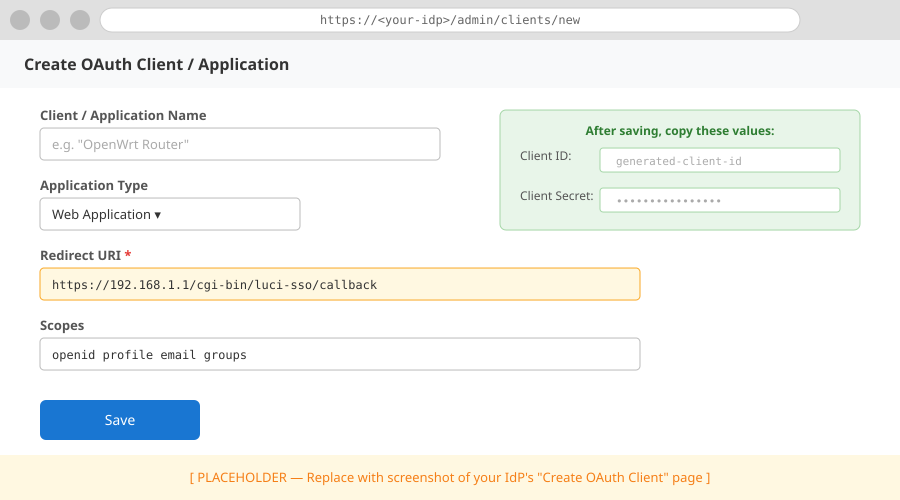
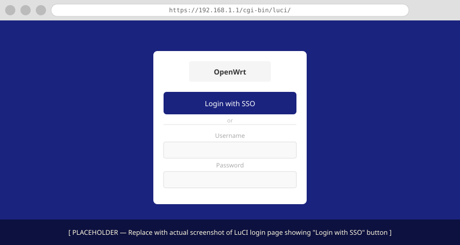

# How to Configure a Generic OIDC Provider

This guide covers connecting `luci-sso` to any standards-compliant OIDC provider — Azure AD, Okta, Dex, Zitadel, or others. If your provider has a dedicated guide in the sidebar (Google, GitHub, Authelia, Keycloak, Authentik, Pocket ID), use that instead; it covers provider-specific setup steps and gotchas.

---

## Prerequisites

Your identity provider must support:

- **OIDC Core 1.0** — authorization code flow with `/.well-known/openid-configuration` discovery
- **PKCE** (RFC 7636) — `S256` method. `luci-sso` requires PKCE; providers that only support the `plain` method or no PKCE at all will not work.
- **RS256 or ES256** signatures for ID Tokens. HS256 is not accepted.

If your provider requires PKCE to be explicitly enabled on the client, enable it before proceeding.

---

## Step 1: Find your issuer URL

The issuer URL is the base URL of your provider's OIDC configuration. It must serve a discovery document at `<issuer_url>/.well-known/openid-configuration`.

Common patterns:

| Provider | Issuer URL pattern |
| :--- | :--- |
| Azure AD | `https://login.microsoftonline.com/<tenant-id>/v2.0` |
| Okta | `https://<org>.okta.com` or `https://<org>.okta.com/oauth2/<server>` |
| Dex | `https://dex.example.com` |
| Zitadel | `https://zitadel.example.com` |

Verify the discovery endpoint is reachable before proceeding:

```bash
curl -s https://<issuer_url>/.well-known/openid-configuration | python3 -m json.tool
```

The response should be a JSON document containing `authorization_endpoint`, `token_endpoint`, and `jwks_uri`.

---

## Step 2: Register luci-sso as an OAuth client

In your IdP's admin interface, create a new OAuth2 / OIDC client (sometimes called an "Application" or "Relying Party").



Set the following values:

| Field | Value |
| :--- | :--- |
| **Application type** | Web application (confidential client) |
| **Redirect URI** | `https://<YOUR_ROUTER_IP_OR_DOMAIN>/cgi-bin/luci-sso/callback` |
| **Scopes** | `openid profile email` — add `groups` if you want group-based role mapping |

After saving, copy the generated **Client ID** and **Client Secret**.

---

## Step 3: Configure the router

!!! note
    Router configuration is not yet available in the LuCI web interface. Use SSH for the steps below.

A minimal working configuration:

```bash
uci set luci-sso.default.issuer_url='https://<your-issuer-url>'
uci set luci-sso.default.client_id='<YOUR_CLIENT_ID>'
uci set luci-sso.default.client_secret='<YOUR_CLIENT_SECRET>'
uci set luci-sso.default.redirect_uri='https://<YOUR_ROUTER_IP_OR_DOMAIN>/cgi-bin/luci-sso/callback'
uci set luci-sso.default.scope='openid profile email'
uci set luci-sso.default.clock_tolerance='60'
uci set luci-sso.default.enabled='1'
uci commit luci-sso
```

For all available options (including `internal_issuer_url` for split-horizon setups), see the [UCI Configuration Reference](../../reference/uci-config.md).

---

## Step 4: Configure role mapping

After a successful login, `luci-sso` maps the user's OIDC claims to a LuCI role. Without a matching role, the user is denied access even if authentication succeeds.

!!! note
    Role configuration is not yet available in the LuCI web interface. Use SSH for the steps below.

### Map by email

```bash
uci add_list luci-sso.admin.email='user@example.com'
uci commit luci-sso
```

### Map by group

If your IdP returns a `groups` claim (requires the `groups` scope and IdP-side group claim mapping):

```bash
uci add_list luci-sso.admin.group='router-admins'
uci commit luci-sso
```

The role name (`admin` above) must match a `config role` section in `/etc/config/luci-sso`. The default installation creates an `admin` role with full read and write access. For fine-grained access control, see the [UCI Configuration Reference](../../reference/uci-config.md#role-mapping).

---

## Step 5: Verify

Check that the service is active:

```bash
curl -sk https://localhost/cgi-bin/luci-sso?action=enabled
# Expected: {"enabled":true}
```

Then open the LuCI login page in a browser.



The **Login with SSO** button should appear. Clicking it redirects to your IdP's login screen. After authenticating, you should be redirected back to the LuCI dashboard.

---

## Troubleshooting

If the login fails, check the system log:

=== "Browser (LuCI)"

    Navigate to **Status > System Log** and filter for `luci-sso`.

=== "Terminal (SSH)"

    ```bash
    logread -e luci-sso
    ```

Common errors and their meaning are listed in the [Log Messages Reference](../../reference/log-messages.md). The most frequent issues with new providers are:

- **`DISCOVERY_ISSUER_MISMATCH`** — The `issuer_url` you configured doesn't exactly match the `issuer` field in the discovery document. Copy the value from the discovery JSON directly.
- **`UNSUPPORTED_ALGORITHM`** — The IdP is signing tokens with HS256. Configure the client to use RS256 or ES256.
- **`USER_NOT_AUTHORIZED`** — Authentication succeeded but no UCI role matched the user's email or groups (the log line before this code will say "matched no roles"). Add the user's email with `uci add_list luci-sso.admin.email='...'`.
- **`OIDC_DISCOVERY_FAILED`** — The router cannot reach the IdP. Check DNS resolution and firewall rules from the router (not just from your laptop).
