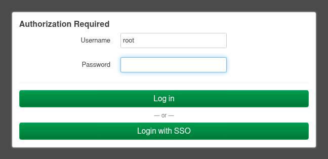

# How to Configure a Generic OIDC Provider

This guide covers connecting `luci-sso` to any standards-compliant OIDC provider — Azure AD, Okta, Dex, Zitadel, or others. If your provider has a dedicated guide in the sidebar (Google, Authelia, Keycloak, Authentik, Pocket ID), use that instead; it covers provider-specific setup steps and gotchas.

---

## Prerequisites

Your identity provider must support:

- **OIDC Core 1.0** — authorization code flow with `/.well-known/openid-configuration` discovery
- **PKCE** (RFC 7636) — `S256` method. `luci-sso` requires PKCE; providers that only support the `plain` method or no PKCE at all will not work.
- **RS256 or ES256** signatures for ID Tokens. HS256 is not accepted.
- **A confidential client** with a client secret, accepted in the token request body (`client_secret_post`).

These are the requirements providers most often miss. The complete list, with the error each failure logs and the status of known providers, is in [Provider Compatibility](../../reference/provider-compatibility.md).

If your provider requires PKCE to be explicitly enabled on the client, enable it before proceeding.

---

## Step 1: Find your issuer URL

The issuer URL is the base URL of your provider's OIDC configuration. It must serve a discovery document at `<issuer_url>/.well-known/openid-configuration`.

Common patterns:

| Provider | Issuer URL pattern |
| :--- | :--- |
| Azure AD | `https://login.microsoftonline.com/<tenant-id>/v2.0` |
| Okta | `https://<org>.okta.com` or `https://<org>.okta.com/oauth2/<server>` |
| Dex | `https://dex.example.com` |
| Zitadel | `https://zitadel.example.com` |

Verify the router can fetch the discovery document before proceeding. On the router:

```bash
uclient-fetch -q -O - '<issuer_url>/.well-known/openid-configuration' | jsonfilter -e '@.issuer' -e '@.authorization_endpoint' -e '@.token_endpoint' -e '@.jwks_uri'
```

The command should print four HTTPS URLs. The first is the issuer: your `issuer_url` must match it exactly, character for character, including any trailing slash. A certificate error means the router does not trust the IdP's certificate; see [How to Install a Private CA Certificate](../../how-to/sysadmin/install-ca-certificate.md).

---

## Step 2: Register luci-sso as an OAuth client

In your IdP's admin interface, create a new OAuth2 / OIDC client (sometimes called an "Application" or "Relying Party").

Set the following values:

| Field | Value |
| :--- | :--- |
| **Application type** | Web application (confidential client) |
| **Token endpoint authentication** | `client_secret_post` (client ID and secret in the request body), if the IdP asks |
| **Redirect URI** | `https://<YOUR_ROUTER_IP_OR_DOMAIN>/cgi-bin/luci-sso/callback` |
| **Scopes** | `openid profile email` — add `groups` if you want group-based role mapping |
| **Post-logout redirect URI** | `https://<YOUR_ROUTER_IP_OR_DOMAIN>/`, if the IdP supports RP-Initiated Logout and asks for one |

Give the client any name you will recognise, such as `LuCI Router`. After saving, the IdP shows the generated **Client ID** and **Client Secret**; copy both.

---

## Step 3: Configure the router

=== "Browser (LuCI)"

    Navigate to **Services > Single Sign-On**.

    Fill in the **Identity provider** section:

    | Field | Value |
    | :--- | :--- |
    | **Issuer URL** | `https://<your-issuer-url>` |
    | **Client ID** | Your Client ID from Step 2 |
    | **Client Secret** | Your Client Secret from Step 2 |
    | **Redirect URI** | `https://<YOUR_ROUTER_IP_OR_DOMAIN>/cgi-bin/luci-sso/callback` |
    | **Scopes** | `openid profile email` |
    | **Enable SSO** | On |

    For split-horizon setups, also fill in **Internal Issuer URL**. See [How to Configure Split-Horizon Networking](../../how-to/sysadmin/split-horizon.md).

    Before you save, click **Test connection**, above **Enable SSO**, and check that every line reads **Pass**; a line that fails says what to fix. See [Test the connection](../sysadmin/configure-in-luci.md#3-test-the-connection).

    Click **Save & Apply**.

=== "Terminal (SSH)"

    A minimal working configuration:

    ```bash
    uci set luci-sso.default.issuer_url='https://<your-issuer-url>'
    uci set luci-sso.default.client_id='<YOUR_CLIENT_ID>'
    uci set luci-sso.default.client_secret='<YOUR_CLIENT_SECRET>'
    uci set luci-sso.default.redirect_uri='https://<YOUR_ROUTER_IP_OR_DOMAIN>/cgi-bin/luci-sso/callback'
    uci set luci-sso.default.scope='openid profile email'
    uci set luci-sso.default.clock_tolerance='60'
    uci set luci-sso.default.enabled='1'
    uci commit luci-sso
    ```

For all available options (including `internal_issuer_url` for split-horizon setups), see the [UCI Configuration Reference](../../reference/uci-config.md).

---

## Step 4: Configure role mapping

After a successful login, `luci-sso` maps the user's OIDC claims to a LuCI role. Without a matching role, the user is denied access even if authentication succeeds.

### Map by email

=== "Browser (LuCI)"

    Navigate to **Services > Single Sign-On** and scroll to the **Roles** section.

    Click **Edit** on the `admin` role. (If it is gone, type `admin` next to **Add**, click **Add**, and put `*` in **Read access** and **Write access**.) In the modal, enter the email address in **Emails**, then click **Save**.

    Click **Save & Apply**.

=== "Terminal (SSH)"

    ```bash
    uci add_list luci-sso.admin.email='user@example.com'
    uci commit luci-sso
    ```

An email matches only if the IdP marks it as verified: `email_verified` is the JSON boolean `true`, not the string `"true"`, in the same response as the email, the ID Token or UserInfo. Many IdPs send `false` for an address an administrator entered, or leave the claim out. Check the IdP's settings for a per-user "email verified" flag, or a claim mapping that adds `email_verified`. If the IdP cannot send `true`, map by group instead, or turn the check off:

--8<-- "email-verified-off.md"

With the check off, an email rule matches any address the IdP sends, verified or not. Do this only if users cannot set their own address at the IdP; see [About Roles and Permissions](../../explanation/roles-and-permissions.md#verified-email-addresses).

### Map by group

If your IdP returns a `groups` claim (requires the `groups` scope and IdP-side group claim mapping):

=== "Browser (LuCI)"

    Navigate to **Services > Single Sign-On** and scroll to the **Roles** section.

    Click **Edit** on the `admin` role. (If it is gone, type `admin` next to **Add**, click **Add**, and put `*` in **Read access** and **Write access**.) In the modal, enter the group name in **Groups**, then click **Save**.

    Click **Save & Apply**.

=== "Terminal (SSH)"

    ```bash
    uci add_list luci-sso.admin.group='router-admins'
    uci commit luci-sso
    ```

The role name (`admin` above) must match a `config role` section in `/etc/config/luci-sso`. The default installation creates an `admin` role whose `rpcd` login entry grants full read and write access; check it with `ubus call luci-sso list_roles`. A user who matches several roles gets the first one. For other roles and their permissions, see [How to Configure Role-Based Access Control](../sysadmin/rbac.md).

---

## Step 5: Verify

Check that the service is active. On the router:

--8<-- "probe-enabled.md"

Then open the LuCI login page in a browser.



The **Login with SSO** button should appear. Clicking it redirects to your IdP's login screen. After authenticating, you should be redirected back to the LuCI dashboard.

---

## Troubleshooting

If the login fails, check the system log:

--8<-- "check-log.md"

Common errors and their meaning are listed in the [Log Messages Reference](../../reference/log-messages.md). The most frequent issues with new providers are:

- **A message under Login with SSO says "The identity provider is not responding"** — The browser cannot reach the IdP; the router has no error to log. Open `<issuer_url>/.well-known/openid-configuration` in the same browser, on the same device. See [The SSO button says the identity provider is not responding](../sysadmin/debugging.md#the-sso-button-says-the-identity-provider-is-not-responding).
- **`[502] OIDC_DISCOVERY_FAILED` after a `DISCOVERY_ISSUER_MISMATCH` line** — The `issuer_url` you configured doesn't match the `issuer` field in the discovery document. The line shows both values; set `issuer_url` to the one the document declares, exactly. The line says so when a trailing slash, letter case or `:443` is the only difference.
- **`[401] ID_TOKEN_VERIFICATION_FAILED`** — The `OAuth flow failed` line before it names the failed check. `UNSUPPORTED_ALGORITHM` means the IdP signs tokens with HS256 or another algorithm: configure the client to use RS256 or ES256. `AT_HASH_MISMATCH` means the ID Token's `at_hash` does not match the access token the IdP returned.
- **`[403] USER_NOT_AUTHORIZED` after `User [sub_id: …] matched no roles`** — Authentication succeeded but no UCI role matched the user's `sub`, email or groups. Email matching ignores case; group and `sub` matching do not. Add the user's email with `uci add_list luci-sso.admin.email='...'`, or the `sub` the error page shows with `uci add_list luci-sso.admin.sub='...'`.
- **`[403] USER_NOT_AUTHORIZED` after `Ignoring the unverified email of user [sub_id: …] for role matching`** — The IdP sent the email without `email_verified: true`, so it did not count. See [Map by email](#map-by-email).
- **`[500] UBUS_LOGIN_FAILED` after a `MISSING_RPCD_LOGIN` line** — The matched role has no `rpcd` login entry, so it has no permissions. Save the role's permissions on the settings page, or with `ubus call luci-sso set_role`; see [How to Configure Role-Based Access Control](../sysadmin/rbac.md).
- **`[502] OIDC_DISCOVERY_FAILED` after `Discovery fetch failed for [id: …]: …`** — The router cannot reach the IdP. The end of the line names the cause, such as `HTTP_REQUEST_FAILED (CERT_UNTRUSTED)`. Check DNS resolution and firewall rules from the router (not just from your laptop).
- **`[502] OIDC_DISCOVERY_FAILED` after a `DISCOVERY_MISSING_ENDPOINT` or `INSECURE_ENDPOINT` line** — The discovery document lacks `authorization_endpoint`, `token_endpoint` or `jwks_uri`, or one of them is not HTTPS. The line names the field.
- **`[500] CONFIG_ERROR` after `Configuration rejected: <reason>`** — A required option is missing or invalid; the reason names it. `redirect_uri is mandatory and must use HTTPS` means `redirect_uri` was never saved. Set it with `uci set luci-sso.default.redirect_uri='https://<YOUR_ROUTER_IP_OR_DOMAIN>/cgi-bin/luci-sso/callback'` and `uci commit luci-sso`.
- **`[502] TOKEN_EXCHANGE_FAILED` after `Token exchange HTTP 401`** (some IdPs answer 400) — The IdP rejected the client credentials. Check `client_id` and `client_secret`, and that the client accepts `client_secret_post`.
- **The IdP shows its own error page instead of a login screen** — The IdP rejected the authorization request, so the browser never returns to the router and the log has no `OIDC callback received` line. The usual cause is a Redirect URI that does not exactly match the one registered in Step 2.
- **`[400] IDP_ERROR` after `IDP_ERROR: the IdP returned error=<error> (<description>)`** — The IdP refused the login and sent the browser back with an error. The line gives the IdP's reason, for example `access_denied` when the user is not allowed to use the client.
- **The IdP shows an error after LuCI's Log out** — For an SSO session, **Log out** ends the router session and sends the browser to the IdP's `end_session_endpoint` with `id_token_hint` and `post_logout_redirect_uri=https://<YOUR_ROUTER_IP_OR_DOMAIN>/` (the origin of `redirect_uri`). Register that URL at the IdP as a post-logout redirect URI. If the discovery document has no `end_session_endpoint`, the browser goes to `/` and the IdP session stays, so the next **Login with SSO** completes without asking for credentials.
