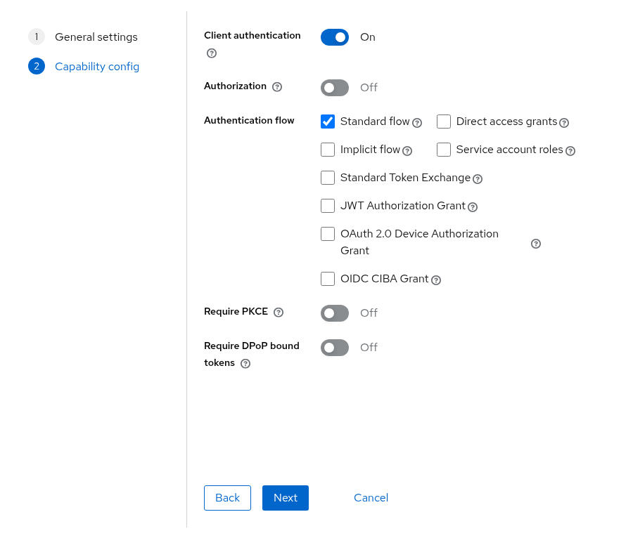
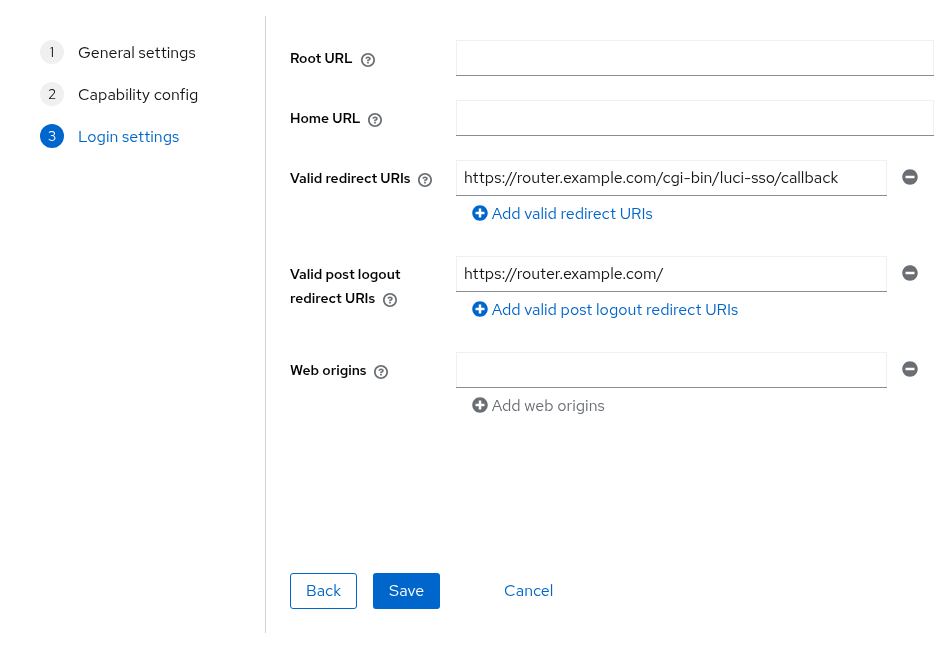
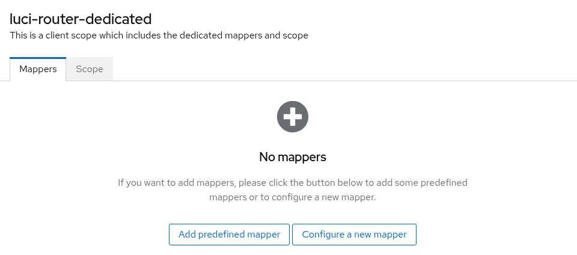
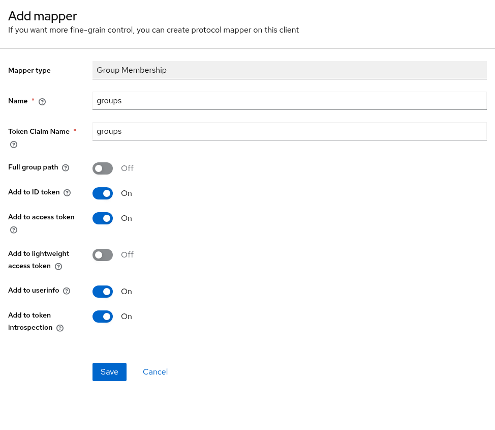

# How to Configure Keycloak

This guide describes how to connect `luci-sso` to a [Keycloak](https://www.keycloak.org/) instance.

The steps and screenshots were checked against Keycloak 26.7.4. Labels can differ in other releases.

---

## 1. Create an OIDC client in Keycloak

Log in to your Keycloak admin console, click **Manage realms**, and click the realm you want to use (or **Create realm**).

Navigate to **Clients** and click **Create client**.

| Field | Value |
| :--- | :--- |
| **Client type** | `OpenID Connect` |
| **Client ID** | `luci-router` (or any label you prefer) |

Click **Next**. On the **Capability config** step:

| Field | Value |
| :--- | :--- |
| **Client authentication** | On (this makes the client confidential) |
| **Authorization** | Off |
| **Authentication flow** | Leave **Standard flow** checked |
| **Require PKCE** | Optional. `luci-sso` always sends an S256 challenge, so turning it on is safe. |

If **Client authentication** is off, Keycloak treats the client as public and ignores the secret. Keep it on.



Click **Next**. On the **Login settings** step:

| Field | Value |
| :--- | :--- |
| **Valid redirect URIs** | `https://<YOUR_ROUTER_IP_OR_DOMAIN>/cgi-bin/luci-sso/callback` |
| **Valid post logout redirect URIs** | `https://<YOUR_ROUTER_IP_OR_DOMAIN>/` (where LuCI's **Log out** returns after ending the Keycloak session) |



Keycloak does not fall back to the redirect URIs for logout: without a **Valid post logout redirect URIs** entry, LuCI's **Log out** stops at a Keycloak error page and the Keycloak session stays open.

Click **Save**.

Go to the **Credentials** tab of the newly created client and copy the **Client Secret**.

---

## 2. Find your issuer URL

The issuer URL includes the realm name. In the Keycloak admin console, navigate to **Realm settings** and click **OpenID Endpoint Configuration** next to **Endpoints**. The `issuer` field of that document is the issuer URL. It has the form:

```
https://<YOUR_KEYCLOAK_HOST>/realms/<YOUR_REALM_NAME>
```

Keycloak 17 and later has no `/auth` prefix. Realm names are case-sensitive.

Verify the router can fetch the discovery document before proceeding. On the router:

```bash
uclient-fetch -q -O - 'https://<YOUR_KEYCLOAK_HOST>/realms/<YOUR_REALM_NAME>/.well-known/openid-configuration'
```

A certificate error here means the router does not trust Keycloak's certificate; see [How to Install a Private CA Certificate](../sysadmin/install-ca-certificate.md).

---

## 3. Configure the router

=== "Browser (LuCI)"

    Navigate to **Services > Single Sign-On**.

    Fill in the **Settings** section:

    | Field | Value |
    | :--- | :--- |
    | **Enable SSO** | On |
    | **Issuer URL** | `https://<YOUR_KEYCLOAK_HOST>/realms/<YOUR_REALM_NAME>` |
    | **Client ID** | `luci-router` |
    | **Client Secret** | Your Client Secret from Step 1 |
    | **Redirect URI** | `https://<YOUR_ROUTER_IP_OR_DOMAIN>/cgi-bin/luci-sso/callback` |
    | **Scopes** | `openid profile email` |

    Click **Save & Apply**.

=== "Terminal (SSH)"

    ```bash
    uci set luci-sso.default.issuer_url='https://<YOUR_KEYCLOAK_HOST>/realms/<YOUR_REALM_NAME>'
    uci set luci-sso.default.client_id='luci-router'
    uci set luci-sso.default.client_secret='<YOUR_CLIENT_SECRET>'
    uci set luci-sso.default.redirect_uri='https://<YOUR_ROUTER_IP_OR_DOMAIN>/cgi-bin/luci-sso/callback'
    uci set luci-sso.default.scope='openid profile email'
    uci set luci-sso.default.enabled='1'
    uci commit luci-sso
    ```

---

## 4. Configure role mapping

A role says which users it matches, by email or by group. What the role may do on the router is its `rpcd` login entry. On a fresh install, the shipped `admin` role grants full access. To give some users less, add a role with its own **Read Access** and **Write Access**, as described in [How to Configure Role-Based Access Control](../sysadmin/rbac.md). A user gets the first role that matches, from the top.

### Map by email

=== "Browser (LuCI)"

    Navigate to **Services > Single Sign-On** and scroll to the **Users** section.

    Click **Edit** in the `admin` row. In **Email Addresses**, replace the placeholder `admin@example.com` with the user's email address, then click **Save** in the editor.

    Click **Save & Apply**.

=== "Terminal (SSH)"

    ```bash
    uci -q del_list luci-sso.admin.email='admin@example.com'
    uci add_list luci-sso.admin.email='user@example.com'
    uci commit luci-sso
    ```

An email matches only if Keycloak marks it as verified (`email_verified: true`). Keycloak sends each user's **Email verified** setting, which is off for a user an administrator creates. For each user you map by email, do one of the following:

- Open **Users**, select the user, turn on **Email verified** on the **Details** tab, and click **Save**.
- To have users confirm their address, turn on **Verify email** in **Realm settings > Login**. Keycloak then emails a link at the next sign-in, which needs an SMTP server in **Realm settings > Email**.
- For users from LDAP or another identity provider, turn on **Trust Email** in that provider's settings.

Otherwise the login fails with `[403] USER_NOT_AUTHORIZED` unless a group matches. If you cannot mark the addresses verified, map by group instead, or turn the check off:

--8<-- "email-verified-off.md"

With the check off, an email rule matches any address the IdP sends, verified or not. Do this only if users cannot set their own address at Keycloak; see [About Roles and Permissions](../../explanation/roles-and-permissions.md#verified-email-addresses).

### Map by group

Keycloak sends group membership only when the client has a mapper for it. In the Keycloak admin console:

1. Open the client you created in Step 1.
2. Go to the **Client scopes** tab and click the dedicated scope, `luci-router-dedicated`.
3. Click **Configure a new mapper** (or, if the scope already has mappers, **Add mapper > By configuration**), then choose **Group Membership**.

    

4. Set **Name** to `groups`, set **Token Claim Name** to `groups`, and turn off **Full group path**, so the claim contains `router-admins`, not `/router-admins`. Leave **Add to ID token** on.

    

5. Click **Save**.

A mapper on the dedicated scope is added to every token issued to this client, so the router's **Scopes** stay `openid profile email`. Do not add `groups` to them: Keycloak has no client scope named `groups`, and it rejects the login with `invalid_scope`.

Then map the group on the router:

=== "Browser (LuCI)"

    Navigate to **Services > Single Sign-On** and scroll to **Users**. Click **Edit** in the `admin` row. In **Groups**, enter the group name, such as `router-admins`, then click **Save** in the editor.

    Click **Save & Apply**.

=== "Terminal (SSH)"

    ```bash
    uci add_list luci-sso.admin.group='router-admins'
    uci commit luci-sso
    ```

---

## 5. Verify

Check that the service is active. On the router:

--8<-- "probe-enabled.md"

Navigate to the LuCI login page. The **Login with SSO** button should appear. Clicking it redirects to your Keycloak login screen.

---

## Troubleshooting

--8<-- "check-log.md"

| Symptom | Likely cause |
| :--- | :--- |
| `[502] OIDC_DISCOVERY_FAILED`, preceded by `Discovery fetch HTTP 404 from [id: …]` | The realm path in `issuer_url` is wrong. Realm names are case-sensitive, and Keycloak 17 and later has no `/auth` prefix. |
| `[502] OIDC_DISCOVERY_FAILED`, preceded by `DISCOVERY_ISSUER_MISMATCH: issuer_url is "…" but the discovery document declares "…"` | Keycloak builds its issuer from its configured host name (the realm's **Frontend URL**, or the server's `hostname` option), which differs from the host in `issuer_url`. Copy the `issuer` field from the realm's `/.well-known/openid-configuration` document. |
| `[400] IDP_ERROR`, preceded by `IDP_ERROR: the IdP returned error=invalid_scope (Invalid scopes: …)` | The router's **Scopes** include a scope Keycloak does not have, usually `groups`. Remove it, or create a client scope with that name and add it to the client. |
| `[500] CONFIG_ERROR`, preceded by `Configuration rejected: <reason>` | A required option is missing or invalid; the reason names it. `redirect_uri is mandatory and must use HTTPS` means `redirect_uri` was never saved: set it with `uci set luci-sso.default.redirect_uri='https://<YOUR_ROUTER_IP_OR_DOMAIN>/cgi-bin/luci-sso/callback'` and `uci commit luci-sso`. |
| Keycloak shows `Invalid parameter: redirect_uri` instead of its login screen | The router's `redirect_uri` is not in the client's **Valid redirect URIs**. The router logs no `OIDC callback received` line. |
| `[502] TOKEN_EXCHANGE_FAILED`, preceded by `Token exchange HTTP 401` | Keycloak rejected the client credentials. Copy the **Client Secret** again from the client's **Credentials** tab, or click **Regenerate** there and update the router. |
| `[403] USER_NOT_AUTHORIZED`, preceded by `Ignoring the unverified email of user [sub_id: …] for role matching` | The user's **Email verified** setting is off, so the email did not count. Turn it on, or see [Map by email](#map-by-email) for the other ways. |
| `[403] USER_NOT_AUTHORIZED`, preceded by `User [sub_id: …] matched no roles` | Group mapping is missing or the mapper has **Full group path** enabled, so the claim contains `/my-group` instead of `my-group`. Either disable Full group path in the mapper or update the role config to match the full path. |
| `[502] OIDC_DISCOVERY_FAILED`, preceded by `Discovery fetch failed for [id: …]: HTTP_REQUEST_FAILED (CERT_UNTRUSTED)` | The router does not trust Keycloak's TLS certificate. See [How to Install a Private CA Certificate](../sysadmin/install-ca-certificate.md). |
| Keycloak shows `Invalid redirect uri` after LuCI's **Log out**, and the Keycloak session stays open | `https://<YOUR_ROUTER_IP_OR_DOMAIN>/` is not in the client's **Valid post logout redirect URIs**. Add it. |

For a full list of error codes, see the [Log Messages Reference](../../reference/log-messages.md). For every check `luci-sso` makes of an identity provider, and the error each failure logs, see [Provider Compatibility](../../reference/provider-compatibility.md).
