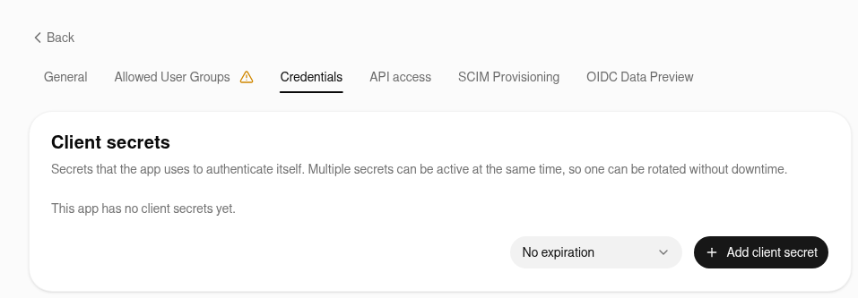
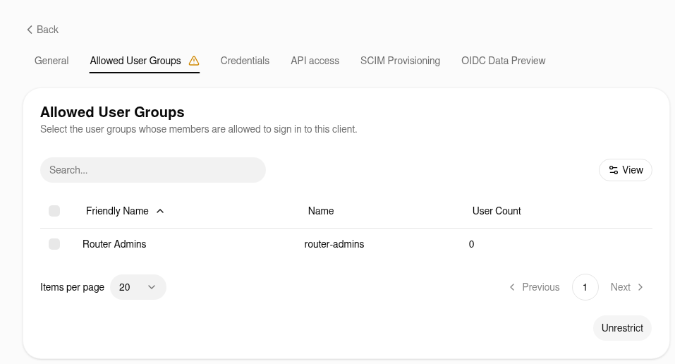
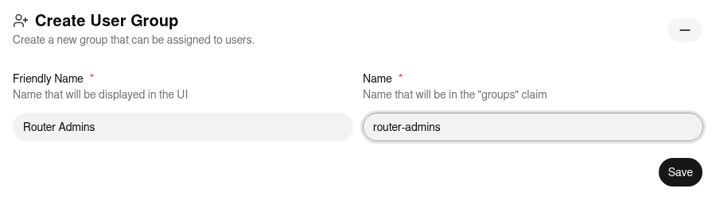

# How to Configure Pocket ID

This guide describes how to connect `luci-sso` to a [Pocket ID](https://pocket-id.org/) instance.

Pocket ID is a self-hosted OIDC provider built around passkeys — users authenticate with biometrics or hardware security keys instead of passwords. Users must have a passkey enrolled in Pocket ID before they can complete an SSO login on your router.

The steps and screenshots were checked against Pocket ID 2.16.0. Labels can differ in other releases.

---

## 1. Create an OIDC client in Pocket ID

Log in to Pocket ID as an administrator and open **Administration > OIDC Clients**. Click **Add OIDC Client** and fill in:

| Field | Value |
| :--- | :--- |
| **Name** | `luci-router` (or any label you prefer) |
| **Callback URLs** | Click **Add**, then enter `https://<YOUR_ROUTER_IP_OR_DOMAIN>/cgi-bin/luci-sso/callback` |
| **Logout Callback URLs** | Click **Add**, then enter `https://<YOUR_ROUTER_IP_OR_DOMAIN>/` (where LuCI's **Log out** returns after ending the Pocket ID session) |

Leave **Public Client** off: `luci-sso` is a confidential client and authenticates with a client secret. Turning on **PKCE** is optional; `luci-sso` always sends a PKCE challenge.


Click **Save**. Pocket ID opens the client's page, which shows the **Client ID**. Copy it.

Pocket ID does not create a client secret on its own. Open the **Credentials** tab and click **Add client secret**. Copy the secret now: Pocket ID shows it in full only until you leave the page.



Open the **Allowed User Groups** tab and choose who may sign in. A new client allows no group, so every login fails with "You are not allowed to access this service." until you do one of the following:

- Tick the groups whose members may sign in, then click **Save**.
- Click **Unrestrict** to let every Pocket ID user sign in, and control access with the router's role mapping (Step 3) instead.



---

## 2. Configure the router

=== "Browser (LuCI)"

    Navigate to **Services > Single Sign-On**.

    Fill in the **Settings** section:

    | Field | Value |
    | :--- | :--- |
    | **Enable SSO** | On |
    | **Issuer URL** | `https://id.example.com` |
    | **Client ID** | Your Client ID from Step 1 |
    | **Client Secret** | Your Client Secret from Step 1 |
    | **Redirect URI** | `https://<YOUR_ROUTER_IP_OR_DOMAIN>/cgi-bin/luci-sso/callback` |

    Replace `https://id.example.com` with the actual URL of your Pocket ID instance. The Redirect URI must exactly match the callback URL set in Step 1. The field suggests one built from your browser's address; check it before you save.

    Click **Save & Apply**.

=== "Terminal (SSH)"

    ```bash
    uci set luci-sso.default.issuer_url='https://id.example.com'
    uci set luci-sso.default.client_id='<YOUR_CLIENT_ID>'
    uci set luci-sso.default.client_secret='<YOUR_CLIENT_SECRET>'
    uci set luci-sso.default.redirect_uri='https://<YOUR_ROUTER_IP_OR_DOMAIN>/cgi-bin/luci-sso/callback'
    uci set luci-sso.default.enabled='1'
    uci commit luci-sso
    ```

    Replace `https://id.example.com` with the actual URL of your Pocket ID instance. The `redirect_uri` must exactly match the callback URL set in Step 1.

---

## 3. Configure role mapping

A role says which users it matches, by email or by group. What the role may do on the router is its `rpcd` login entry. On a fresh install, the shipped `admin` role grants full access. To give some users less, add a role with its own **Read Access** and **Write Access**, as described in [How to Configure Role-Based Access Control](../sysadmin/rbac.md). A user gets the first role that matches, from the top.

### Map by email

=== "Browser (LuCI)"

    Navigate to **Services > Single Sign-On** and scroll to the **Users** section.

    Click **Edit** in the `admin` row. In **Email Addresses**, replace the placeholder `admin@example.com` with the user's email address, then click **Save** in the editor.

    Click **Save & Apply**.

=== "Terminal (SSH)"

    ```bash
    uci -q del_list luci-sso.admin.email='admin@example.com'
    uci add_list luci-sso.admin.email='user@example.com'
    uci commit luci-sso
    ```

An email matches only if Pocket ID marks it as verified (`email_verified: true`). Pocket ID keeps a verified flag on each user, which is off for a user an administrator creates, so the login fails with `[403] USER_NOT_AUTHORIZED` unless a group matches. For each user you map by email, do one of the following:

- Open **Administration > Users** and edit the user. The envelope button next to **Email** is yellow while the address is unverified; click it (**Mark as verified**) so that it turns green, then save the user.
- To mark new addresses verified from the start, turn on **Emails verified by default** in **Administration > Application Configuration**, on the **Email** tab. It applies to addresses added or changed from then on, not to existing users.
- To have users confirm their address, turn on **Email Verification** on the same tab. Pocket ID then emails them a link, which needs an SMTP server.

Users synced from LDAP are always marked verified. Changing a user's email resets the flag to the **Emails verified by default** setting.

If you cannot mark the addresses verified, map by group instead, or turn the check off:

--8<-- "email-verified-off.md"

With the check off, an email rule matches any address the IdP sends, verified or not. Do this only if users cannot set their own address at Pocket ID; see [About Roles and Permissions](../../explanation/roles-and-permissions.md#verified-email-addresses).

### Map by group

Pocket ID sends a user's groups in the `groups` claim of the ID Token when the `groups` scope is requested. Each value is the group's **Name**, exactly as set in **Administration > User Groups**, not its **Friendly Name**. When you type a Friendly Name such as `Router Admins`, Pocket ID fills in `router_admins` as the Name, so check the Name before you use it in a role.



=== "Browser (LuCI)"

    Navigate to **Services > Single Sign-On**.

    In **Settings**, update **Scopes** to `openid profile email groups` and click **Save & Apply**.

    Scroll to **Users** and click **Edit** in the `admin` row. In **Groups**, enter the group's Name (for example `router-admins`), then click **Save** in the editor.

    Click **Save & Apply**.

=== "Terminal (SSH)"

    ```bash
    uci set luci-sso.default.scope='openid profile email groups'
    uci add_list luci-sso.admin.group='router-admins'
    uci commit luci-sso
    ```

---

## 4. Verify

Check that the service is active. On the router:

--8<-- "probe-enabled.md"

Open the LuCI login page at the host name used in the Redirect URI; the login fails with `MISSING_HANDSHAKE_COOKIE` if it starts at a different address. The **Login with SSO** button should appear. Clicking it opens Pocket ID's "Sign in to luci-router" page. Click **Sign in** and use your passkey. The first time, Pocket ID asks the user to approve the information the router requests (email, profile and, for group mapping, groups). It remembers the answer. To skip this approval, turn on **Skip Consent Screen** on the client.

---

## Troubleshooting

--8<-- "check-log.md"

| Symptom | Likely cause |
| :--- | :--- |
| `[502] OIDC_DISCOVERY_FAILED`, preceded by `DISCOVERY_ISSUER_MISMATCH: issuer_url is "…" but the discovery document declares "…"` | `issuer_url` must be the base URL of your Pocket ID instance (`https://id.example.com`), with no path. It must use the host name Pocket ID is configured with, not an IP address or another alias. Pocket ID's issuer is its `APP_URL` setting. |
| `[500] CONFIG_ERROR`, preceded by `Configuration rejected: <reason>` | A required option is missing or invalid; the reason names it. `redirect_uri is mandatory and must use HTTPS` means `redirect_uri` was never saved: set it with the `uci set luci-sso.default.redirect_uri=…` command from Step 2. |
| `[401] MISSING_HANDSHAKE_COOKIE` | The login started at a different host name than the one in the Redirect URI. Open LuCI at the Redirect URI's host and try again. |
| `[403] USER_NOT_AUTHORIZED`, preceded by `Ignoring the unverified email of user [sub_id: …] for role matching` | The user's email is not marked as verified in Pocket ID. Mark it as described in [Map by email](#map-by-email). |
| `[403] USER_NOT_AUTHORIZED`, preceded by `User [sub_id: …] matched no roles` | Authentication succeeded but no role matched. If using group mapping, check that **Scopes** includes `groups` and that the role uses the group's **Name** exactly as Pocket ID shows it; group matching is case-sensitive. |
| `[400] IDP_ERROR`, preceded by `IDP_ERROR: the IdP returned error=<error> (<description>)` | Pocket ID refused the authorization request and sent the reason back to the router. The line gives Pocket ID's reason. |
| `[502] TOKEN_EXCHANGE_FAILED`, preceded by `Token exchange HTTP 401` | Pocket ID rejected the client secret. Check `client_secret`, or add a new secret on the client's **Credentials** tab if the old one expired or was deleted. |
| `[502] OIDC_DISCOVERY_FAILED`, preceded by `Discovery fetch failed for [id: …]: HTTP_REQUEST_FAILED (CERT_UNTRUSTED)` | The router does not trust Pocket ID's TLS certificate. See [How to Install a Private CA Certificate](../sysadmin/install-ca-certificate.md). |
| Pocket ID shows "You are not allowed to access this service." | The client's **Allowed User Groups** does not include any of the user's groups. A new client allows no group at all. Add the user's group, or click **Unrestrict**. The router logs no `OIDC callback received` line. |
| Pocket ID shows "The redirect_uri '…' is not registered for this client." | The router's `redirect_uri` does not exactly match an entry in the client's **Callback URLs**. |
| The login stops at Pocket ID with "The passkey prompt was canceled or timed out" | The user has no passkey registered in Pocket ID on this device. The router logs no `OIDC callback received` line. |

For a full list of error codes, see the [Log Messages Reference](../../reference/log-messages.md). For every check `luci-sso` makes of an identity provider, and the error each failure logs, see [Provider Compatibility](../../reference/provider-compatibility.md).
