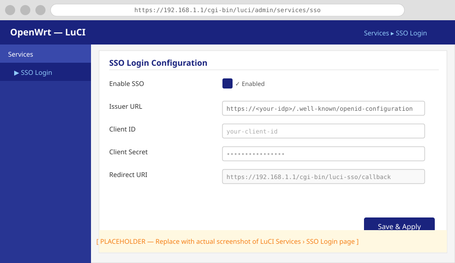
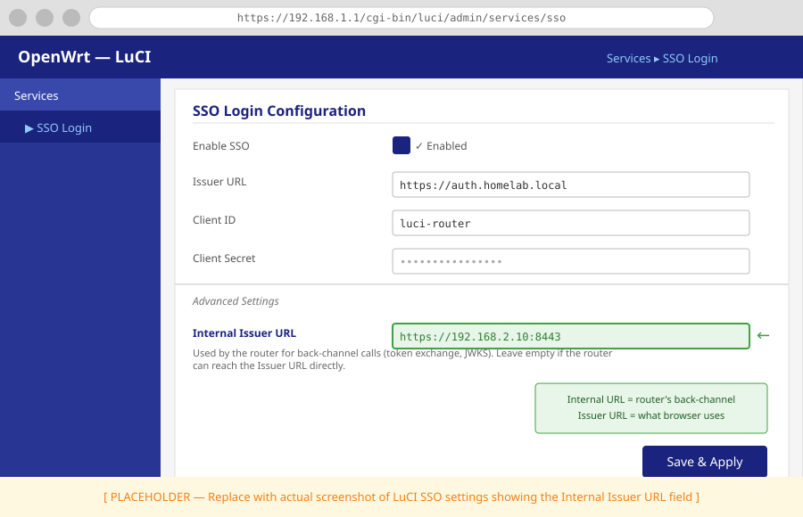

# How to Configure luci-sso in the LuCI Web Interface

This guide enters or updates the identity provider's settings and the access roles on the **Services > Single Sign-On** page. Use it when you already have a client ID and secret from your identity provider.

If you are connecting to a provider for the first time, use the [provider guides](../index.md#identity-providers) instead: they cover the IdP registration and these router settings together. For what each field stores, see [LuCI Form ↔ UCI Option](../../reference/uci-config.md#luci-form-uci-option).

---

## 1. Open the settings page

Log in to LuCI and navigate to **Services > Single Sign-On**. The page heading reads **SSO Login**. It has two sections: **Settings** and **Users**.



---

## 2. Fill in the Settings section

1.  Enter the **Issuer URL**, **Client ID** and **Client Secret** from your identity provider. The Issuer URL must be exactly the `issuer` your provider declares.
2.  Check the **Redirect URI**. If none is saved yet, the field suggests `https://<host>/cgi-bin/luci-sso/callback` with the host you opened LuCI at. Keep it only if users will open LuCI at that same host name; otherwise, replace the host. The value must match the redirect URI registered with the IdP exactly.
3.  If you map users by group, add `groups` to **Scopes** (for example `openid profile email groups`), provided your IdP supports it. See [How to Configure Role-Based Access Control](rbac.md).
4.  If the router reaches the IdP at a different address than browsers do, set **Internal Issuer URL** to that origin (`https://host[:port]`, no path). Otherwise leave it empty. See [How to Configure Split-Horizon Networking](split-horizon.md).
5.  Leave **Clock Tolerance** at `60` unless logins fail with `TOKEN_EXPIRED` or `TOKEN_ISSUED_IN_FUTURE` while the clocks look right.
6.  Tick **Enable SSO** when the settings and at least one role are ready.



---

## 3. Add or change roles in the Users section

A role says who may log in (by email or group) and which LuCI access groups they get. Every role a user matches applies, and the permissions are merged.

To add a role:

1.  Type a name (letters, digits and underscores; not `default`) and click **Add**.
2.  In the role editor, add entries to **Email Addresses**, **Groups**, or both. A role with neither is ignored.
3.  Add access groups to **Read Access** and **Write Access**. For a full administrator, put `*` in **Write Access**. For a role that may save settings, include `luci-base` in **Write Access**.
4.  Click **Save** to close the editor.

To change a role, click its pencil icon. To remove one, click its trash icon; a user who matched only that role gets `USER_NOT_AUTHORIZED` at their next login.

For which access groups to grant, see [How to Configure Role-Based Access Control](rbac.md).

---

## 4. Save and apply

Click **Save & Apply**. There is no service to restart: `luci-sso` reads the configuration on every request, so the change applies from the next login. Sessions that already exist keep the permissions they were given.

To discard unsaved edits, click **Reset**.

---

## 5. Check the result

On the router:

```bash
uci get luci-sso.default.redirect_uri
uclient-fetch -q -O - --no-check-certificate 'https://127.0.0.1/cgi-bin/luci-sso?action=enabled'
```

The first command prints the redirect URI you saved. The second answers `{"enabled": true}` once SSO is enabled; then log out and use the SSO button on the login page. If the login fails, see [How to Debug luci-sso](debugging.md).

---

## Next steps

- Map users by group instead of email: [How to Configure Role-Based Access Control](rbac.md)
- Update credentials after a provider rotation: [How to Rotate Credentials](rotate-credentials.md)
- Configure a split-horizon setup: [How to Configure Split-Horizon Networking](split-horizon.md)
