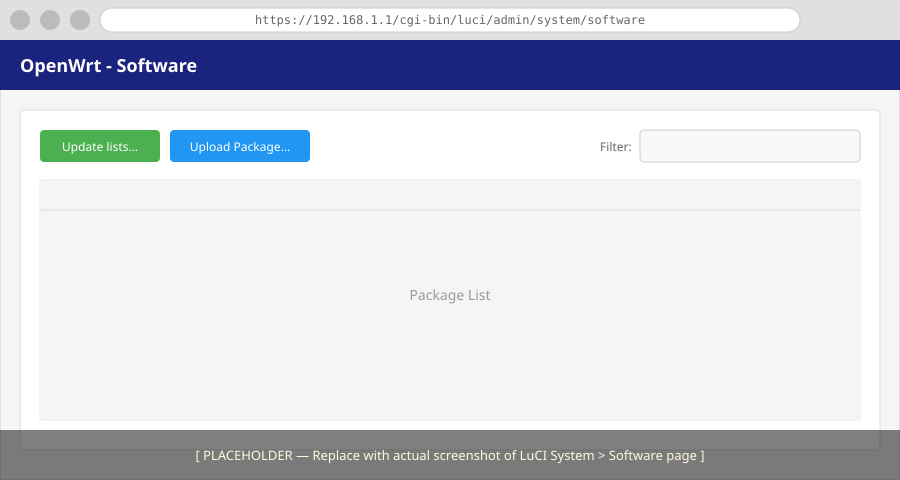

# How to Install luci-sso

This guide describes how to install the `luci-sso` package and its required dependencies on your OpenWrt router.

---

## 1. Choose a Crypto Backend

`luci-sso` requires a native crypto bridge to handle secure tokens. Use **mbedTLS** unless you have a reason not to — it is lightweight and already present on most OpenWrt systems. Use **wolfSSL** as an alternative lightweight option, or **OpenSSL** if the router already uses it for other services such as VPNs.

---

## 2. Install the Package

Choose your preferred method below to install the `.ipk` file.

=== "Browser (LuCI)"

    1.  **Log in** to your router's LuCI web interface.
    2.  Navigate to **System** -> **Software**.

    

    3.  Click **Update lists...** to refresh package information.
    4.  Click **Upload Package...** and select your local `luci-sso` file.
    5.  **Installation**: When prompted, confirm the installation.
    6.  **Backend**: If `luci-sso-crypto-mbedtls` is not automatically installed, search for it in the **Filter** box and install it manually.

=== "Terminal (SSH)"

    1.  **Upload the Package**: Copy the `.ipk` file to your router (e.g., via `scp`). If you used the `devenv` build, the path will look like this:
        ```bash
        scp -O bin/lib/<ARCH>/<VERSION>/packages/luci-sso*.ipk root@192.168.1.1:/tmp/
        ```
    2.  **Install via opkg**: Run the following commands on the router:
        ```bash
        opkg update
        opkg install /tmp/luci-sso*.ipk
        ```
    3.  **Verify Backend**: By default, `opkg` will attempt to pull in `luci-sso-crypto-mbedtls`. To use a different one:
        ```bash
        opkg install luci-sso-crypto-wolfssl
        ```

---

## 3. Verify the Installation

After installing, check that the `luci-sso` service is responsive and active.

=== "Browser (LuCI)"

    Navigate to the following URL in your browser:
    `https://192.168.1.1/cgi-bin/luci-sso?action=enabled`

    It should return a JSON response: `{"enabled": true}`.

=== "Terminal (SSH)"

    You can simulate a web request directly from the SSH terminal to verify the service is alive:

    ```bash
    # On the router
    QUERY_STRING="action=enabled" /www/cgi-bin/luci-sso
    ```

    **Expected Output:**
    ```http
    Status: 200 OK
    Content-Type: application/json

    {"enabled": true}
    ```

---

## Next Steps

Configure `luci-sso` with an identity provider:

- **[Your First SSO Login: Public IdP](../../tutorials/first-sso-login.md)** — Google. Requires a domain name and a publicly trusted certificate.
- **[Your First SSO Login: Self-hosted IdP](../../tutorials/pocket-id-sso-login.md)** — Pocket ID on your LAN. No public infrastructure required.

If you already know which provider you are using, go directly to the [How-to Guides](../index.md#identity-providers) for provider-specific configuration.
