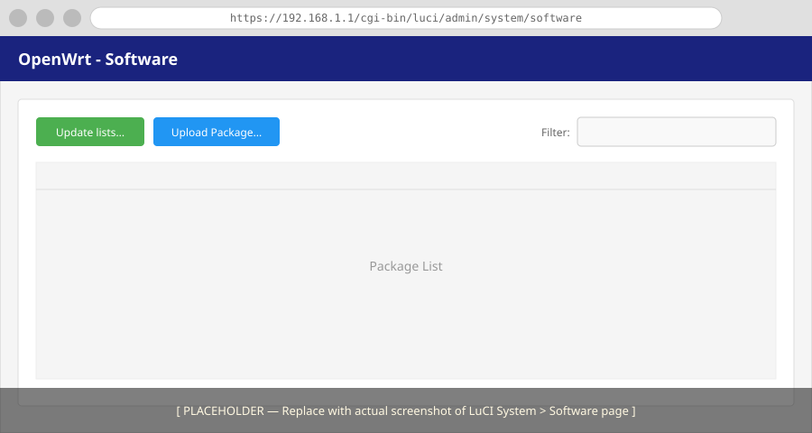

# How to Install luci-sso

This guide describes how to install `luci-sso` and its crypto backend on your OpenWrt router.

`luci-sso` is two packages: `luci-sso` itself, plus **exactly one** crypto backend package. `luci-sso` depends on a virtual `luci-sso-crypto` package that each backend provides, so the package manager will not install it alone, and will not pick a backend for you. All three backends install the same file, `/usr/lib/ucode/luci_sso/native.so`, so installing more than one fails.

---

## 1. Choose a crypto backend

| Package | Library it uses |
| :--- | :--- |
| `luci-sso-crypto-mbedtls` | mbedTLS |
| `luci-sso-crypto-wolfssl` | wolfSSL |
| `luci-sso-crypto-openssl` | OpenSSL |

Use **mbedTLS** unless you have a reason not to: it is lightweight and already present on most OpenWrt systems. Use **wolfSSL** as an alternative lightweight option, or **OpenSSL** if the router already uses it for other services such as VPNs. The package manager installs the library from the OpenWrt feeds if it is missing. For the trade-offs, see [About Crypto Backends](../../explanation/crypto-backends.md).

---

## 2. Check your router's architecture

On the router, run:

```bash
grep DISTRIB_ARCH /etc/openwrt_release
```

`opkg print-architecture` (OpenWrt 24.10) or `apk --print-arch` (OpenWrt 25.12) shows the same value. The package feed serves these architectures, for both OpenWrt 24.10 and 25.12:

- `x86_64`
- `aarch64_generic`
- `aarch64_cortex-a53`

If your router's architecture is one of them, [install from the package feed](#3-install-from-the-package-feed). Any other architecture (for example `mipsel_24kc` or `arm_cortex-a7`) has to [build the packages from source](build-from-source.md) and [install them as a local package](#4-install-from-a-local-package).

---

## 3. Install from the package feed

The packages are published, signed, at `https://m00qek.github.io/packages.ucode.dev/<series>`, where `<series>` is your OpenWrt release series: `24.10` or `25.12`. The feed carries released versions of `luci-sso`.

Adding the feed's signing key needs a shell: LuCI's **Software** page can edit the list of feeds but not the keys. Do step 1 over SSH, then install either way.

1.  **Add the signing key and the feed** on the router.

    === "OpenWrt 24.10 (opkg)"

        ```bash
        wget -O /tmp/feed.pub https://m00qek.github.io/packages.ucode.dev/24.10/feed.pub
        cp /tmp/feed.pub "/etc/opkg/keys/$(usign -F -p /tmp/feed.pub)"
        echo 'src/gz ucode.dev https://m00qek.github.io/packages.ucode.dev/24.10' >> /etc/opkg/customfeeds.conf
        ```

        The key's file name is its fingerprint, `a2288d4745630a38`.

    === "OpenWrt 25.12 (apk)"

        ```bash
        wget -O /etc/apk/keys/packages.ucode.dev.pem https://m00qek.github.io/packages.ucode.dev/25.12/feed.pub.pem
        echo 'https://m00qek.github.io/packages.ucode.dev/25.12' >> /etc/apk/repositories.d/customfeeds.list
        ```

2.  **Install `luci-sso` and one backend.**

    === "Terminal (SSH)"

        On OpenWrt 24.10:

        ```bash
        opkg update
        opkg install luci-sso luci-sso-crypto-mbedtls
        ```

        `opkg update` should report `Signature check passed.` for the feed. It also prints `has no valid architecture, ignoring` for the feed's packages built for other routers; that is harmless.

        On OpenWrt 25.12:

        ```bash
        apk update
        apk add luci-sso luci-sso-crypto-mbedtls
        ```

    === "Browser (LuCI)"

        1.  Navigate to **System** -> **Software** and click **Update lists…**.
        2.  In the **Filter** box, type `luci-sso-crypto`, and click **Install…** next to the backend you chose (for example `luci-sso-crypto-mbedtls`).
        3.  Filter for `luci-sso` and click **Install…** next to `luci-sso`.

---

## 4. Install from a local package

Use this for an architecture the feed does not serve, or to try a build of your own. Build the packages as described in [How to Build the Packages from Source](build-from-source.md). The build leaves the `luci-sso` packages in `bin/lib/<SDK_ARCH>/<SDK_VERSION>/packages/`: `luci-sso` and the three crypto backends. On OpenWrt 24.10 they are `.ipk` files, and you need two of them:

```text
luci-sso_<version>_<arch>.ipk
luci-sso-crypto-mbedtls_<version>_<arch>.ipk
```

OpenWrt 25.12 uses `apk` packages instead, built with `SDK_VERSION=25.12.3` and named `luci-sso-<version>.apk` and `luci-sso-crypto-mbedtls-<version>.apk`.

=== "Browser (LuCI)"

    These steps are for OpenWrt 24.10. On 25.12, use the terminal.

    1.  **Log in** to your router's LuCI web interface.
    2.  Navigate to **System** -> **Software**.

    

    3.  Click **Update lists…** so the backend's crypto library can be installed from the OpenWrt feeds.
    4.  Click **Upload Package…**, select the backend file (for example `luci-sso-crypto-mbedtls_<version>_<arch>.ipk`) and confirm the installation.
    5.  Click **Upload Package…** again, select the `luci-sso_<version>_<arch>.ipk` file and confirm. The backend must already be installed: `luci-sso` cannot be installed without one.

=== "Terminal (SSH)"

    1.  **Copy the two packages to the router**, for example with `scp` from the build machine:

        ```bash
        scp -O luci-sso_<version>_<arch>.ipk luci-sso-crypto-mbedtls_<version>_<arch>.ipk root@192.168.1.1:/tmp/
        ```

    2.  **Install both in one command** on the router.

        On OpenWrt 24.10 (`opkg`):

        ```bash
        opkg update
        opkg install /tmp/luci-sso_<version>_<arch>.ipk /tmp/luci-sso-crypto-mbedtls_<version>_<arch>.ipk
        ```

        On OpenWrt 25.12 (`apk`):

        ```bash
        apk update
        apk add --allow-untrusted /tmp/luci-sso-<version>.apk /tmp/luci-sso-crypto-mbedtls-<version>.apk
        ```

        `--allow-untrusted` is needed because packages you built yourself are not signed with a key the router trusts; without it `apk` stops with `UNTRUSTED signature`.

---

## 5. After installing

Installing runs the package's setup scripts once: they create `/var/run/luci-sso/`, add a daily cleanup job to root's crontab, and add the SSO button to LuCI's login page templates with `luci-sso-repatch`. Run that command again whenever a LuCI upgrade removes the button; see [How to Upgrade luci-sso](upgrade.md#restore-the-login-button-after-a-luci-upgrade).

### Switch to a different backend later

Only one backend can be installed, so replace it rather than adding a second one.

On OpenWrt 24.10, remove the old backend without removing `luci-sso`, then install the new one (from the feed, or give the `.ipk` file instead):

```bash
opkg remove --force-depends luci-sso-crypto-mbedtls
opkg install luci-sso-crypto-openssl
```

On OpenWrt 25.12, swap them in one transaction; `apk` refuses to remove the only backend on its own:

```bash
apk add luci-sso-crypto-openssl '!luci-sso-crypto-mbedtls'
```

---

## 6. Verify the installation

The package ships with SSO turned off (`enabled '0'`), so right after installation the probe answers `false`. That answer shows the CGI script and the crypto backend are working.

=== "Browser (LuCI)"

    Navigate to the following URL in your browser:
    `https://192.168.1.1/cgi-bin/luci-sso?action=enabled`

    It should return a JSON response: `{"enabled": false}`.

=== "Terminal (SSH)"

    Run the CGI script directly on the router:

    ```bash
    QUERY_STRING="action=enabled" /www/cgi-bin/luci-sso
    ```

    **Expected output** (the security headers are left out here):

    ```http
    Status: 200 OK
    Content-Type: application/json

    {"enabled": false}
    ```

The probe answers `{"enabled": true}` once you have configured an identity provider and turned SSO on.

---

## Next Steps

Configure `luci-sso` with an identity provider:

- **[Your First SSO Login: Public IdP](../../tutorials/first-sso-login.md)** — Google. Requires a domain name and a publicly trusted certificate.
- **[Your First SSO Login: Self-hosted IdP](../../tutorials/pocket-id-sso-login.md)** — Pocket ID on your LAN. No public infrastructure required.

If you already know which provider you are using, go directly to the [How-to Guides](../index.md#identity-providers) for provider-specific configuration.
