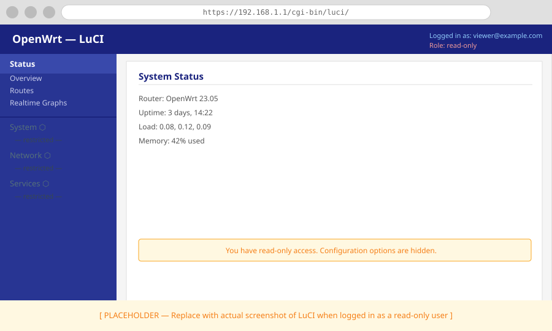

# How to Configure Role-Based Access Control

This guide describes how to define who can access the router and what they can do, using `luci-sso`'s role mapping system.

---

## How roles work

A **role** is a UCI `config role` section in `/etc/config/luci-sso`. When a user logs in, `luci-sso` checks their OIDC claims (email and groups) against every configured role. If any role matches, the user gets the permissions defined by that role. Multiple roles can match — permissions are merged with OR logic.

The default installation creates one role (`admin`) with full access. Everything beyond that is optional configuration.

---

## Basic admin role (full access)

The `*` wildcard grants complete read and write access to all LuCI functionality, present and future:

```uci
config role 'admin'
    list email 'alice@example.com'
    list read '*'
    list write '*'
```

```bash
uci set luci-sso.admin=role
uci add_list luci-sso.admin.email='alice@example.com'
uci add_list luci-sso.admin.read='*'
uci add_list luci-sso.admin.write='*'
uci commit luci-sso
```

---

## Read-only access

Omit `write` (or leave it empty) and specify only the LuCI access groups the user may view. The available group names are the JSON keys matching `luci-*` in `/usr/share/rpcd/acl.d/`.

A common starting point for read-only users — access to status and network views but no configuration changes:

```bash
uci set luci-sso.viewer=role
uci add_list luci-sso.viewer.email='bob@example.com'
uci add_list luci-sso.viewer.read='luci-base'
uci add_list luci-sso.viewer.read='luci-mod-status'
uci add_list luci-sso.viewer.read='luci-mod-network'
uci commit luci-sso
```

A user configured this way sees status pages and network overviews but cannot save changes. Buttons and forms requiring write access are hidden or disabled by LuCI.



Compare with an admin session where the full menu is visible:


---

## Group-based access

If your IdP returns a `groups` claim, you can match roles by group instead of (or in addition to) individual email addresses. Ensure the `groups` scope is included in your IdP client configuration and that the `scope` option in UCI includes it:

```bash
uci set luci-sso.default.scope='openid profile email groups'
uci commit luci-sso
```

Then configure roles by group:

```bash
# Full admin for the ops team
uci set luci-sso.ops_admin=role
uci add_list luci-sso.ops_admin.group='network-ops'
uci add_list luci-sso.ops_admin.read='*'
uci add_list luci-sso.ops_admin.write='*'
uci commit luci-sso

# Read-only for the security team
uci set luci-sso.sec_viewer=role
uci add_list luci-sso.sec_viewer.group='security-team'
uci add_list luci-sso.sec_viewer.read='luci-base'
uci add_list luci-sso.sec_viewer.read='luci-mod-status'
uci commit luci-sso
```

A user who is a member of both groups gets the combined permissions of both roles.

---

## Multiple roles with combined permissions

Permissions from all matched roles are merged. A user who matches both a read-only role and a role with write access to `luci-mod-network` ends up with the union of both:

```
config role 'viewer'
    list email 'charlie@example.com'
    list read 'luci-base'
    list read 'luci-mod-status'

config role 'network_editor'
    list email 'charlie@example.com'
    list read 'luci-mod-network'
    list write 'luci-mod-network'
```

Charlie can view status, view network settings, and edit network settings — but cannot reboot or touch system configuration.

---

## Verify a role is working

After committing configuration, test with:

```bash
# Confirm the service is enabled and config is valid
curl -sk https://localhost/cgi-bin/luci-sso?action=enabled
# Expected: {"enabled":true}
```

Then log in as the user in question and confirm the LuCI navigation matches what you expect. If a user is denied despite correct credentials, check the log for `NO_ROLES_MATCHED` or `USER_NOT_AUTHORIZED`:

```bash
logread -e luci-sso | tail -20
```

If you see `USER_NOT_AUTHORIZED`, the user's email or group claims do not match any configured role, or the matched role has no `read` or `write` entries. Verify the exact claim value the IdP is sending — email addresses are matched case-insensitively, but must otherwise be exact.

---

## Reference

- All UCI options are documented in the [UCI Configuration Reference](../../reference/uci-config.md#role-mapping).
- Error codes from role evaluation are described in [Log Messages](../../reference/log-messages.md#authorization-errors).
