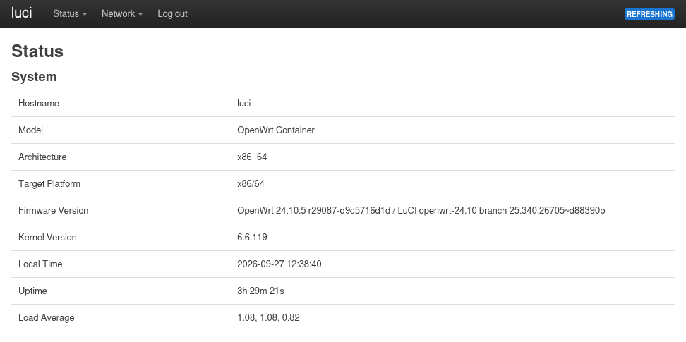
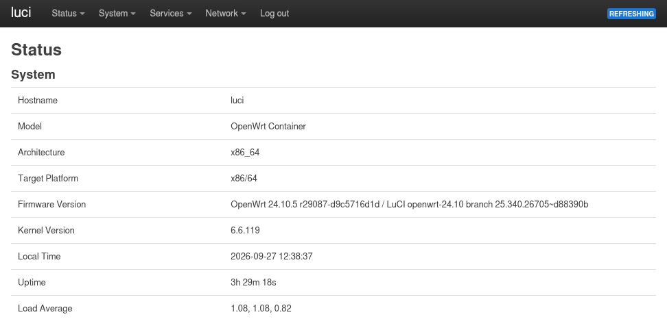

# How to Configure Role-Based Access Control

This guide describes how to decide who can access the router and what they can do, using `luci-sso`'s roles. Why roles work this way is explained in [About Roles and Permissions](../../explanation/roles-and-permissions.md).

---

## How roles work

A role has two halves:

- **Who it matches.** A `config role '<name>'` section in `/etc/config/luci-sso`, with `email`, `group` and `sub` rules, and the `sub_issuer` its `sub` rules belong to. A role with no rule is ignored.
- **What it grants.** The role's `rpcd` login entry, `luci_sso_<name>` in `/etc/config/rpcd`, with `read` and `write` lists of access groups. `rpcd` is the OpenWrt daemon that holds LuCI sessions and their rights.

When a user logs in, `luci-sso` checks their subject (`sub`), email and groups against the roles **in order**, from the top. The user gets the **first** role that matches, and only that one: roles are not merged. The session gets exactly the rights of that role's entry. An email counts only if the IdP marks it as verified (`email_verified`); see [About Roles and Permissions](../../explanation/roles-and-permissions.md#verified-email-addresses).

A fresh install ships one role, `admin`. It matches the placeholder `admin@example.com`, and its entry grants full access (`*` in both lists). Replace the placeholder with a real address before you enable SSO.

The settings page edits both halves together. On the command line, you edit both with `uci`. Both files, and every limit, are described in the [UCI Configuration Reference](../../reference/uci-config.md#role-mapping-config-role). This layout is stable: later releases add options, but do not move permissions or rules between the two files.

Write access to the settings page, the `luci-app-sso` access group, is as good as `root`: see [Who may change the roles](#who-may-change-the-roles).

---

## What the access lists mean

`read` and `write` name access groups: the top-level keys of the JSON files in `/usr/share/rpcd/acl.d/`, such as `luci-base`, `luci-mod-status-realtime` or `luci-mod-network-config`. The file names are not group names: `luci-mod-network.json` defines `luci-mod-network-config`, `luci-mod-network-dhcp` and `luci-mod-network-diagnostics`. To list the LuCI groups on the router:

```bash
for f in /usr/share/rpcd/acl.d/*.json; do jsonfilter -i "$f" -e '@' | grep -o '"luci-[^"]*": {' | cut -d'"' -f2; done
```

The lists have the meaning `rpcd` gives them for a password login, because they *are* an `rpcd` login entry:

- Entries may be globs (`luci-mod-status-*`) and negations (`!luci-mod-status-logs`). Within a list, negations are checked first.
- `*` matches every access group, including groups that are not LuCI's.
- **Write implies read.** A group in `write` can also be read, unless the `read` list negates it.
- `luci-base`'s `write` section holds the calls that save and apply settings (`uci set`, `uci apply`). A role that should change anything needs `luci-base` in `write`, as well as the groups for the pages it edits.
- Every `read` list also grants the `unauthenticated` group, which LuCI needs on every page. The settings page adds it for you and never shows it; on the command line, add it yourself. The settings page refuses a `read` entry that negates it, such as `!*`.

| `read` | `write` | Result |
| :--- | :--- | :--- |
| `*` | `*` | **Full admin.** Exactly what the `root` password login gets on a stock OpenWrt. |
| `*` | empty | **Read-only.** Every page can load its data; nothing can be saved. |
| `*` | specific groups | Read everything; change only what the listed groups allow (include `luci-base`). |
| specific groups | specific groups | Exactly the groups listed. |
| empty | empty | **No access.** The user can log in but sees nothing. The settings page shows `None: this role grants no access`. |

A CI test logs in both ways, through SSO and with a password, against the real `rpcd`, and fails if the two ever differ.

---

## Where to change a role

=== "Browser (LuCI)"

    Navigate to **Services > Single Sign-On** and scroll to the **Roles** section. The table lists the roles in the order they are tried. Drag a row to move it.

    - To add a role, type its name in the box next to **Add** and click **Add**.
    - To change a role, click **Edit** in its row.
    - To remove a role, click **Delete** in its row.

    **Read access** and **Write access** offer the router's access groups, and take any name or pattern you type. They edit the role's entry in `/etc/config/rpcd`; everything else edits `/etc/config/luci-sso`.

    The page works like any LuCI page. The editor's own **Save**, and **Save** at the bottom of the page, stage the change; LuCI's header counts it under **Unsaved Changes**. **Save & Apply**, at the bottom of the page or in the header's **Unsaved Changes** dialog, applies every staged change in both files at once, with LuCI's rollback if the router stops answering. The header dialog's **Revert** discards every staged change; **Reset** discards only edits on the page that are not saved yet. After the apply, `rpcd` reloads, so users already logged in get the new rights.

=== "Terminal (SSH)"

    Change who a role matches, and the order, in `/etc/config/luci-sso`. The next login reads it; no apply is needed:

    ```bash
    uci set luci-sso.viewer=role
    uci add_list luci-sso.viewer.email='bob@example.com'
    uci reorder luci-sso.viewer=1      # position 1: the first role, after the 'default' section
    uci commit luci-sso
    ```

    Change what a role grants in its entry in `/etc/config/rpcd`, with `unauthenticated` in the `read` list and never a `password` option, then apply it, so that `rpcd` reloads and users already logged in get the new rights:

    ```bash
    uci set rpcd.luci_sso_viewer=login
    uci set rpcd.luci_sso_viewer.username='sso:viewer'
    uci -q delete rpcd.luci_sso_viewer.read
    uci add_list rpcd.luci_sso_viewer.read='luci-base'
    uci add_list rpcd.luci_sso_viewer.read='luci-mod-status-*'
    uci add_list rpcd.luci_sso_viewer.read='unauthenticated'
    uci -q delete rpcd.luci_sso_viewer.write
    uci commit rpcd
    /etc/init.d/luci-sso reload    # makes rpcd reload; reload_config does too
    uci show rpcd.luci_sso_viewer
    ```

    To delete a role, delete both halves: `uci delete luci-sso.viewer`, `uci delete rpcd.luci_sso_viewer`, then commit both and run `/etc/init.d/luci-sso reload`.

A new role needs both halves. Without its `rpcd` entry, its users are refused at login with `MISSING_RPCD_LOGIN`, and the settings page shows `Not set: edit this role and Save & Apply, or its users cannot log in`.

---

## Full access

The shipped `admin` role already grants full access. Make it match the real administrator:

=== "Browser (LuCI)"

    In the **Roles** section, click **Edit** in the `admin` row. In **Emails**, replace `admin@example.com` with `alice@example.com`. Check that **Read access** and **Write access** hold `*`. Click **Save** in the editor, then **Save & Apply**.

=== "Terminal (SSH)"

    ```bash
    uci -q del_list luci-sso.admin.email='admin@example.com'   # the shipped placeholder
    uci add_list luci-sso.admin.email='alice@example.com'
    uci commit luci-sso
    uci show rpcd.luci_sso_admin    # read '*', write '*'
    ```

    If the `admin` entry is missing or grants less, set it:

    ```bash
    uci set rpcd.luci_sso_admin=login
    uci set rpcd.luci_sso_admin.username='sso:admin'
    uci -q delete rpcd.luci_sso_admin.read
    uci add_list rpcd.luci_sso_admin.read='*'
    uci -q delete rpcd.luci_sso_admin.write
    uci add_list rpcd.luci_sso_admin.write='*'
    uci commit rpcd
    /etc/init.d/luci-sso reload
    ```

---

## Read-only access

Leave **Write access** empty and list the access groups the user may view. `*` in **Read access** shows everything; to narrow it, name groups or globs.

A common starting point: status and network views, but no changes.

=== "Browser (LuCI)"

    In the **Roles** section, type `viewer` in the field next to **Add** and click **Add**. Fill in the editor:

    - **Emails**: `bob@example.com`
    - **Read access**: `luci-base`, `luci-mod-status-*`, `luci-mod-network-*`
    - Leave **Write access** empty.

    Click **Save** in the editor, then **Save & Apply**.

=== "Terminal (SSH)"

    ```bash
    uci set luci-sso.viewer=role
    uci add_list luci-sso.viewer.email='bob@example.com'
    uci commit luci-sso
    uci set rpcd.luci_sso_viewer=login
    uci set rpcd.luci_sso_viewer.username='sso:viewer'
    uci -q delete rpcd.luci_sso_viewer.read
    uci add_list rpcd.luci_sso_viewer.read='luci-base'
    uci add_list rpcd.luci_sso_viewer.read='luci-mod-status-*'
    uci add_list rpcd.luci_sso_viewer.read='luci-mod-network-*'
    uci add_list rpcd.luci_sso_viewer.read='unauthenticated'
    uci -q delete rpcd.luci_sso_viewer.write
    uci commit rpcd
    /etc/init.d/luci-sso reload
    ```

A user with this role sees status pages and network overviews but cannot save changes. LuCI leaves out the menus the role has no access group for. On the pages it shows, the **Save & Apply**, **Save** and **Reset** buttons are disabled. There is no separate read-only notice.



Compare with an admin session, where the menu also has System and Services:



---

## Group-based access

If your IdP returns a `groups` claim, you can match roles by group instead of, or as well as, email. Request the `groups` scope at the IdP and on the router:

=== "Browser (LuCI)"

    Navigate to **Services > Single Sign-On**. In the **Identity provider** section, set **Scopes** to `openid profile email groups` and click **Save & Apply**.

=== "Terminal (SSH)"

    ```bash
    uci set luci-sso.default.scope='openid profile email groups'
    uci commit luci-sso
    ```

Then create one role per group. Put the more privileged role first: a user in both groups gets the first match.

=== "Browser (LuCI)"

    In the **Roles** section, add a role `ops_admin`:

    - **Groups**: `network-ops`
    - **Read access**: `*`
    - **Write access**: `*`

    Click **Save** in the editor. Add a role `sec_viewer`:

    - **Groups**: `security-team`
    - **Read access**: `luci-base`, `luci-mod-status-*`

    Click **Save** in the editor. Drag `ops_admin` above `sec_viewer` if it is not already, then click **Save & Apply**.

=== "Terminal (SSH)"

    ```bash
    # Full admin for the ops team, tried first
    uci set luci-sso.ops_admin=role
    uci add_list luci-sso.ops_admin.group='network-ops'
    uci reorder luci-sso.ops_admin=1

    # Read-only for the security team
    uci set luci-sso.sec_viewer=role
    uci add_list luci-sso.sec_viewer.group='security-team'
    uci reorder luci-sso.sec_viewer=2
    uci commit luci-sso

    uci set rpcd.luci_sso_ops_admin=login
    uci set rpcd.luci_sso_ops_admin.username='sso:ops_admin'
    uci -q delete rpcd.luci_sso_ops_admin.read
    uci add_list rpcd.luci_sso_ops_admin.read='*'
    uci -q delete rpcd.luci_sso_ops_admin.write
    uci add_list rpcd.luci_sso_ops_admin.write='*'
    uci set rpcd.luci_sso_sec_viewer=login
    uci set rpcd.luci_sso_sec_viewer.username='sso:sec_viewer'
    uci -q delete rpcd.luci_sso_sec_viewer.read
    uci add_list rpcd.luci_sso_sec_viewer.read='luci-base'
    uci add_list rpcd.luci_sso_sec_viewer.read='luci-mod-status-*'
    uci add_list rpcd.luci_sso_sec_viewer.read='unauthenticated'
    uci -q delete rpcd.luci_sso_sec_viewer.write
    uci commit rpcd
    /etc/init.d/luci-sso reload
    ```

A member of both groups gets `ops_admin`. The login's log line names the other match: `mapped to role 'ops_admin', the first match; also matched: sec_viewer`.

---

## Match one account by its subject

A `sub` rule matches one account at the IdP, whatever its email address or groups, and keeps matching if the address changes. Use it for a single person, such as the router's owner. Why it is the most stable rule is explained in [About Roles and Permissions](../../explanation/roles-and-permissions.md#matching-by-subject).

1. Find the user's `sub`. The simplest way works with every IdP: ask the user to click **Login with SSO**. Until a role matches them, the refusal page says "Your account is not allowed to manage this router" and, below it, "give your administrator this account identifier", followed by their `sub`. Some IdPs also show it:

    | IdP | Where the `sub` is |
    | :--- | :--- |
    | Pocket ID | The user's ID, a UUID: in the address of the user's page, **Settings > Users >** the user (`/settings/admin/users/<id>`). |
    | Keycloak | The **ID** field on the user's **Details** tab, under **Users**. Keycloak's default `sub` is that ID. |
    | Authentik | Depends on the provider's **Subject mode**. The default, a hash of the user's ID, is not shown anywhere: use the refusal page. |
    | Authelia | An opaque UUID per user. `authelia storage user identifiers export` writes them to a file; the refusal page is simpler. |
    | Google | A number that Google does not show in its user interfaces: use the refusal page. |

    An IdP not listed here may also use a value it does not show. The refusal page always shows the value `luci-sso` compares.

2. Add the value to a role, exactly as shown. Letter case matters: `AbC` and `abc` are different accounts.

    === "Browser (LuCI)"

        In the **Roles** section, click **Edit** in the role's row, or add a role. In **Subjects**, enter the value. **Subject issuer** holds the **Issuer URL** when the role has no subject yet; keep it. Click **Save** in the editor, then **Save & Apply**: the subjects and their issuer are saved together.

    === "Terminal (SSH)"

        ```bash
        uci set luci-sso.owner=role
        uci add_list luci-sso.owner.sub='f81d4fae-7dec-11d0-a765-00a0c91e6bf6'
        uci set luci-sso.owner.sub_issuer="$(uci get luci-sso.default.issuer_url)"
        uci reorder luci-sso.owner=1
        uci commit luci-sso
        uci set rpcd.luci_sso_owner=login
        uci set rpcd.luci_sso_owner.username='sso:owner'
        uci -q delete rpcd.luci_sso_owner.read
        uci add_list rpcd.luci_sso_owner.read='*'
        uci -q delete rpcd.luci_sso_owner.write
        uci add_list rpcd.luci_sso_owner.write='*'
        uci commit rpcd
        /etc/init.d/luci-sso reload
        ```

        The role's `sub_issuer` names the IdP its subjects belong to; its `sub` rules count only while it equals `issuer_url`. The settings page fills it in for you.

3. Ask the user to log in again. The system log line names the role: `User [sub_id: …] mapped to role 'owner'`. The log records a hash of the `sub`, never the value itself.

### After you change the identity provider

A subject belongs to the IdP that issued it, so a role's `sub` rules stop counting when `issuer_url` changes: the log says `Ignoring sub rules of role '<role>': its sub_issuer '<old issuer>' does not match issuer_url '<new issuer>'`, and those users are matched by email or group, or refused. Why: [About Roles and Permissions](../../explanation/roles-and-permissions.md#matching-by-subject).

- If the new `issuer_url` is the same IdP under a new address, keep the rules:

    === "Browser (LuCI)"

        Under **Issuer URL** on the **Provider** tab, and above the table in the **Roles** section, the page names each role whose subjects belong to the old issuer: "The subject rules of role `<role>` belong to `<old issuer>` and are ignored for `<new issuer>`." The role's **Subjects** cell says `(ignored: another provider)`. Click **Use with this provider** next to each role to keep; it stages that role's change, like a **Save**. Then click **Save & Apply**. The page never moves a role's rules on its own.

    === "Terminal (SSH)"

        ```bash
        uci set luci-sso.owner.sub_issuer="$(uci get luci-sso.default.issuer_url)"   # for each role to keep
        uci commit luci-sso
        ```

- If it is another IdP, its accounts have other subjects: replace each `sub` value with the user's `sub` at the new IdP (step 1 above), then move the rules to it as shown.

---

## A user who needs two sets of rights

A session carries one role's rights. When some users need what two roles grant, create a role that grants both, and put it above the narrower roles.

For example, `viewer` reads status and network pages, and a few users should also edit network interfaces. Give those users a `net_operator` role:

=== "Browser (LuCI)"

    Add a role `net_operator`:

    - **Emails**: `charlie@example.com`
    - **Read access**: `luci-base`, `luci-mod-status-*`, `luci-mod-network-*`
    - **Write access**: `luci-base`, `luci-mod-network-config`

    Click **Save** in the editor. Drag `net_operator` above `viewer`, then click **Save & Apply**.

=== "Terminal (SSH)"

    ```bash
    uci set luci-sso.net_operator=role
    uci add_list luci-sso.net_operator.email='charlie@example.com'
    uci reorder luci-sso.net_operator=1
    uci commit luci-sso
    uci set rpcd.luci_sso_net_operator=login
    uci set rpcd.luci_sso_net_operator.username='sso:net_operator'
    uci -q delete rpcd.luci_sso_net_operator.read
    uci add_list rpcd.luci_sso_net_operator.read='luci-base'
    uci add_list rpcd.luci_sso_net_operator.read='luci-mod-status-*'
    uci add_list rpcd.luci_sso_net_operator.read='luci-mod-network-*'
    uci add_list rpcd.luci_sso_net_operator.read='unauthenticated'
    uci -q delete rpcd.luci_sso_net_operator.write
    uci add_list rpcd.luci_sso_net_operator.write='luci-base'
    uci add_list rpcd.luci_sso_net_operator.write='luci-mod-network-config'
    uci commit rpcd
    /etc/init.d/luci-sso reload
    ```

Charlie can view status and network settings, and edit network interfaces, but cannot reboot or touch system configuration. If Charlie also matches `viewer`, for example through a group, the order keeps `net_operator` first.

---

## Verify a role is working

Check that SSO is enabled:

--8<-- "probe-enabled.md"

Check the role's permissions as `rpcd` holds them:

```bash
uci show rpcd | grep luci_sso_
```

Then log in as the user and confirm the LuCI menus match what you expect. Each login logs the role it chose:

--8<-- "check-log.md"

```text
luci-sso[1234]: User [sub_id: c775e7b757ede630] mapped to role 'viewer' [session_id: 8e25f313865ad01a]
```

- **`[403] USER_NOT_AUTHORIZED`**, after `matched no roles`: the user's `sub`, email and groups match no role. Check the exact values the IdP sends; the error page shows the user their `sub`. Email matching ignores case, but must otherwise be exact; group and `sub` matching are case-sensitive. An `Ignoring the unverified email` line before it means the IdP did not mark the email as verified, so it was not matched; see [Provider Compatibility](../../reference/provider-compatibility.md#verified-email).
- **`[500] UBUS_LOGIN_FAILED`**, after a `MISSING_RPCD_LOGIN` line: the role has no `rpcd` entry. Save the role on the settings page, which gives it one, or create `luci_sso_<role>` with `uci` as shown in [Where to change a role](#where-to-change-a-role).
- **The wrong role**: the line says `the first match; also matched: …`. Move the role you expect higher up.

If the user logs in but a page they should see is missing or read-only, look for this line from the login:

```text
luci-sso[1234]: Role 'viewer' grants unknown access group 'luci-mod-network'; no ACL file defines it
```

It names a `read` or `write` entry that matches no access group, usually a file name used instead of a group name, or a typo. Globs and negations are not checked this way.

---

## Change access for users already logged in

A permission change reaches users who are logged in. Each apply that changes `/etc/config/rpcd`, from the settings page, `reload_config` or `/etc/init.d/luci-sso reload`, makes `rpcd` reload, and the reload rebuilds every session of that role from its entry. Deleting a role's entry leaves its sessions with no rights at that reload. While a LuCI apply can still be rolled back, the reload waits until it is confirmed or rolled back. A `uci commit rpcd` without an apply reaches new logins at once, but sessions already open only at the next reload.

Changes to emails, groups and the order apply from the next login only. A session keeps the role it was given. To take a user out of a role at once, remove them from the role, then end their sessions.

1. List the sessions. Under its session ID, each SSO session shows its role as `username` (`sso:<role>`) and, when the IdP marked it as verified, the user's email as `oidc_user`:

    ```bash
    ubus call session list | grep -E '"(ubus_rpc_session|oidc_user|username)"'
    ```

    ```text
    	"ubus_rpc_session": "01c8b0237fb048cb1e8042e022e51baa",
    		"oidc_user": "bob@example.com",
    		"username": "sso:viewer"
    	"ubus_rpc_session": "7d2f95c0e6a14b0c9a5d3f8e21b6c4aa",
    		"username": "sso:ops"
    ```

    `oidc_user` holds only an email the IdP sent with `email_verified: true`, even with `require_email_verified` off, so a user cannot label a session with an address they typed in themselves. A session with no `oidc_user` belongs to a user whose IdP sent no email, or no verified one; such a user logged in through a `group` rule, or through an `email` rule with `require_email_verified` off. It can only be told apart by its role: to remove such a user at once, end every session of that role, and let the others log in again.

2. Destroy each of that user's sessions by its ID:

    ```bash
    ubus call session destroy '{"ubus_rpc_session": "01c8b0237fb048cb1e8042e022e51baa"}'
    ```

The user's next LuCI request is refused, and their next sign-in goes through the updated roles. Other users are not affected. The user may still be signed in at the IdP; revoke that there.

---

## Edit the rpcd entries by hand

You can edit a `luci_sso_*` entry in `/etc/config/rpcd` over SSH, for example to script it. `luci-sso` uses it as you wrote it: nothing rewrites it. Follow the entry's rules, or its users cannot log in:

- Keep the section type `login` and `option username 'sso:<role>'`. Otherwise the login fails with `MISSING_RPCD_LOGIN`.
- Never add a `password` option, not even an empty one. The login fails with `INSECURE_RPCD_LOGIN`: `rpcd` would accept a password login with that entry.
- Use `list read` and `list write`. `rpcd` ignores a single `option read`, so it grants nothing.
- Keep `unauthenticated` in the `read` list, or a pattern that matches it. Without it, LuCI shows "Session expired" on every page. Saving the role's read list on the settings page adds it back.

Then apply it, so that sessions already open get the new rights:

```bash
uci commit rpcd
/etc/init.d/luci-sso reload    # makes rpcd reload; reload_config does too
```

---

## Who may change the roles

Grant write access to the settings page, the `luci-app-sso` access group, only to people you would give the `root` password. It is root-equivalent, and has been in every release: whoever may change the roles may add their own email to a role and give it `*` in both lists. The group also has UCI read and write on `/etc/config/rpcd`, so its holder can change any login entry there. Read access alone shows the client secret and every `rpcd` login entry. See [Who may change roles](../../explanation/threat-model.md#who-may-change-roles).

---

## Reference

- Role options, the `rpcd` entry and the reload after an apply: [UCI Configuration Reference](../../reference/uci-config.md#role-mapping-config-role).
- Error codes from role mapping and session creation: [Log Messages](../../reference/log-messages.md#authorization-errors).
