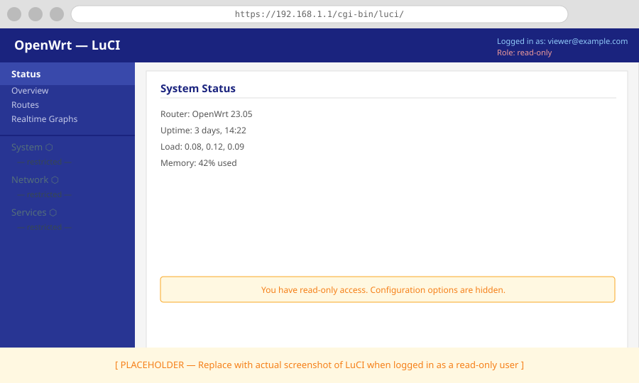

# How to Configure Role-Based Access Control

This guide describes how to define who can access the router and what they can do, using `luci-sso`'s role mapping system.

---

## How roles work

A **role** is a UCI `config role` section in `/etc/config/luci-sso`. When a user logs in, `luci-sso` checks their OIDC claims (email and groups) against every configured role. If any role matches, the user gets the permissions defined by that role. Multiple roles can match — permissions are merged with OR logic.

The default installation creates one role (`admin`) with full access. Everything beyond that is optional configuration.

---

## What a role's lists mean

`read` and `write` name LuCI **access groups**: the top-level keys of the JSON files in `/usr/share/rpcd/acl.d/`, such as `luci-base`, `luci-mod-status-realtime` or `luci-mod-network-config`. The file names are not group names: `luci-mod-network.json` defines `luci-mod-network-config`, `luci-mod-network-dhcp` and `luci-mod-network-diagnostics`. To list them on the router:

```bash
for f in /usr/share/rpcd/acl.d/*.json; do jsonfilter -i "$f" -e '@' | grep -o '"luci-[^"]*": {' | cut -d'"' -f2; done
```

A session gets exactly the rights rpcd would give a **password login** whose rpcd `login` entry had the same `read` and `write` lists: each granted group's `read` or `write` section is expanded into the concrete `ubus`, `uci`, `file` and `cgi-io` permissions it lists. The rules follow rpcd's:

- Entries may be globs (`luci-mod-status-*`) and negations (`!luci-mod-status-logs`); within a list, negations win. A pattern with a wildcard only ever matches `luci-*` groups.
- **Write implies read**: a group in `write` also gets its `read` section, even if `read` negates it.
- `luci-base`'s `write` section holds the calls that save and apply settings (`uci set`, `uci apply`). A role that should change anything needs `luci-base` in `write` as well as the groups for the pages it edits.
- Every session also gets the small `unauthenticated` group that rpcd gives anonymous clients (`session access`, `luci.getFeatures`), which LuCI's pages rely on.

A CI test logs in both ways against the real rpcd and fails if the two ever differ.

### The `*` wildcard

`*` matches every `luci-*` access group, and never other groups, such as `unauthenticated` or a group a third-party package defines under another prefix. Its effect depends on the list:

| `read` | `write` | Result |
| :--- | :--- | :--- |
| any | `*` | **Full admin.** Unrestricted `ubus`, `uci`, `file` and `cgi-io` access, plus read and write on every LuCI access group. |
| `*` | empty | **Read-only.** Every LuCI page can load its data; nothing can be saved. |
| `*` | specific groups | Read everything; change only what the listed groups allow (include `luci-base`). |
| specific groups | specific groups | Exactly the groups listed. |

---

## Basic admin role (full access)

`write '*'` grants complete read and write access to all LuCI functionality, present and future. Set `read '*'` too, for clarity:

```uci
config role 'admin'
    list email 'alice@example.com'
    list read '*'
    list write '*'
```

=== "Browser (LuCI)"

    Navigate to **Services > Single Sign-On** and scroll to the **Users** section.

    The default installation already has an `admin` role: click **Edit** in its row. (Without it, type `admin` as the role name in the field next to **Add** and click **Add**.) Fill in the modal:

    - **Email Addresses**: `alice@example.com`, replacing the placeholder `admin@example.com`
    - **Read Access**: `*`
    - **Write Access**: `*`

    Click **Save**, then **Save & Apply**.

=== "Terminal (SSH)"

    ```bash
    uci set luci-sso.admin=role
    uci -q del_list luci-sso.admin.email='admin@example.com'   # the shipped placeholder
    uci add_list luci-sso.admin.email='alice@example.com'
    uci add_list luci-sso.admin.read='*'
    uci add_list luci-sso.admin.write='*'
    uci commit luci-sso
    ```

---

## Read-only access

Omit `write` (or leave it empty) and list the access groups the user may view. `read '*'` shows everything; to narrow it, name groups or globs.

A common starting point for read-only users — access to status and network views but no configuration changes:

=== "Browser (LuCI)"

    Navigate to **Services > Single Sign-On** and scroll to the **Users** section.

    Type `viewer` as the role name in the field next to **Add**, click **Add**, then fill in the modal:

    - **Email Addresses**: `bob@example.com`
    - **Read Access**: `luci-base`, `luci-mod-status-*`, `luci-mod-network-*`
    - Leave **Write Access** empty.

    Click **Save**, then **Save & Apply**.

=== "Terminal (SSH)"

    ```bash
    uci set luci-sso.viewer=role
    uci add_list luci-sso.viewer.email='bob@example.com'
    uci add_list luci-sso.viewer.read='luci-base'
    uci add_list luci-sso.viewer.read='luci-mod-status-*'
    uci add_list luci-sso.viewer.read='luci-mod-network-*'
    uci commit luci-sso
    ```

A user configured this way sees status pages and network overviews but cannot save changes. Buttons and forms requiring write access are hidden or disabled by LuCI.



Compare with an admin session where the full menu is visible:


---

## Group-based access

If your IdP returns a `groups` claim, you can match roles by group instead of (or in addition to) individual email addresses. Ensure the `groups` scope is included in your IdP client configuration and that the `scope` option in the router config includes it:

=== "Browser (LuCI)"

    Navigate to **Services > Single Sign-On**. In **Settings**, update **Scopes** to `openid profile email groups` and click **Save & Apply**.

=== "Terminal (SSH)"

    ```bash
    uci set luci-sso.default.scope='openid profile email groups'
    uci commit luci-sso
    ```

Then configure roles by group:

=== "Browser (LuCI)"

    Navigate to **Services > Single Sign-On** and scroll to the **Users** section.

    Type `ops_admin` as the role name in the field next to **Add**, click **Add**, then fill in the modal:

    - **Groups**: `network-ops`
    - **Read Access**: `*`
    - **Write Access**: `*`

    Click **Save**.

    Type `sec_viewer` as the role name in the field next to **Add**, click **Add**, then fill in the modal:

    - **Groups**: `security-team`
    - **Read Access**: `luci-base`, `luci-mod-status-*`

    Click **Save**, then **Save & Apply**.

=== "Terminal (SSH)"

    ```bash
    # Full admin for the ops team
    uci set luci-sso.ops_admin=role
    uci add_list luci-sso.ops_admin.group='network-ops'
    uci add_list luci-sso.ops_admin.read='*'
    uci add_list luci-sso.ops_admin.write='*'
    uci commit luci-sso

    # Read-only for the security team
    uci set luci-sso.sec_viewer=role
    uci add_list luci-sso.sec_viewer.group='security-team'
    uci add_list luci-sso.sec_viewer.read='luci-base'
    uci add_list luci-sso.sec_viewer.read='luci-mod-status-*'
    uci commit luci-sso
    ```

A user who is a member of both groups gets the combined permissions of both roles.

---

## Multiple roles with combined permissions

Permissions from all matched roles are merged. A user who matches both a read-only role and a role that may edit network interfaces ends up with the union of both:

```
config role 'viewer'
    list email 'charlie@example.com'
    list read 'luci-base'
    list read 'luci-mod-status-*'

config role 'network_editor'
    list email 'charlie@example.com'
    list read 'luci-mod-network-*'
    list write 'luci-base'
    list write 'luci-mod-network-config'
```

Charlie can view status, view network settings, and edit network settings — but cannot reboot or touch system configuration.

---

## Verify a role is working

After committing configuration, test on the router with:

--8<-- "probe-enabled.md"

Then log in as the user in question and confirm the LuCI navigation matches what you expect. If a user is denied despite correct credentials, check the log for `USER_NOT_AUTHORIZED` (the line before it will say "matched no roles" if the issue is role mapping):

--8<-- "check-log.md"

If you see `USER_NOT_AUTHORIZED`, the user's email or group claims do not match any configured role, or the matched role has no `read` or `write` entries. Verify the exact claim value the IdP is sending — email addresses are matched case-insensitively, but must otherwise be exact; group names are matched case-sensitively.

If the user logs in but a page they should see is missing or read-only, look for this line from the login:

```
luci-sso[1234]: Role grants unknown access group 'luci-mod-network'; no ACL file defines it
```

It names a `read` or `write` entry that matches no access group, usually a file name used instead of a group name, or a typo. Globs and negations are not checked this way.

---

## End a user's sessions now

Changing a role affects the next login only: a user who is already logged in keeps the session they have until it times out. To remove access immediately, first take the user out of every role (or delete the role), then end their sessions on the router.

1. List the sessions. Each SSO session shows the user's email as `oidc_user` on the line after its session ID:

    ```bash
    ubus call session list | grep -E '"(ubus_rpc_session|oidc_user)"'
    ```

    ```text
    	"ubus_rpc_session": "01c8b0237fb048cb1e8042e022e51baa",
    		"oidc_user": "bob@example.com",
    ```

2. Destroy each of that user's sessions by its ID:

    ```bash
    ubus call session destroy '{"ubus_rpc_session": "01c8b0237fb048cb1e8042e022e51baa"}'
    ```

The user's next LuCI request is refused, and the sign-in they try next goes through the updated roles. Other users are not affected. The user may still be signed in at the IdP; revoke that there.

---

## Reference

- All UCI options are documented in the [UCI Configuration Reference](../../reference/uci-config.md#role-mapping-config-role).
- Error codes from role evaluation are described in [Log Messages](../../reference/log-messages.md#authorization-errors).
