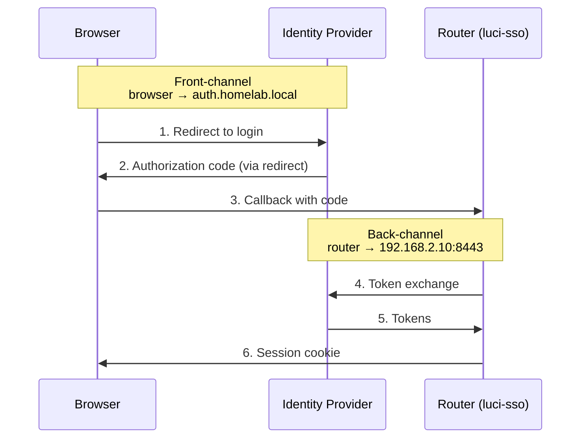

# How to Configure Split-Horizon Networking

This guide covers configuring `luci-sso` when your router and your browser reach the identity provider at different network addresses — a common setup in home labs and self-hosted environments.

---

## When you need this

Split-horizon applies when:

- Your IdP runs behind a reverse proxy or has a public hostname (e.g., `auth.homelab.local`) that the router cannot resolve, but your browser can.
- Your router must reach the IdP via an internal IP or a different port (e.g., `192.168.2.10:8443`).
- Your IdP's DNS name is only resolvable from your LAN, but your router uses a different DNS server or sits on a separate network segment.



The browser uses the public `issuer_url` for steps 1–3. The router uses `internal_issuer_url` for the back-channel token exchange (step 4), which never involves the browser.

---

## What gets replaced

When `internal_issuer_url` is set, `luci-sso` replaces the **origin** (scheme + host) of the following back-channel URLs with the internal address:

| URL | Replaced? |
| :--- | :--- |
| Token endpoint | ✅ Yes |
| JWKS endpoint | ✅ Yes |
| UserInfo endpoint | ✅ Yes |
| Discovery document fetch | ✅ Yes |
| Authorization endpoint (browser redirect) | ❌ No — the browser handles this |
| `iss` claim validation | ❌ No — always checked against `issuer_url` |

Only the origin is swapped; the path is preserved. `https://auth.homelab.local/oauth/token` becomes `https://192.168.2.10:8443/oauth/token`.

The IdP's discovery document must still declare the public `issuer_url` as its `iss`. `luci-sso` validates the issuer claim against the public address regardless of the internal URL.

---

## Prerequisites

The internal address must:

- Use **HTTPS** — plain HTTP is rejected even for internal addresses.
- Have a certificate the router trusts. If the IdP uses a self-signed or private CA certificate, install it on the router:

```bash
# Copy your CA certificate to the router
scp -O ca.crt root@192.168.1.1:/etc/ssl/certs/my-homelab-ca.crt

# Update the CA bundle
update-ca-certificates
```

If the router cannot verify the IdP's certificate, the token exchange will fail with `SSL_INIT_FAILED` or a `TOKEN_ENDPOINT_NETWORK_ERROR`. See [How to Debug luci-sso](debugging.md) for log-based diagnosis.

---

## Configuration

!!! note
    Router configuration is not yet available in the LuCI web interface. Use SSH for the steps below.

Set `internal_issuer_url` alongside the standard configuration:

```bash
# Standard configuration
uci set luci-sso.default.issuer_url='https://auth.homelab.local'
uci set luci-sso.default.client_id='luci-router'
uci set luci-sso.default.client_secret='YOUR_SECRET_HERE'
uci set luci-sso.default.enabled='1'

# Split-horizon: the router reaches the IdP via this internal address
uci set luci-sso.default.internal_issuer_url='https://192.168.2.10:8443'

uci commit luci-sso
```

---

## Verify

After committing, confirm the back-channel is working:

```bash
curl -sk https://localhost/cgi-bin/luci-sso?action=enabled
# Expected: {"enabled":true}
```

Then attempt a login from your browser. If the browser redirects to the IdP correctly but the router fails to exchange the code, the problem is in the back-channel. Check the log:

=== "Browser (LuCI)"

    Navigate to **Status > System Log** and filter for `luci-sso`.

=== "Terminal (SSH)"

    ```bash
    logread -e luci-sso | tail -30
    ```

Back-channel failures typically appear as `TOKEN_EXCHANGE_FAILED`, `OIDC_DISCOVERY_FAILED`, or `JWKS_FETCH_FAILED`. All three indicate the router cannot reach the internal address. Check:

1. The router can reach `internal_issuer_url` — test with `curl -sk <internal_issuer_url>/.well-known/openid-configuration` from the router.
2. The certificate is trusted — test with `curl -s` (without `-k`) to verify without skipping certificate checks.
3. The internal URL's origin exactly matches what `replace_origin` expects — it must start with the same scheme and host as `issuer_url`, just with the origin swapped.

For the full list of error codes, see the [Log Messages Reference](../../reference/log-messages.md).
