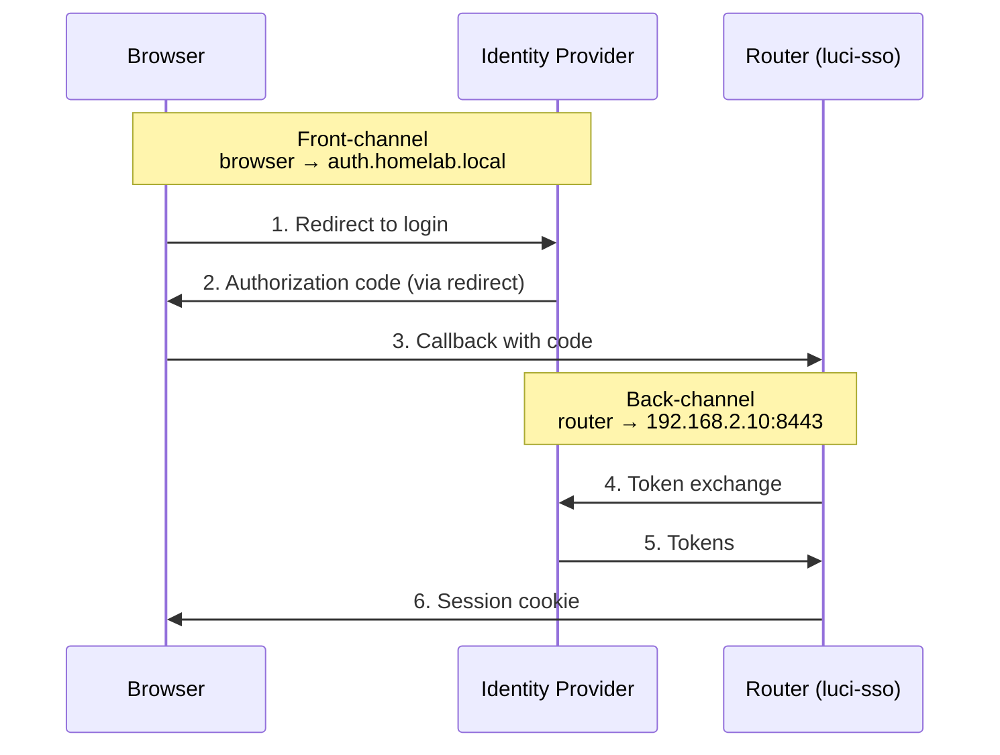

# How to Configure Split-Horizon Networking

This guide covers configuring `luci-sso` when your router and your browser reach the identity provider at different network addresses — a common setup in home labs and self-hosted environments.

---

## When you need this

Split-horizon applies when:

- Your IdP runs behind a reverse proxy or has a public hostname (e.g., `auth.homelab.local`) that the router cannot resolve, but your browser can.
- Your router must reach the IdP via an internal IP or a different port (e.g., `192.168.2.10:8443`).
- Your IdP's DNS name is only resolvable from your LAN, but your router uses a different DNS server or sits on a separate network segment.


```mermaid
sequenceDiagram
    participant B as Browser
    participant I as Identity Provider
    participant R as Router (luci-sso)

    note over B,I: Front-channel<br/>browser → auth.homelab.local
    B->>I: 1. Redirect to login
    I->>B: 2. Authorization code (via redirect)
    B->>R: 3. Callback with code

    note over R,I: Back-channel<br/>router → 192.168.2.10:8443
    R->>I: 4. Token exchange
    I->>R: 5. Tokens

    R->>B: 6. Session cookie
```

The browser uses the public `issuer_url` for steps 1–3. The router uses `internal_issuer_url` for its back-channel requests, which never involve the browser: the discovery document, the token exchange (step 4), the JWKS and UserInfo.

---

## What gets replaced

`internal_issuer_url` is an **origin**: `https://host` or `https://host:port`, with no path. When it is set, `luci-sso` replaces the origin (scheme, host and port) of the following back-channel URLs with it:

| URL | Replaced? |
| :--- | :--- |
| Token endpoint | ✅ Yes |
| JWKS endpoint | ✅ Yes |
| UserInfo endpoint | ✅ Yes |
| Discovery document fetch | ✅ Yes |
| Authorization endpoint (browser redirect) | ❌ No — the browser handles this |
| End-session (logout) endpoint (browser redirect) | ❌ No — the browser handles this |
| Any endpoint on a host other than `issuer_url`'s | ❌ No — e.g. Google's `googleapis.com` JWKS stays as published |
| `iss` claim validation | ❌ No — always checked against `issuer_url` |

Only the origin is swapped; the path and query are kept exactly. `https://auth.homelab.local/oauth/token` becomes `https://192.168.2.10:8443/oauth/token`.

This also works when `issuer_url` has a path, as with Keycloak realms or Authentik applications:

| | Public | Internal |
| :--- | :--- | :--- |
| `issuer_url` / `internal_issuer_url` | `https://kc.example.com/realms/home` | `https://10.0.0.5:8443` |
| Discovery fetch | — | `https://10.0.0.5:8443/realms/home/.well-known/openid-configuration` |
| Token endpoint | `https://kc.example.com/realms/home/protocol/openid-connect/token` | `https://10.0.0.5:8443/realms/home/protocol/openid-connect/token` |

!!! warning "The internal address must serve the same paths"
    `internal_issuer_url` with a path, query or fragment (for example `https://10.0.0.5/realms/home`) is rejected with `CONFIG_ERROR`. Give only the origin; the path comes from `issuer_url`. A reverse proxy that exposes the IdP under a *different* path internally than publicly is not supported.

The IdP's discovery document must still declare exactly the public `issuer_url` as its `issuer`. `luci-sso` validates the issuer claim against the public address regardless of the internal URL.

---

## Prerequisites

The internal address must:

- Use **HTTPS** — plain HTTP is rejected even for internal addresses.
- Have a certificate the router trusts, issued for the host name in `internal_issuer_url`. If the IdP uses a self-signed or private CA certificate, copy the CA certificate to the router. There is no store to rebuild afterwards; see [How to Install a Private CA Certificate](install-ca-certificate.md).

```bash
scp -O ca.crt root@192.168.1.1:/etc/ssl/certs/my-homelab-ca.crt
```

If the router cannot verify the IdP's certificate, discovery already fails when the user clicks the button: the log shows `[502] OIDC_DISCOVERY_FAILED`, and the line before it ends in `HTTP_REQUEST_FAILED (CERT_UNTRUSTED)`, or `(CERT_NAME_MISMATCH)` if the certificate does not cover the internal host name. See [How to Debug luci-sso](debugging.md) for log-based diagnosis.

---

## Configuration

Set `internal_issuer_url` alongside the standard configuration:

=== "Browser (LuCI)"

    Navigate to **Services > Single Sign-On**.

    Fill in the **Settings** section with your standard provider credentials, then set **Internal Issuer URL** to the address the router uses to reach the IdP:

    | Field | Value |
    | :--- | :--- |
    | **Enable SSO** | On |
    | **Issuer URL** | `https://auth.homelab.local` |
    | **Client ID** | `luci-router` |
    | **Client Secret** | Your secret |
    | **Redirect URI** | `https://<router-host>/cgi-bin/luci-sso/callback` |
    | **Internal Issuer URL** | `https://192.168.2.10:8443` |

    Click **Save & Apply**.

=== "Terminal (SSH)"

    ```bash
    # Standard configuration
    uci set luci-sso.default.issuer_url='https://auth.homelab.local'
    uci set luci-sso.default.client_id='luci-router'
    uci set luci-sso.default.client_secret='YOUR_SECRET_HERE'
    uci set luci-sso.default.redirect_uri='https://<router-host>/cgi-bin/luci-sso/callback'
    uci set luci-sso.default.enabled='1'

    # Split-horizon: the router reaches the IdP via this internal address
    uci set luci-sso.default.internal_issuer_url='https://192.168.2.10:8443'

    uci commit luci-sso
    ```

---

## Verify

After committing, confirm the configuration is valid. On the router:

--8<-- "probe-enabled.md"

Then attempt a login from your browser. If the browser redirects to the IdP correctly but the router fails to exchange the code, the problem is in the back-channel. Check the log:

--8<-- "check-log.md"

Back-channel connection failures end as `[502] OIDC_DISCOVERY_FAILED`, `[502] TOKEN_ENDPOINT_NETWORK_ERROR` or `[502] JWKS_FETCH_FAILED`, with a line ending in `HTTP_REQUEST_FAILED (<cause>)` before them. Check:

1. The router can reach the internal address and trusts its certificate. Fetch the discovery document through it from the router, adding the issuer's path if it has one:

    ```bash
    uclient-fetch -q -O - 'https://192.168.2.10:8443/.well-known/openid-configuration'
    ```

    A JSON document means both work. `SSL verify error` means the certificate is not trusted, or does not cover that host name.
2. The document's `issuer` is the public `issuer_url`, not the internal address.
3. `internal_issuer_url` is only an origin. If the log shows `Configuration rejected: internal_issuer_url must be an origin`, remove its path: the issuer's path is added automatically.
4. The internal address serves the IdP under the same paths as the public one.

For the full list of error codes, see the [Log Messages Reference](../../reference/log-messages.md).
