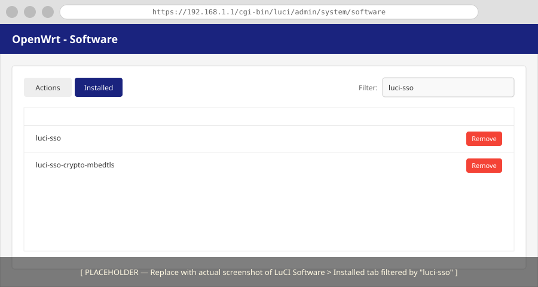

# How to Remove luci-sso

This guide covers completely removing `luci-sso` from your router and restoring the standard LuCI password login.

---

## Step 1: Remove the Packages

Choose your preferred method below to remove the software.

=== "Browser (LuCI)"

    1.  **Log in** to your router's LuCI web interface.
    2.  Navigate to **System** -> **Software**.
    3.  Click the **Installed** tab.
    4.  In the **Filter** box, type `luci-sso`.
    5.  Click **Remove** next to `luci-sso`.
    6.  Find your crypto backend (e.g., `luci-sso-crypto-mbedtls`) and click **Remove**.

    

=== "Terminal (SSH)"

    1.  **Remove the main package and its crypto backend**:
        ```bash
        opkg remove luci-sso luci-sso-crypto-mbedtls
        ```
    2.  If you installed a different backend, replace `luci-sso-crypto-mbedtls` with the one you used (e.g., `luci-sso-crypto-wolfssl`).

---

## Step 2: Confirm the login page is restored

Navigate to `https://<YOUR_ROUTER>/cgi-bin/luci/`. The SSO button should be gone, and only the standard username and password fields should be visible.

If the SSO button is still showing, the LuCI cache may not have cleared automatically. You can force a refresh:

=== "Browser (LuCI)"

    1.  In **System** -> **Software**, click **Update lists...** (this often triggers a cache check).
    2.  Or simply clear your browser's site data/cache for the router's IP.

=== "Terminal (SSH)"

    Run the following command to clear the LuCI template cache:
    ```bash
    rm -rf /tmp/luci-modulecache/ /tmp/luci-indexcache
    ```

---

## Step 3: Clean up remaining files (optional)

`opkg remove` does not delete two categories of files: conffiles and files created at runtime.

=== "Browser (LuCI)"

    Most cleanup is easier via the terminal, but you can remove the main configuration file:
    1.  Navigate to **System** -> **Backup / Flash Firmware**.
    2.  Click the **Configuration** tab.
    3.  If `/etc/config/luci-sso` is listed, you can exclude it from future backups or use a file manager plugin to delete it.

=== "Terminal (SSH)"

    **Configuration** — `/etc/config/luci-sso` is preserved by opkg's conffile mechanism. Remove it manually:
    ```bash
    rm /etc/config/luci-sso
    ```

    **Session signing key** — `/etc/luci-sso/secret.key` is generated at runtime on first use. Remove the entire directory:
    ```bash
    rm -rf /etc/luci-sso
    ```

    **Runtime state** — `/var/run/luci-sso/` disappears on the next reboot. To clear it immediately:
    ```bash
    rm -rf /var/run/luci-sso
    ```

**Custom CA certificates** — If you added a private CA certificate for a self-hosted IdP during split-horizon setup, remove it manually:

```bash
rm /etc/ssl/certs/my-homelab-ca.crt
update-ca-certificates
```

---

## What happens to active SSO sessions

Users who are currently logged in via SSO remain logged in until their UBUS session expires. `opkg remove` does not invalidate existing sessions — that would require a UBUS restart, which would also log out any password-authenticated users.

If you need to immediately revoke all active sessions, restart the UBUS session manager (`rpcd`):

=== "Browser (LuCI)"

    1.  Navigate to **System** -> **Startup**.
    2.  Find `rpcd` in the list of Init Scripts.
    3.  Click **Restart**.
    
    *Note: This will immediately log you out of the current session.*

=== "Terminal (SSH)"

    Run the following command to restart the session manager:
    ```bash
    /etc/init.d/rpcd restart
    ```

This logs out all users, including those authenticated with a password.
