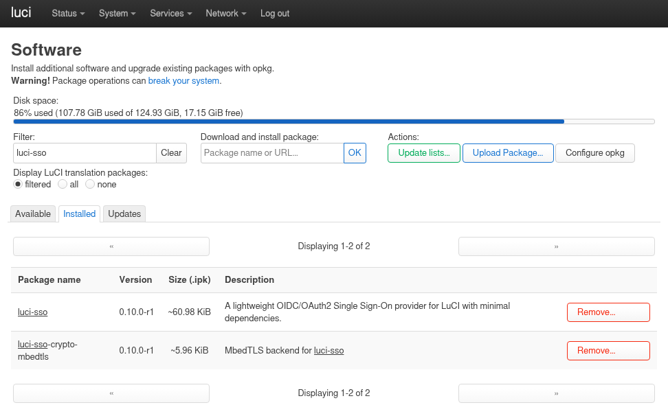

# How to Remove luci-sso

This guide covers completely removing `luci-sso` from your router and restoring the standard LuCI password login.

!!! warning "Removal takes every right away from SSO users"
    Removing `luci-sso` reloads `rpcd`. Password sessions stay logged in, without access to the SSO settings. SSO sessions stay open but lose all their rights, so SSO users can no longer use LuCI. Remove the package from a `root` password session or over SSH, and make sure the `root` password works before you start.

---

## What removal does

Removing the `luci-sso` package deletes its files, including its override of LuCI's **Log out** entry, so LuCI's own logout is back. It also runs its removal script, which:

- takes the cleanup job out of root's crontab, and keeps any comment that mentions it,
- removes the SSO button from LuCI's login templates, in every theme (`luci-sso-repatch --remove`),
- copies each role's permissions from its `rpcd` login entry (`luci_sso_<role>`) back onto the role in `/etc/config/luci-sso`, as `list read` and `list write`, then deletes every `luci_sso_*` section from `/etc/config/rpcd`,
- deletes the `luci-app-sso` access group and the `luci-sso` ubus object, then reloads `rpcd`, which rebuilds every session's rights,
- clears LuCI's cache.

Because the permissions are kept in `/etc/config/luci-sso`, installing the package again recreates every role's `rpcd` entry, with the same lists, in the order of the roles. That includes `opkg install --force-reinstall`, which runs the removal script. The script logs a warning, tagged `luci-sso`, for any `luci_sso_*` section without a matching role, which it deletes. An upgrade skips all of this.

The crypto backend is a separate package and has to be removed as well. `luci-sso` depends on it, so remove `luci-sso` first, or both in one command.

---

## Step 1: Remove the packages

=== "Terminal (SSH)"

    On OpenWrt 24.10:

    ```bash
    opkg remove luci-sso luci-sso-crypto-mbedtls
    ```

    On OpenWrt 25.12:

    ```bash
    apk del luci-sso luci-sso-crypto-mbedtls
    ```

    If you installed a different backend, replace `luci-sso-crypto-mbedtls` with the one you used (for example `luci-sso-crypto-wolfssl`).

=== "Browser (LuCI)"

    1.  **Log in** to your router's LuCI web interface with the `root` password.
    2.  Navigate to **System** -> **Software** and click the **Installed** tab.
    3.  In the **Filter** box, type `luci-sso`.
    4.  Click **Remove** next to `luci-sso`.
    5.  Click **Remove** next to your crypto backend (for example `luci-sso-crypto-mbedtls`).

    

---

## Step 2: Confirm the login page is restored

Navigate to `https://<YOUR_ROUTER>/cgi-bin/luci/`. The SSO button should be gone, and only the standard username and password fields should be visible.

If the SSO button is still showing, your browser may be using a cached copy of the page. Clear the browser's cache for the router's address and reload. On the router, you can also clear LuCI's cache again:

```bash
rm -rf /tmp/luci-modulecache/ /tmp/luci-indexcache*
```

---

## Step 3: Clean up remaining files (optional)

Removal leaves a few files behind:

- **Configuration** — the package manager keeps `/etc/config/luci-sso` when it has changed, which removal itself does when it copies the permissions back. It holds the IdP settings, the client secret and the roles with their permissions, and a later install uses it. To remove `luci-sso` for good, delete it:

    ```bash
    rm /etc/config/luci-sso
    ```

    Check that no role entry is left in `rpcd`; this prints nothing:

    ```bash
    uci show rpcd | grep luci_sso_
    ```

- **Package feed** — if you installed from the package feed, remove it and its signing key so the package manager stops using it. On OpenWrt 24.10:

    ```bash
    sed -i '/packages.ucode.dev/d' /etc/opkg/customfeeds.conf
    rm -f /etc/opkg/keys/a2288d4745630a38
    ```

    On OpenWrt 25.12:

    ```bash
    sed -i '/packages.ucode.dev/d' /etc/apk/repositories.d/customfeeds.list
    rm -f /etc/apk/keys/packages.ucode.dev.pem
    ```

- **Leftover key from older versions** — older releases created `/etc/luci-sso/secret.key` on first login. Current versions neither create nor read it. If the directory exists, it is safe to delete:

    ```bash
    rm -rf /etc/luci-sso
    ```

- **Runtime state** — `/var/run/luci-sso/` (discovery cache, token registry, rate-limit state) disappears on the next reboot. To clear it immediately:

    ```bash
    rm -rf /var/run/luci-sso
    ```

- **Empty module directories** — `/usr/share/ucode/luci_sso/` and `/usr/lib/ucode/luci_sso/` may remain, empty. They are harmless; delete them if you like:

    ```bash
    rm -rf /usr/share/ucode/luci_sso /usr/lib/ucode/luci_sso
    ```

- **Custom CA certificates** — if you added a private CA certificate for a self-hosted IdP, and nothing else on the router needs it, remove it:

    ```bash
    rm /etc/ssl/certs/my-homelab-ca.crt
    ```

    There is no certificate store to rebuild: `luci-sso` reads the files in `/etc/ssl/certs/` directly.
