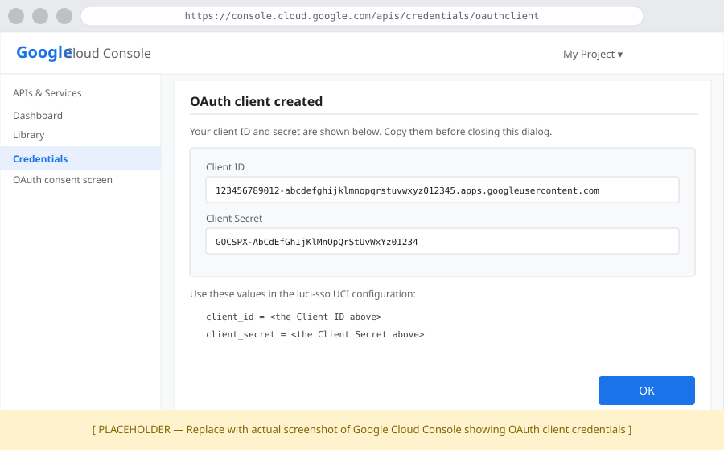

# Your First SSO Login: Public IdP

In this tutorial, we will enable single sign-on on your OpenWrt router using Google as the identity provider. By the end, we will have replaced the router's password prompt with a "Login with SSO" button and confirmed full admin access to LuCI.

---

## What we will build

```
                                      ┌──────────────────────────────┐
┌──────────────────────────────┐      │ Authorization Required       │
│ Authorization Required       │      │   Username [              ]  │
│   Username [              ]  │  =>  │   Password [              ]  │
│   Password [              ]  │      │                  < Log in >  │
│                  < Log in >  │      │            — or —            │
└──────────────────────────────┘      │      < Login with SSO >      │
                                      └──────────────────────────────┘
```

The password login remains available as a fallback at `/cgi-bin/luci/admin/` — SSO is additive, not a replacement.

---

## Before we start

We need:

- `luci-sso` installed on the router. If not, follow [How to Install luci-sso](../how-to/sysadmin/installation.md) first.
- SSH access to the router.
- A Google account and access to [Google Cloud Console](https://console.cloud.google.com/).
- **A domain name pointing to the router's public IP** (e.g. `router.example.com`).
- **LuCI accessible over HTTPS with a publicly trusted certificate** (e.g. Let's Encrypt) at that domain.

!!! warning "Why a trusted certificate is required"
    After login, Google redirects the browser back to the router's callback URL. That URL must use HTTPS with a certificate the browser already trusts. A self-signed certificate will cause the browser to block or warn on the redirect, breaking the login flow mid-way. Do not proceed without a valid certificate.

If the router does not yet have a domain name and a trusted certificate, configure those first before continuing.

---

## Step 1: Register a client with Google

We need to tell Google that our router is allowed to request user logins.

1. Open the [Google Cloud Console](https://console.cloud.google.com/) and sign in.
2. Create a new project: click the project dropdown at the top, then **New Project**. Name it anything — "Home Router" works fine.
3. In the left sidebar, go to **APIs & Services > OAuth consent screen**.
   - Choose **External**.
   - Fill in an app name (e.g. "LuCI Router") and your email for the support and developer contact fields.
   - Click through to **Save and Continue** on each screen.
4. Go to **APIs & Services > Credentials > Create Credentials > OAuth client ID**.
   - **Application type:** Web application.
   - **Name:** LuCI Router.
   - **Authorized redirect URIs:** `https://router.example.com/cgi-bin/luci-sso/callback` — replace with your actual domain.
   - Click **Create**.

Google will display the Client ID and Client Secret. Copy both.



---

## Step 2: Configure luci-sso

SSH into the router and run the following commands, replacing the placeholders with the values from Step 1 and your own domain and email:

```bash
uci set luci-sso.default.issuer_url='https://accounts.google.com'
uci set luci-sso.default.client_id='YOUR_CLIENT_ID'
uci set luci-sso.default.client_secret='YOUR_CLIENT_SECRET'
uci set luci-sso.default.redirect_uri='https://router.example.com/cgi-bin/luci-sso/callback'
uci set luci-sso.default.scope='openid profile email'
uci set luci-sso.default.clock_tolerance='60'
uci set luci-sso.default.enabled='1'

uci add_list luci-sso.admin.email='your-email@gmail.com'

uci commit luci-sso
```

The `redirect_uri` must exactly match what we entered in Google Cloud Console.

---

## Step 3: Confirm the service is running

Before opening a browser, verify the configuration took effect:

```bash
curl -s https://router.example.com/cgi-bin/luci-sso?action=enabled
```

Expected response:

```json
{"enabled": true}
```

If we see `{"enabled": false}`, check that `uci commit luci-sso` ran without errors and that `enabled` is set:

```bash
uci show luci-sso.default.enabled
# Should output: luci-sso.default.enabled='1'
```

---

## Step 4: See the SSO button

Navigate to `https://router.example.com/cgi-bin/luci/`. The login page should show a "Login with SSO" button above the standard fields.


If the button is not there, clear the browser cache and reload. If it still does not appear, check the system log:

=== "Browser (LuCI)"

    Navigate to **Status > System Log** and filter for `luci-sso`.

=== "Terminal (SSH)"

    ```bash
    logread -e luci-sso | tail -20
    ```

---

## Step 5: Log in

Click **Login with SSO**. The browser redirects to Google's sign-in page. Sign in with the Google account whose email we added to the `admin` role in Step 2.

After authenticating, Google redirects back to the router. The router exchanges the authorization code for tokens, validates them, matches the email to the `admin` role, and issues a LuCI session.


---

## What we just built

- Google authenticates users; the router never sees their password.
- The authorization code that travels through the browser is short-lived and bound to a PKCE verifier — it cannot be replayed.
- The Google email is matched to the `admin` role, which grants full read and write access to LuCI.
- The standard username/password login still works at `/cgi-bin/luci/admin/` as a fallback.

---

## Next steps

- Restrict access or add more users: [How to Configure Role-Based Access Control](../how-to/sysadmin/rbac.md)
- Try a self-hosted IdP instead: [Your First SSO Login: Self-hosted IdP](pocket-id-sso-login.md)
- Understand what happened under the hood: [About the OIDC Login Flow](../explanation/oidc-flow.md)
