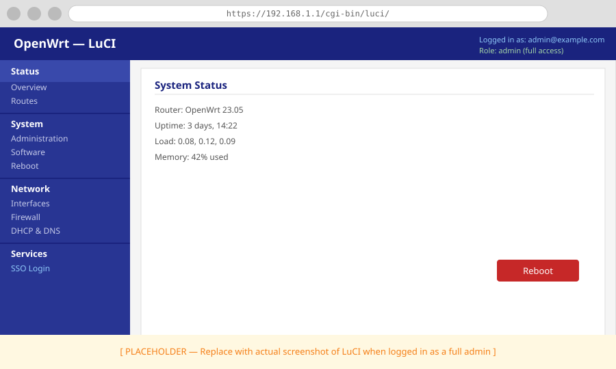

# Your First SSO Login: Self-hosted IdP

In this tutorial, we will enable single sign-on on your OpenWrt router using [Pocket ID](https://pocket-id.org/) — a self-hosted identity provider that runs entirely on your LAN. No external accounts or public infrastructure are required; the entire login flow stays on your network.

Users authenticate with a passkey (biometric or hardware security key) instead of a password.

---

## What we will build

```
                                      ┌──────────────────────────────┐
┌──────────────────────────────┐      │ Authorization Required       │
│ Authorization Required       │      │   Username [              ]  │
│   Username [              ]  │  =>  │   Password [              ]  │
│   Password [              ]  │      │                  < Log in >  │
│                  < Log in >  │      │            — or —            │
└──────────────────────────────┘      │      < Login with SSO >      │
                                      └──────────────────────────────┘
```

The browser authenticates against Pocket ID on your LAN. No traffic leaves your network during the login flow.

---

## Before we start

We need:

- `luci-sso` installed on the router. If not, follow [How to Install luci-sso](../how-to/sysadmin/installation.md) first.
- Pocket ID running on a device on your LAN, with at least one user and passkey enrolled.
- **LuCI accessible over HTTPS with a certificate the browser trusts.** If using a self-signed certificate, navigate to LuCI in the browser and click through the certificate warning to trust it before continuing — the SSO callback will fail otherwise.

!!! warning "Accepting certificate warnings is a security risk"
    Clicking through a certificate warning trains users to dismiss security indicators, which makes them more vulnerable when a warning signals a real threat. If possible, use a certificate signed by a local CA rather than a bare self-signed certificate — that way users never see a warning at all.

---

## Step 1: Create an OIDC client in Pocket ID

Log in to your Pocket ID admin interface and navigate to **OIDC Clients > Create**.

| Field | Value |
| :--- | :--- |
| **Name** | `luci-router` |
| **Callback URL** | `https://192.168.1.1/cgi-bin/luci-sso/callback` |

Replace `192.168.1.1` with your router's actual LAN IP or hostname.

Save the client. Copy the generated **Client ID** and **Client Secret**.

---

## Step 2: Configure luci-sso

Navigate to **Services > SSO Login**.

Fill in the **Settings** section with the values from Step 1:

| Field | Value |
| :--- | :--- |
| **Enable SSO** | On |
| **Issuer URL** | `https://id.example.com` |
| **Client ID** | Our Client ID from Step 1 |
| **Client Secret** | Our Client Secret from Step 1 |
| **Redirect URI** | `https://192.168.1.1/cgi-bin/luci-sso/callback` |
| **Scopes** | `openid profile email` |
| **Clock Tolerance** | `60` |

Replace `https://id.example.com` with the actual URL of our Pocket ID instance. The **Redirect URI** is pre-filled from our browser's address bar — verify it matches the callback URL set in Step 1.

Scroll to the **Users** section, click **Edit** on the `admin` role, add our email address to **Email Addresses**, and click **Save**.

Click **Save & Apply**.

!!! note "Prefer the command line?"
    The same configuration can be done over SSH. See [How to Connect luci-sso to Pocket ID](../how-to/providers/pocket-id.md) for the UCI equivalents.

---

## Step 3: Confirm the service is running

```bash
curl -s https://192.168.1.1/cgi-bin/luci-sso?action=enabled
```

Expected response:

```json
{"enabled": true}
```

If we see `{"enabled": false}`, verify that **Enable SSO** is toggled on in **Services > SSO Login** and that we clicked **Save & Apply**.

---

## Step 4: See the SSO button

Navigate to `https://192.168.1.1/cgi-bin/luci/`. The login page should show a "Login with SSO" button above the standard fields.


If the button is not there, clear the browser cache and reload. If it still does not appear, check the system log:

=== "Browser (LuCI)"

    Navigate to **Status > System Log** and filter for `luci-sso`.

=== "Terminal (SSH)"

    ```bash
    logread -e luci-sso | tail -20
    ```

---

## Step 5: Log in

Click **Login with SSO**. The browser redirects to the Pocket ID login page. Authenticate with your passkey.

After authenticating, Pocket ID redirects back to the router. The router exchanges the authorization code for tokens, validates them, matches the email to the `admin` role, and issues a LuCI session.



---

## What we just built

- Pocket ID authenticates users with passkeys; the router never sees a password.
- The entire login flow is contained within the LAN — no external services are involved.
- The authorization code is short-lived and bound to a PKCE verifier — it cannot be replayed.
- The email is matched to the `admin` role, granting full read and write access to LuCI.
- The standard username/password login still works at `/cgi-bin/luci/admin/` as a fallback.

---

## Next steps

- Restrict access or add more users: [How to Configure Role-Based Access Control](../how-to/sysadmin/rbac.md)
- Map access by group instead of email: [How to Configure Pocket ID](../how-to/providers/pocket-id.md)
- Try a public IdP: [Your First SSO Login: Public IdP](first-sso-login.md)
- Understand what happened under the hood: [About the OIDC Login Flow](../explanation/oidc-flow.md)
